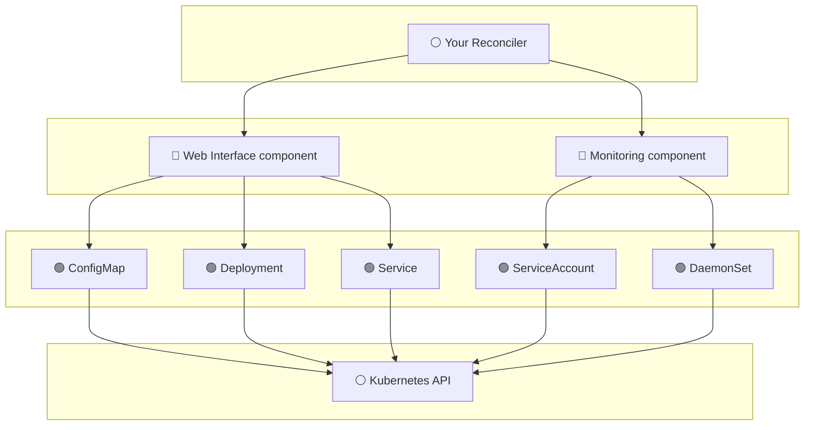

# Operator Component Framework

[](https://pkg.go.dev/github.com/sourcehawk/operator-component-framework)
[](https://goreportcard.com/report/github.com/sourcehawk/operator-component-framework)
[](LICENSE)

A Go framework for building Kubernetes operators that stay maintainable as they grow. It pulls reconciliation mechanics,
status reporting, and lifecycle behavior into reusable building blocks (**components** and **resource primitives**), so
your controllers stay thin and focused on construction and orchestration, without sacrificing customizability where it
matters.

<p align="center">
  
</p>

> [!NOTE]
>
> This framework is not a replacement for [controller-runtime](https://github.com/kubernetes-sigs/controller-runtime).
> It is a library you use inside controller-runtime reconcilers, such as in Kubebuilder-generated projects, to manage
> the layers between the reconciler and the Kubernetes resources it manages.

## Architecture

An operator built with this framework has two layers between the controller and raw Kubernetes objects:



> ⚪ What you already have &emsp; 🔵 OCF component layer &emsp; 🟢 OCF primitive layer

A component composes resource primitives into one reconcilable unit with a single condition on the owner. The reconciler
builds it and hands it to the framework, which applies the resources, aggregates their health, and writes the condition
back.

```go
comp, err := component.NewComponentBuilder().
    WithName("web-interface").
    WithConditionType("WebInterfaceReady").
    WithResource(configMap).
    WithResource(deployment).
    WithResource(service).
    WithGracePeriod(5 * time.Minute).
    Suspend(owner.Spec.Suspended).
    Build()
if err != nil {
    return err
}

return comp.Reconcile(ctx, recCtx)
```

## Installation

```bash
go get github.com/sourcehawk/operator-component-framework
```

Requires Go 1.26+ and [controller-runtime](https://github.com/kubernetes-sigs/controller-runtime) v0.22 or later. See
[compatibility](docs/compatibility.md) for the tested version combinations.

## Scaffolding

Wrapping a CRD the built-in primitives do not cover is mechanical. The `ocf` CLI generates the whole wrapper package,
compiling and tested, from one command:

```bash
go install github.com/sourcehawk/operator-component-framework/cmd/ocf@latest

ocf scaffold wrapper \
  --type github.com/cert-manager/cert-manager/pkg/apis/certmanager/v1.Certificate \
  --variant integration \
  --group cert-manager.io
```

See the [CLI guide](https://sourcehawk.github.io/operator-component-framework/cli/) for the full flag set and what to
replace in the generated code.

## Documentation

Full documentation, including a step-by-step tutorial, is at
**[sourcehawk.github.io/operator-component-framework](https://sourcehawk.github.io/operator-component-framework/)**.

| Guide                                                                                          | What it covers                                               |
| ---------------------------------------------------------------------------------------------- | ------------------------------------------------------------ |
| [Getting Started](https://sourcehawk.github.io/operator-component-framework/getting-started/)  | Build your first component, end to end                       |
| [Component](https://sourcehawk.github.io/operator-component-framework/component/)              | Lifecycle, status model, grace periods, suspension, guards   |
| [Primitives](https://sourcehawk.github.io/operator-component-framework/primitives/)            | Typed wrappers, the mutation system, editors, feature gating |
| [Custom Resources](https://sourcehawk.github.io/operator-component-framework/custom-resource/) | Wrap your own CRDs with `pkg/generic`                        |
| [CLI](https://sourcehawk.github.io/operator-component-framework/cli/)                          | Scaffold wrapper packages with `ocf scaffold wrapper`        |
| [Guidelines](https://sourcehawk.github.io/operator-component-framework/guidelines/)            | Patterns for structuring operators well                      |
| [Testing](https://sourcehawk.github.io/operator-component-framework/testing/)                  | Golden snapshots and version-matrix coverage                 |
| [Compatibility](https://sourcehawk.github.io/operator-component-framework/compatibility/)      | Supported Kubernetes and controller-runtime versions         |

The full Go API reference is on [pkg.go.dev](https://pkg.go.dev/github.com/sourcehawk/operator-component-framework).

## Claude Code plugin

The repository ships a [Claude Code](https://code.claude.com) plugin that teaches Claude the framework's concepts and
idioms: skills for components, primitives, custom resource wrappers, operator structure, and testing, plus scaffolding
commands and a guidelines reviewer.

Install it from this repository:

```
/plugin marketplace add sourcehawk/operator-component-framework
/plugin install ocf
```

Then use `/ocf:docs <topic>`, `/ocf:new-component`, `/ocf:new-wrapper`, and `/ocf:review` inside your operator project.

## Contributing

Contributions are welcome. Open an issue to discuss significant changes before submitting a pull request. New code
should include tests; run `go test ./...` (or `make all`) before opening a PR.

## Further Reading

- [The Missing Layers in Your Kubernetes Operator](https://medium.com/@sourcehawk/the-missing-layers-in-your-kubernetes-operator-306ee8633350),
  a walkthrough of common structural problems in Kubernetes operators and how the framework addresses them.

## License

Apache License 2.0. See [LICENSE](LICENSE) for details.
