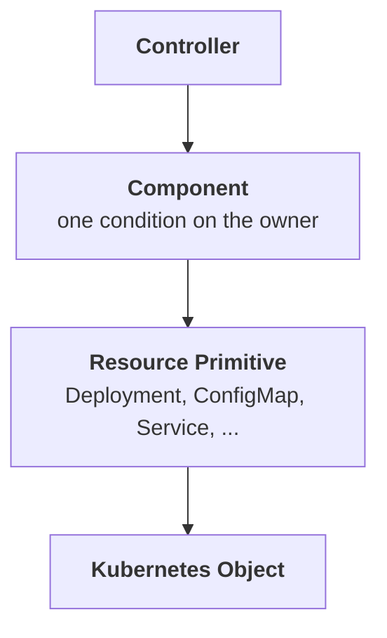
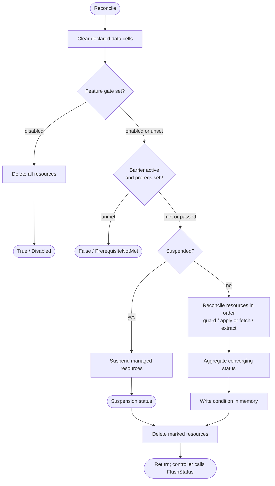
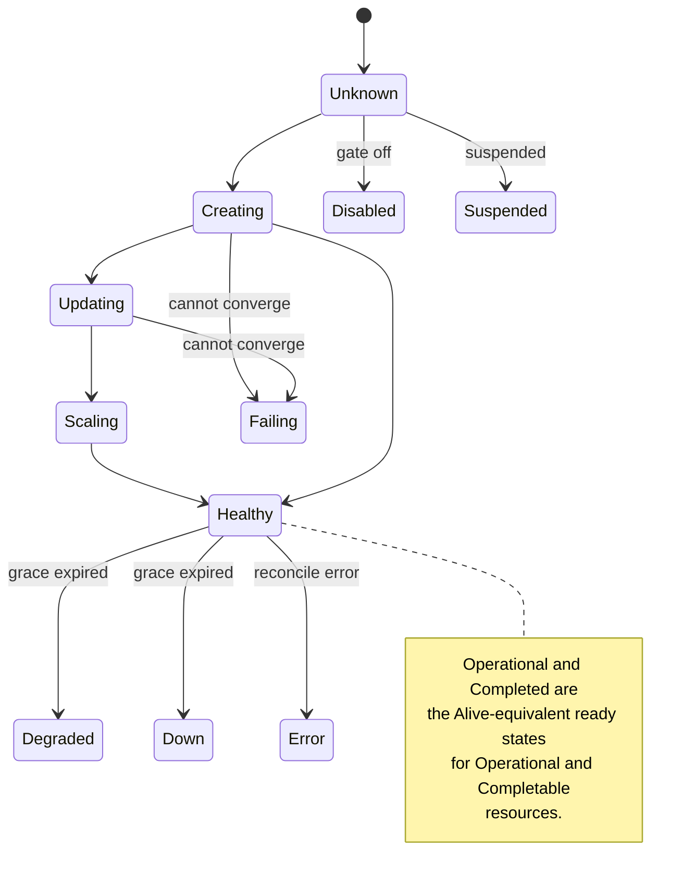

# Component

For operator authors implementing reconcilers. This page covers how a component is built, how it reconciles a set of
resources, and how their individual states aggregate into a single condition on the owner object.

A **Component** groups related Kubernetes resources into one behavioral unit. It reconciles those resources, manages
their shared lifecycle (feature gating, prerequisites, suspension, grace periods, guards), and reports their aggregate
health through a single condition on the owner CRD.



For the broader mental model and the primitive layer beneath a component, see the [Primitives Overview](primitives.md).
For operator-structuring advice (one component per condition, thin controllers, participation modes), see the
[Guidelines](guidelines.md).

## Building a Component

Components are constructed through a builder. The builder collects resource registrations, configuration, and lifecycle
flags, then produces an immutable `Component` ready for reconciliation.

`Build()` requires `WithName` and `WithConditionType`; every other builder method is optional. If either is missing, or
any registered resource fails validation, `Build()` returns a single aggregated error containing every failure, using
`errors.Join`.

```go
comp, err := component.NewComponentBuilder().
    WithName("frontend").
    WithConditionType("FrontendReady").
    WithFeatureGate(frontendFeature).                       // optional: disable to remove all resources
    WithPrerequisite(component.DependsOn("BackendReady")).  // optional: wait for another component
    WithResource(frontendConfig, component.ReadOnly()).
    WithResource(frontendDeployment).
    WithResource(frontendService).
    WithResource(legacyService, component.Delete()).
    WithGracePeriod(5 * time.Minute).
    Suspend(owner.Spec.Suspended).
    Build()
if err != nil {
    return err
}
```

### Resource registration options

Each resource is registered via `WithResource`. The second argument accepts zero or more `ResourceOption` values that
control how the component interacts with the resource. A `nil` option is ignored, so a conditionally-assigned option can
be passed without a guard.

| Option                                              | Behavior                                                                                                                                                                                                                                |
| --------------------------------------------------- | --------------------------------------------------------------------------------------------------------------------------------------------------------------------------------------------------------------------------------------- |
| (none)                                              | **Managed**: created or updated via Server-Side Apply; health contributes to the condition                                                                                                                                              |
| `component.ReadOnly()`                              | **Read-only**: fetched but never modified; health still contributes                                                                                                                                                                     |
| `component.Delete()` / `component.DeleteWhen(cond)` | **Delete**: removed from the cluster (unconditionally, or when `cond` is true); does not contribute to health                                                                                                                           |
| `component.GatedBy(gate)`                           | Deletes the resource when the feature gate is disabled; managed when enabled                                                                                                                                                            |
| `component.OrphanWhen(cond)`                        | **Orphan**: when `cond` is true, removes the component's owner reference and stops managing the resource, leaving the object in the cluster; does not contribute to health. Mutually exclusive with the deletion options and `ReadOnly` |
| `component.Unowned()`                               | **Unowned**: created and updated normally, but no controller owner reference is set; not garbage-collected on owner CR deletion                                                                                                         |
| `component.Auxiliary()`                             | The resource's health does not contribute to the component condition (a blocked guard still does)                                                                                                                                       |
| `component.BlockOnAbsence()`                        | Read-only only: a NotFound records a blocked status and short-circuits the remaining resources                                                                                                                                          |
| `component.IgnoreIfAbsent()`                        | Read-only only: a NotFound is silently ignored and last-known state is preserved                                                                                                                                                        |
| `component.SuppressGraceInconsistencyWarning()`     | Suppresses the grace/convergence inconsistency warning                                                                                                                                                                                  |

A read-only resource is not owned by the component, so it is never deleted. `ReadOnly()` is mutually exclusive with
`Delete()`, `DeleteWhen()`, `GatedBy()`, and `OrphanWhen()`; combining them is a build error. `BlockOnAbsence()` and
`IgnoreIfAbsent()` each require `ReadOnly()` and are mutually exclusive with each other. To conditionally include a
read-only resource, use [`IncludeWhen`](#includewhen-vs-gatedby), which omits the resource without deleting it.

`Unowned()` resources are created and updated by the component but are not garbage-collected when the owner CR is
deleted, because no controller owner reference is set. This is intended for resources that must outlive the management
lifecycle — for example, backup records that should persist after the application CR is removed. An `Unowned` resource
is still subject to explicit deletion: `Delete()`, `DeleteWhen()`, `GatedBy()` (when the gate is disabled), and
suspension with `DeleteOnSuspend()` all delete it directly, regardless of the `Unowned` flag. Only Kubernetes GC
(triggered by owner CR deletion) is suppressed.

Options compose. Gate a resource and exclude it from health aggregation in one call:

```go
component.NewComponentBuilder().
    WithName("api").
    WithConditionType("ApiReady").
    WithResource(apiDeployment).
    WithResource(metricsExporter, component.GatedBy(tracingGate), component.Auxiliary()).
    Build()
```

When `tracingGate` is disabled, the exporter is deleted. When enabled, it is managed but does not block the component
from becoming ready.

### IncludeWhen vs. GatedBy

These two options look similar but answer different questions, and choosing the wrong one either deletes a resource you
do not own or fails to clean up one you do:

- **`GatedBy` / `DeleteWhen` conditionally render a resource the component owns.** When the condition turns off, the
  resource is **deleted** from the cluster. Reach for these to make an owned resource exist for some states and be
  removed for others.
- **`IncludeWhen` conditionally includes a resource and never deletes it.** When the condition is false the resource is
  omitted entirely: not created, read, or deleted, and its constructor is never called.

`IncludeWhen`'s primary purpose is optional, externally-owned resources that may or may not exist, most commonly a
read-only reference to a Secret or ConfigMap owned by the user or another operator behind an optional spec field.
Because construction is deferred behind the `func() Resource` closure, the builder may safely dereference the optional
input that determined inclusion.

```go
// Optional, externally-owned read-only reference. Construction is deferred, so
// the closure only dereferences ConfigRef when it is non-nil.
builder.IncludeWhen(spec.ConfigRef != nil, func() component.Resource {
    r := spec.ConfigRef
    res, _ := configmap.NewBuilder(&corev1.ConfigMap{
        ObjectMeta: metav1.ObjectMeta{Name: r.Name, Namespace: r.Namespace},
    }).Build()
    return res
}, component.ReadOnly(), component.BlockOnAbsence())
```

The second real case is a kind the cluster may not serve at all. A `ServiceMonitor` exists only where the Prometheus
Operator is installed, and the same holds for cert-manager kinds and for any optional CRD. Use a RESTMapper lookup as
the `include` input, and let `GatedBy` keep owning the spec flag that says whether the user wants the resource:

```go
// The cluster serves the kind only when the CRD is installed.
_, err := mgr.GetRESTMapper().RESTMapping(
    schema.GroupKind{Group: "monitoring.coreos.com", Kind: "ServiceMonitor"}, "v1",
)
served := err == nil

builder.IncludeWhen(served, func() component.Resource {
    res, _ := servicemonitor.NewBuilder(serviceMonitor(app)).Build()
    return res
}, component.GatedBy(metricsGate))
```

The lookup names `v1` on purpose. `RESTMapping` takes variadic versions and matches any served version when you pass
none, but the check should name the version the operator actually applies: a cluster serving only `v1beta1` would pass
an any-version check and then fail at apply. Gate on the version you send.

The two options answer different questions here, and they compose. `IncludeWhen(served, ...)` answers "can this cluster
hold the resource at all", and `GatedBy(metricsGate)` answers "does this owner want it". When the CRD is present and the
gate turns off, the framework deletes the `ServiceMonitor`, which is correct. When the CRD is absent, the resource is
never registered, so the framework never attempts that delete. This matters because a delete against a kind the cluster
no longer serves fails with a no-matches error from the REST mapper, and it would fail every reconcile. Removing a CRD
already removes every instance of its kind, so there is nothing left for the component to clean up.

A secondary use is migrating a resource from tracked to untracked without deleting it. Moving a resource from
`WithResource` (or `IncludeWhen(true, ...)`) to `IncludeWhen(false, ...)` drops it from the component entirely: the
component no longer creates, updates, or deletes it, so an already-present resource is left in place, rather than
removed the way `GatedBy` or `DeleteWhen` would.

!!! note "Untracking vs. releasing"

    `IncludeWhen(false, ...)` only stops the component from touching the resource; it does not remove the owner reference
    the component set while the resource was managed, so Kubernetes still garbage-collects the resource when the owner is
    deleted. To release a resource so it outlives its owner (for example, to migrate it to a new owner), use
    [`OrphanWhen(cond)`](#resource-registration-options) instead: when the condition is true the component removes its
    owner reference and stops managing the resource, leaving the object in the cluster and no longer tied to the owner's
    lifecycle.

## Feature Gates

A component-level feature gate controls whether the component is active. When the gate is disabled, the component
deletes all of its resources and reports a `True` condition with reason `Disabled`. When enabled (or not set), the
component reconciles normally.

```go
comp, err := component.NewComponentBuilder().
    WithName("monitoring-sidecar").
    WithConditionType("MonitoringReady").
    WithFeatureGate(monitoringFeature).
    WithResource(exporterDeployment).
    WithResource(exporterService).
    Suspend(owner.Spec.Suspended).
    Build()
```

A disabled feature gate takes precedence over suspension. If the gate is disabled and the component is also marked
suspended, the component is treated as disabled (resources deleted), not suspended.

The condition when the gate is disabled:

```yaml
type: MonitoringReady
status: "True"
reason: Disabled
message: "Component is disabled."
```

The `True` status follows the convention that `True` means "in its expected state", consistent with how a `Suspended`
component also reports `True`.

!!! note

    If the gate's `Enabled()` evaluation returns an error, the component reports reason `FeatureGateError` rather than
    `Disabled` or a generic `Error`. This distinct reason lets the prerequisite barrier tell a pre-prerequisite failure
    apart from a post-prerequisite one.

## Prerequisites

Prerequisites are initialization barriers that prevent a component from reconciling until a condition is met. Unlike
resource-level [guards](#guards), prerequisites are evaluated only while the component's condition reason indicates it
has not yet proceeded past initialization. The barrier remains active while the condition reason is `Unknown`,
`PrerequisiteNotMet`, `Disabled`, or `FeatureGateError`. Once the reason changes to any other value, the barrier is
permanently passed and the prerequisite is never re-evaluated.

This makes prerequisites suitable for startup dependencies between components. If a dependency later becomes unhealthy,
the dependent component keeps reconciling its own resources. Prerequisites answer "can this component be created?", not
"should this component keep running?".

### Registering prerequisites

Prerequisites are registered with `WithPrerequisite`. Multiple may be registered; all must be satisfied before the
component proceeds.

```go
comp, err := component.NewComponentBuilder().
    WithName("frontend").
    WithConditionType("FrontendReady").
    WithPrerequisite(component.DependsOn("BackendReady")).
    WithPrerequisite(component.DependsOn("CacheReady")).
    WithResource(frontendDeployment).
    WithResource(frontendService).
    Suspend(owner.Spec.Suspended).
    Build()
```

The built-in `DependsOn` helper checks whether a named condition on the owner has `Status: True`. The owner is read from
the `ReconcileContext` passed to `Check`, so no cluster reads are performed.

For custom logic, implement the `Prerequisite` interface:

```go
type Prerequisite interface {
    Check(rec ReconcileContext) (PrerequisiteResult, error)
}
```

### Prerequisite behavior

- Prerequisites are evaluated before any resource is reconciled or suspended.
- The barrier is active while the condition reason is `Unknown`, `PrerequisiteNotMet`, `Disabled`, or
  `FeatureGateError`. Any other reason means the component has proceeded past initialization and the barrier is
  permanently passed.
- While the barrier is active, suspension is a no-op. No resources exist to suspend.
- A feature gate check runs before the prerequisite check. If the gate is disabled, prerequisites are not evaluated.
- Prerequisites are evaluated in registration order. The first unmet prerequisite short-circuits the check.
- A prerequisite error sets the component condition to `False` with reason `PrerequisiteNotMet`.

A blocked prerequisite produces a condition like:

```yaml
type: FrontendReady
status: "False"
reason: PrerequisiteNotMet
message:
  'Prerequisite not met: waiting for condition "BackendReady" to become True (currently False: Backend is still creating
  resources)'
```

## Reconciliation Lifecycle

`comp.Reconcile(ctx, recCtx)` runs the following steps on every call. They match the authoritative order in the
`Reconcile` GoDoc.

Every declared [data cell](#declared-data) is cleared before step 1 runs, so no value extracted during a previous
reconcile can be observed during this one.

1. **Feature gate check.** If a feature gate is set and disabled, all managed resources are deleted and the condition is
   set to `True/Disabled`. No further processing occurs. A gate evaluation error sets `FeatureGateError`.
2. **Prerequisite check.** If prerequisites are registered and the initialization barrier is still active, all
   prerequisites are evaluated. If any is not met, the condition is set to `False/PrerequisiteNotMet` and no resources
   are reconciled or suspended.
3. **Suspension check.** If the component is marked suspended, `Suspend()` is called on all managed (non-read-only)
   resources, the condition is updated to reflect suspension progress, pending deletions are processed, and the
   remaining steps are skipped. Guards are not evaluated during suspension.
4. **Resource reconciliation.** All non-delete resources are processed sequentially in registration order, managed or
   read-only alike. For each resource: its guard (if any) is evaluated and a blocked guard stops that resource and all
   later ones; the resource is applied (managed) or fetched (read-only); its declared data extractions run immediately,
   making the extracted values available to subsequent resources' data guards and mutations.
5. **Status aggregation.** The converging status of every processed resource is collected, including any blocked-guard
   result.
6. **Condition update.** A new component condition is derived from the aggregate resource status, the previous
   condition, and the configured grace period, then written to the owner **in memory only**. The derived `Reason` is a
   [`component.Status`](#condition-priority-and-aggregation) value. `Reconcile` never calls the Kubernetes status API;
   the controller persists with [`FlushStatus`](#persisting-status-with-flushstatus).
7. **Resource deletion.** Resources registered for deletion are removed from the cluster, in the same registration order
   used for reconciliation; the framework does not reverse it.



A read-only resource registered before a managed one can extract data that feeds the managed resource's data guard or
mutations within the same reconcile cycle. Read-only resources that implement `ObservationRecorder` have the fetched
object recorded back onto them so later inspection sees live cluster state; resources built from `generic.BaseResource`
do this automatically. Managed resources are applied with Server-Side Apply and receive a controller owner reference,
except where the owner is namespace-scoped and the resource is cluster-scoped (see
[Cluster-scoped resources](#cluster-scoped-resources)).

### Previewing desired state

`Component.Preview() ([]client.Object, error)` renders the desired state of every managed resource in registration order
without contacting the cluster. Read-only resources (fetched, not applied) and delete resources (removal markers) are
excluded.

`Preview` does not evaluate guards. Reconcile stops at the first resource whose guard is `Blocked` and skips it and all
later ones, but a guard's outcome usually depends on cluster state and earlier extracted data, neither of which exists
in a cluster-free render. `Preview` therefore returns the full desired set, including resources a given reconcile might
skip behind a blocked guard, which keeps the snapshot deterministic and focused on baseline construction, mutation
wiring, and registration order.

No extraction runs during a preview either, so every [data cell](#declared-data) is unset. A mutation that calls `Get`
degrades quietly and simply omits the enriched field. A mutation that calls `Require` returns an error wrapping
`concepts.ErrDataNotExtracted`, which fails the whole preview. Tests that render such a resource must seed the cell
first:

```go
comp, dbHost, err := BuildComponent(owner)
if err != nil {
    return err
}
dbHost.Set("postgres.default.svc") // stand in for the value a real reconcile would extract

objs, err := comp.Preview()
```

Return the cells from your component assembly function so tests can reach them, as
[`examples/extraction-and-guards`](https://github.com/sourcehawk/operator-component-framework/tree/main/examples/extraction-and-guards)
does.

Each managed resource must implement [`concepts.Previewable`](primitives.md#lifecycle-interfaces) (`Preview()`). All
built-in primitives satisfy it through `generic.BaseResource`. A custom resource must implement it to be previewable;
without it, `Component.Preview` returns an error for that resource. `Preview` is the natural input for whole-component
golden snapshots via `golden.AssertComponentYAML`.

```go
objs, err := comp.Preview()
if err != nil {
    return err
}
for _, obj := range objs {
    fmt.Printf("%s/%s\n", obj.GetNamespace(), obj.GetName())
}
```

If you need the concrete Kubernetes type rather than `client.Object`, type-assert the returned value:

```go
dep, ok := objs[0].(*appsv1.Deployment)
```

`Component.Resource(identity string) (Resource, bool)` looks up a registered resource by its `Identity()` string,
covering managed, read-only, and delete resources. For namespaced resources the identity is
`<apiVersion>/<kind>/<namespace>/<name>` (for example `apps/v1/Deployment/default/frontend`); cluster-scoped resources
omit the namespace segment (for example `rbac.authorization.k8s.io/v1/ClusterRole/viewer`).

The component also satisfies `concepts.MutationInspector` (`RegisteredMutations()` and `FiringSet()`), which surfaces
the names of registered mutations and the subset that fire at the version the component was built at. A custom resource
implements the same interface so version-matrix golden generation can introspect it. See
[`concepts.MutationInspector`](primitives.md#lifecycle-interfaces) for the contract and the [Testing](testing.md) guide
for how it drives version-matrix goldens.

The data-flow counterpart is `concepts.DataInspector` (`DataTopology()`), which reports the declared flow of every data
cell through the component without running any extraction. See [Inspecting the topology](#inspecting-the-topology).

### Cluster-scoped resources

When a component manages cluster-scoped resources (such as `ClusterRole` or `PersistentVolume`) and the owner CRD is
namespace-scoped, the framework **automatically skips** setting a controller owner reference on those resources. A
namespace-scoped object cannot own a cluster-scoped object. The scope of both owner and resource is determined at
reconcile time using the cluster's REST mapper; no configuration is needed, and the framework logs an info-level
message.

!!! warning

    Without an owner reference, cluster-scoped resources are **not** garbage-collected when the owner is removed. To
    ensure cleanup, either register the resource with `component.Delete()` so it is removed during reconciliation, or
    add a finalizer on the owner CRD that cleans up cluster-scoped resources before the owner is deleted.

If the owner CRD is itself cluster-scoped, owner references are set normally on all resources regardless of scope.

## Status Model

A component reports one condition whose reason is a `component.Status` value. Which states are reachable depends on
which [lifecycle interfaces](primitives.md#lifecycle-interfaces) a resource implements: long-running workloads report
`Alive` states, run-to-completion resources report `Completable` states, externally-dependent resources report
`Operational` states, and resources implementing none of these are ready as long as they exist. The component aggregates
across all registered resources and surfaces the most critical state.

For the raw lifecycle-interface to status-string mapping, see
[Primitives Overview: Lifecycle Interfaces](primitives.md#lifecycle-interfaces). This page owns the priority and
aggregation behavior.



### Reading a component's condition

`(*Component).GetCondition(owner OperatorCRD) Condition` returns the condition this component owns on the given owner.
When the owner carries no condition of that type, it returns a synthetic one instead of nothing: status `False`, reason
`Unknown`, message `Component has not been reconciled yet.`, and the owner's current generation. A controller that reads
conditions this way therefore never mistakes a component that has not reconciled for a component that is ready.

```go
cond := comp.GetCondition(owner)         // component.Condition, an alias of metav1.Condition
status := cond.ComponentStatus()         // component.Status, the reason as a typed value
priority := status.Priority()            // the aggregation priority of that status
```

`GetCondition` reads the owner object in memory, so reconcile the component first. A condition read before
`comp.Reconcile` reflects the previous pass. Prefer it over `meta.FindStatusCondition` on the owner's conditions: the
synthetic `Unknown` is what keeps a not-yet-reconciled component visible to
[owner-level aggregation](guidelines.md#derive-the-owners-aggregate-condition-from-component-conditions).

### Condition priority and aggregation

When several resources are aggregated into one condition, the framework selects the state with the highest priority.
`Status.Priority()` defines the order: a higher number wins. The table below lists every reason in descending priority,
so a reader can determine exactly how a failing or mixed-state component aggregates. `Error` and `FeatureGateError`
outrank everything; the ready states (`Healthy`, `Operational`, `Completed`) are the lowest non-zero priorities;
`Unknown` and any unrecognized reason are priority `0` and never influence aggregation.

`Status.Priority()` is the exported way to consume this ordering. A controller that derives an owner-level condition
from several component conditions calls it directly, as
[Derive the Owner's Aggregate Condition from Component Conditions](guidelines.md#derive-the-owners-aggregate-condition-from-component-conditions)
describes. A condition's `Reason` is always a `component.Status` value, never free text, so metrics and other consumers
can key on the reason string. Convert one back with `Condition.ComponentStatus()`.

| Priority | Reason(s)                                        | Condition status | Category                                          |
| -------- | ------------------------------------------------ | ---------------- | ------------------------------------------------- |
| 20       | `Error`, `FeatureGateError`                      | `False`          | Reconcile or gate failure                         |
| 19       | `Down`                                           | `False`          | Grace expired, non-functional                     |
| 18       | `Degraded`                                       | `False`          | Grace expired, partially functional               |
| 17       | `PendingSuspension`                              | `True`           | Suspension acknowledged, not started              |
| 16       | `Suspending`                                     | `True`           | Converging towards suspended                      |
| 15       | `Suspended`                                      | `True`           | Fully suspended                                   |
| 14       | `Disabled`                                       | `True`           | Feature gate disabled                             |
| 13       | `AliveFailing` (`Failing`)                       | `False`          | Workload cannot converge                          |
| 12       | `OperationFailing`                               | `False`          | Integration cannot become operational             |
| 11       | `CompletionFailing` (`TaskFailing`)              | `False`          | Task finished with an error                       |
| 10       | `GuardBlocked` (`Blocked`), `PrerequisiteNotMet` | `False`          | Precondition not met                              |
| 9        | `AliveScaling` (`Scaling`)                       | `False`          | Workload converging                               |
| 8        | `CompletionRunning` (`TaskRunning`)              | `False`          | Task running                                      |
| 7        | `AliveUpdating` (`Updating`)                     | `False`          | Workload converging                               |
| 6        | `AliveCreating` (`Creating`)                     | `False`          | Workload converging                               |
| 5        | `OperationPending`                               | `False`          | Integration waiting on a dependency               |
| 4        | `CompletionPending` (`TaskPending`)              | `False`          | Task waiting to start                             |
| 3        | `Healthy`                                        | `True`           | Workload ready                                    |
| 2        | `Operational`                                    | `True`           | Integration ready                                 |
| 1        | `Completed`                                      | `True`           | Task finished successfully                        |
| 0        | `Unknown`                                        | `False`          | Not yet reconciled; ignored in aggregation        |
| 0        | Any unrecognized reason                          | not set here     | Written by another writer; ignored in aggregation |

!!! note

    The reason string written to the condition is the runtime status value. Several `component.Status` constants alias a
    shared value: `AliveFailing` is `"Failing"`, `GuardBlocked` is `"Blocked"`, and the `Completion*` constants map to
    `"Completed"`, `"TaskRunning"`, `"TaskPending"`, and `"TaskFailing"`. The parentheses in the table give the runtime
    value where it differs from the constant name.

    The two priority `0` rows differ in origin. `Unknown` is the framework's own synthetic condition for a component
    that has not reconciled yet, and its condition status is `False`, which is what stops a fresh CR from reporting
    ready. The framework never writes `metav1.ConditionUnknown`, so an unrecognized reason on the owner came from
    another writer and the framework determines neither its reason nor its status.

A resource registered with [`component.Auxiliary()`](#resource-registration-options) does not contribute its converging
health to this aggregation. A blocked guard on an auxiliary resource still contributes, because a blocked guard halts
the whole pipeline.

### Aggregating components into one owner condition

A controller that runs several components usually needs one condition for all of them. `component.Aggregate` derives
that aggregate condition from the component conditions already on the owner:

```go
func Aggregate(conditionType ConditionType, owner OperatorCRD, comps ...*Component) Condition
```

The controller stages the result on the owner like any other condition:

```go
ready := component.Aggregate("Ready", owner, brokerComponent, gatewayComponent)
meta.SetStatusCondition(owner.GetStatusConditions(), metav1.Condition(ready))
```

Two separate decisions produce the result.

**Truth by unanimity.** The aggregate condition status is `True` if and only if every component condition is `True`.
Priority never decides `True` or `False`.

**Reason by priority.** The reason and message come from the governing component. If any component condition is not
`True`, the governing component is the one with the highest `Status.Priority()` among those. If all of them are `True`,
it is the one with the highest priority among all of them. When two component conditions tie on priority, the first
component passed to `Aggregate` wins, so the result is deterministic.

The two decisions must stay separate. A rule that derives truth from priority reports `True`/`Suspended` for an owner
with a failing component. `Suspended` has priority 15 and maps to condition status `True`, and `AliveFailing` has
priority 13 and maps to `False`. Unanimity decides whether every component is in its expected state. Priority decides
which component the reader must look at first.

`Aggregate` reads each component condition through `Component.GetCondition`. For a component that never reconciled, that
method returns a synthetic `Unknown` condition with status `False`. A new custom resource therefore never reports ready.
The `ObservedGeneration` field takes the generation of the owner.

The message of the aggregate condition has the form `<component name>: <component message>`. It therefore names the
governing component and keeps the text of that component. If the governing condition has no message, the aggregate
message is the component name alone.

| Component conditions passed in | Aggregate condition     |
| ------------------------------ | ----------------------- |
| all `Healthy`                  | `True`, `Healthy`       |
| `Healthy` and `AliveFailing`   | `False`, `AliveFailing` |
| `Suspended` and `AliveFailing` | `False`, `AliveFailing` |
| all `Suspended`                | `True`, `Suspended`     |
| `Suspended` and `Healthy`      | `True`, `Suspended`     |
| `Healthy` and `Disabled`       | `True`, `Disabled`      |
| one component never reconciled | `False`, `Unknown`      |
| one component errored          | `False`, `Error`        |
| no components passed           | `False`, `Unknown`      |

Four properties of the aggregate condition are easy to miss:

- Partial suspension reports `True` with reason `Suspended`. A suspended component is in its expected state and cannot
  make the aggregate false. An operator that wants owner-level suspension as an explicit state must branch on its own
  suspend field before it calls `Aggregate`.
- A component disabled by a feature gate reports `True`/`Disabled` and therefore counts as ready, for the same reason.
- `Aggregate` looks only at the components that you pass in. If the controller no longer builds a component, the
  condition of that component stays on the owner. `Aggregate` ignores that stale condition, but users still see it,
  because [`FlushStatus`](#persisting-status-with-flushstatus) merges conditions by type and never prunes them.
- The returned `Condition` is a plain struct. A caller that wants different prose can change the message before it
  stages the condition with `meta.SetStatusCondition`.

## Grace Period

The grace period defines how long a component may remain in a converging state (`Creating`, `Updating`, `Scaling`)
before escalating to `Degraded` or `Down`.

```go
component.NewComponentBuilder().
    WithGracePeriod(5 * time.Minute).
    // ...
```

During the grace period the component reports its real converging state, not a failure. After the period expires, if the
component is still not ready, a `Graceful` resource's `GraceStatus()` determines the post-expiry severity: `Healthy` (no
issue), `Degraded` (partially functional), or `Down` (non-functional). This prevents spurious failure alerts during
normal operations such as rolling updates. See the [Guidelines](guidelines.md) for choosing grace durations.

## Suspension

Suspension intentionally deactivates a component without deleting its configuration. When `Suspend(true)` is set on the
builder:

1. The component calls `Suspend()` on all `Suspendable` resources.
2. Each resource performs its suspension behavior, typically scaling to zero replicas.
3. The component polls `SuspensionStatus()` on each resource.
4. Once all resources report `Suspended`, the condition transitions to `Suspended`.

The progression reports `PendingSuspension`, then `Suspending`, then `Suspended` (all with condition status `True`).

Resources that do not yet exist in the cluster are created in their suspended state, with suspension mutations already
applied (a Deployment is created with zero replicas), so the resource is immediately available when suspension ends.
Resources with `DeleteOnSuspend` enabled are **not** created if already absent; their absence is treated as already
suspended, which avoids a create-then-delete loop on every reconcile while the component stays suspended. Resources that
are not `Suspendable` are left in place.

Guards are not evaluated during suspension, but [declared extractions](#declared-data) still run for each managed
resource in registration order, so a mutation that calls `Require()` on a cell an earlier managed resource produces
still works while the component is suspended. Cells produced by read-only resources (which are not fetched during
suspension) or by resources with `DeleteOnSuspend` (which are skipped once absent) stay absent for as long as the
component is suspended. A mutation that depends on one of those must use `Get()` rather than `Require()` if the
component can ever be suspended.

## ReconcileContext

`ReconcileContext` carries all dependencies for a reconciliation pass. Pass it from your controller on each call:

```go
recCtx := component.ReconcileContext{
    Client:        r.Client,        // sigs.k8s.io/controller-runtime/pkg/client
    Scheme:        r.Scheme,        // *runtime.Scheme
    EventRecorder: r.EventRecorder, // events.EventRecorder, from manager.GetEventRecorder(name)
    Metrics:       r.Metrics,       // component.MetricsRecorder (condition metrics), optional
    Owner:         owner,           // the CRD that owns this component
}

err = comp.Reconcile(ctx, recCtx)
```

Dependencies are passed explicitly so components stay testable and decoupled from global state. The `Metrics` field is
optional; when set, the framework records Prometheus metrics for every condition reported during a reconcile, using the
recorder from [go-crd-condition-metrics](https://github.com/sourcehawk/go-crd-condition-metrics). Leave it `nil` to opt
out.

`EventRecorder` takes a `k8s.io/client-go/tools/events.EventRecorder`. The manager accessor that returns one,
`GetEventRecorder(name)`, was added in controller-runtime v0.23; on v0.22.x, build the recorder from client-go instead,
as described in [Compatibility](compatibility.md).

## Persisting Status with FlushStatus

`Component.Reconcile` only mutates the owner's status conditions in memory. The controller persists them by calling
`component.FlushStatus` once per reconcile, typically from a deferred call so that conditions set on error paths are
still written:

```go
func (r *WebAppReconciler) Reconcile(ctx context.Context, req reconcile.Request) (_ reconcile.Result, err error) {
    owner := &v1alpha1.WebApp{}
    if err := r.Get(ctx, req.NamespacedName, owner); err != nil {
        return reconcile.Result{}, client.IgnoreNotFound(err)
    }

    recCtx := component.ReconcileContext{
        Client:        r.Client,
        Scheme:        r.Scheme,
        EventRecorder: r.EventRecorder,
        Metrics:       r.Metrics,
        Owner:         owner,
    }
    // Declared before the deferred flush so the closure sees every component built below.
    var comps []*component.Component
    defer func() {
        if flushErr := component.FlushStatus(ctx, recCtx, comps); flushErr != nil && err == nil {
            err = flushErr
        }
    }()

    comp, err := buildFrontendComponent(owner)
    if err != nil {
        return reconcile.Result{}, err
    }
    comps = append(comps, comp)
    return reconcile.Result{}, comp.Reconcile(ctx, recCtx)
}
```

`FlushStatus` performs one `Status().Update` call, wrapped in `retry.RetryOnConflict`. That call writes the **whole
status subresource**, not only the conditions. Every status field the controller staged in memory is sent, and every
field it did not stage is sent exactly as it stands on the in-memory object. Fetch the owner fresh at the top of each
reconcile, so the fields nobody staged still hold current server state. An owner carried over from an earlier pass
writes stale values back over newer ones.

On a 409 Conflict, for example when another writer updated the owner between the controller's `Get` and this call,
`FlushStatus` keeps the staged owner as the object it writes. It fetches the server's copy into a **separate** object,
takes that copy's `resourceVersion` so the retry targets the live object, restores from it only the conditions whose
type this flush does not own, and retries. The staged owner is never replaced.

Two things follow from that. Non-condition status fields staged during the reconcile survive a conflict, because the
object holding them is the object that gets written. And a condition type this flush does not own keeps the server's
value rather than the copy the controller happens to be holding, so a concurrent update by another writer is not rolled
back.

Which types count as owned comes from the components passed to `FlushStatus`:

```go
component.FlushStatus(ctx, recCtx, []*component.Component{backendComp, frontendComp})
```

Their condition types are the owned set, so it cannot drift from what the components actually write.

Note that this is a slice, while [`Aggregate`](#aggregating-components-into-one-owner-condition) takes the same
components variadically. The difference is deliberate, for the reason below.

The parameter is required rather than variadic on purpose. A variadic would let every existing call keep compiling while
silently retaining the old, wider ownership, which would make a correctness fix opt-in and invisible. Requiring the
argument forces each call site to be looked at exactly once.

A controller that manages no components passes `nil`. `nil` and an empty slice behave identically: every condition
staged on the owner is then owned. That is a deliberate special case rather than an empty set. A controller with no
components stages its condition by hand, and if an empty list meant "own nothing" that condition would be reverted on
every conflict. Passing `nil` is a visible choice a reader can see, not an omission nobody notices. See
[One write path for the owner's status](#one-write-path-for-the-owners-status).

!!! note "An owner-level aggregate is not owned by any component"

    A condition the controller stages itself, such as a `Ready` produced by
    [`component.Aggregate`](#aggregating-components-into-one-owner-condition), belongs to no component, so a conflict
    reverts it to the value the server already holds and the next reconcile stages it again. Passing the components
    covers their own conditions; the aggregate is recomputed from them each pass anyway.

    For unowned types the server is the source of truth, absence included. An unowned condition the server no longer
    carries is dropped from the staged owner rather than written back, so a condition another writer removed is not
    resurrected. A condition the server has never held, such as the first write of the aggregate, is dropped for the
    same reason and staged again on the next reconcile.

After a successful update, `FlushStatus` records metrics for every condition on the owner. If `Metrics` is `nil`,
recording is skipped.

This split is what lets a controller with several components stage several conditions during one reconcile and persist
them in a single write. Persisting after each component would race the components' writes and produce 409 conflicts. See
[Keep Controllers Thin](guidelines.md#keep-controllers-thin) and
[One Component Per Logical Condition](guidelines.md#one-component-per-logical-condition).

### One write path for the owner's status

A CR's status is written once per reconcile, through `FlushStatus`. This rule also holds for a controller that builds no
components at all. A validation-only CRD stages its condition with `meta.SetStatusCondition` and persists it with a
`ReconcileContext` that carries only `Client` and `Owner`. `Scheme`, `EventRecorder`, and `Metrics` are used by resource
reconciliation and metric recording, so a status-only controller can leave them unset.

```go
func (r *PolicyReconciler) Reconcile(ctx context.Context, req reconcile.Request) (reconcile.Result, error) {
    policy := &v1alpha1.Policy{}
    if err := r.Get(ctx, req.NamespacedName, policy); err != nil {
        return reconcile.Result{}, client.IgnoreNotFound(err)
    }

    cond := metav1.Condition{
        Type: "Validated", Status: metav1.ConditionTrue, Reason: "SpecValid",
        Message: "Spec passed validation.", ObservedGeneration: policy.Generation,
    }
    if err := validate(policy); err != nil {
        cond.Status, cond.Reason, cond.Message = metav1.ConditionFalse, "SpecInvalid", err.Error()
    }
    meta.SetStatusCondition(policy.GetStatusConditions(), cond)

    // nil: no components, so every staged condition is owned and survives a conflict.
    return reconcile.Result{}, component.FlushStatus(ctx, component.ReconcileContext{
        Client: r.Client,
        Owner:  policy,
    }, nil)
}
```

Server-Side Apply is for managed resources, never for the owner's status subresource. An SSA status patch next to a
`FlushStatus` call puts two field managers on one conditions list. `FlushStatus` writes the full status, so the outcome
depends on which call runs last: the `Update` can overwrite the patched condition, or the patch can overwrite what the
`Update` wrote. Keep every owner-status write on the `meta.SetStatusCondition` plus `FlushStatus` path.

### Where the owner's observedGeneration is set

The framework sets `ObservedGeneration` on every **component condition** it writes, from `owner.GetGeneration()`. It
never writes `status.observedGeneration` on the owner itself. `OperatorCRD` requires only `GetStatusConditions` and
`GetKind`, so the framework has no setter to call.

An owner-level `status.observedGeneration` is the controller's own field. Assign it on the owner before `FlushStatus`
runs, in the same staging step that writes the owner's own condition, and the single status write persists both. This
applies to a status-only controller too, as in the validation-only example above.

```go
app.Status.ObservedGeneration = app.Generation
```

## Declared Data

Resources inside one component pass observed values to each other through **data cells**. A cell is created in the
component assembly function, written by a declared extraction on an earlier resource, and read by later resources'
guards and mutations during the same reconcile.

```go
dbHost := concepts.NewData[string]("db-host")
```

`concepts.Data[T]` is named, typed, and presence-aware, which is what separates "not extracted yet" from "extracted as
the empty string".

| Method                 | Returns                                                                            |
| ---------------------- | ---------------------------------------------------------------------------------- |
| `Name() string`        | The diagnostic name, used in guard reasons, validation errors, and topology output |
| `IsSet() bool`         | Whether the cell currently holds a value                                           |
| `Get() (T, bool)`      | The value and its presence; the zero value of `T` when unset                       |
| `Require() (T, error)` | The value, or an error wrapping `concepts.ErrDataNotExtracted` and naming the cell |

There is deliberately no panicking accessor: reconciler code must degrade to conditions and requeues, never crash the
manager. Cell identity is the pointer, not the name.

`Set` and `Clear` are exported because the extraction runner and the reconcile-start reset live in other packages.
Calling them from resource code bypasses topology validation and is unsupported. Seeding a cell in a test before
[previewing](#previewing-desired-state) is the one intended manual use of `Set`.

### Declaring a write

Every primitive package exports an `ExtractInto` function that records "this resource produces this cell". It is a
package-level function rather than a builder method because a Go method cannot introduce the value type parameter.

```go
configmap.ExtractInto(cmBuilder, dbHost, func(cm corev1.ConfigMap) (string, error) {
    return cm.Data["db-host"], nil
})
```

The function runs immediately after the resource is applied (managed) or fetched (read-only), and the framework stores
its result in the cell and marks it present. If it returns an error, the reconcile fails with that error. Extracting
several values from one object means several `ExtractInto` calls, one per cell.

Custom resource wrappers expose the same shape by delegating to `generic.ExtractInto`; see the
[custom resource guide](custom-resource.md#5-implement-the-builder).

### Declaring a read

Two builder methods record "this resource reads this cell", and both accept any number of cells:

- `WithDataGuard(cells...)` blocks the resource until every listed cell is set. See [Guards](#guards).
- `WithOptionalData(cells...)` does not gate. Use it when the resource proceeds either way and a mutation enriches the
  object only when the value is there.

Both modes are validated and both show up in the topology. The
[Guidelines](guidelines.md#use-data-extraction-and-guards-for-intra-component-dependencies) page has the table of
consumption modes and when to pick each.

### Reset at the start of each reconcile

`Reconcile` clears every declared cell before it does anything else. Cells created in the assembly function are already
scoped to one reconcile; the reset is a hardening so that a cell which somehow outlives its assembly function still
cannot leak a value from one pass into the next. Sharing a cell across components is unsupported, because both the reset
and the validation below are per component.

### Build-time validation

`Build()` walks the resources in registration order and rejects a component whose data flow cannot work.

Every cell a resource reads must have a producer registered **strictly earlier**. A producer never satisfies its own
read, since extraction runs after mutations on the same resource:

```text
resource "v1/Secret/default/db-credentials" reads data "db-host" but no earlier resource produces it
```

No two distinct cells may share a name. Pointer identity is what the checks run on; the name check exists so diagnostics
and topology output stay unambiguous:

```text
resource "v1/ConfigMap/default/app-config" in component "database" declares data "db-host", but a distinct cell already uses that name; data names must be unique within a component
```

Multiple resources may produce the same cell. That is allowed, and at runtime the last registered producer's extraction
wins, because each one overwrites the cell as it runs.

Only resources that actually reconcile participate. Declarations on resources registered with `Delete()`,
`DeleteWhen()`, or `OrphanWhen()` never run an extraction and are not considered. A resource whose `GatedBy` gate is
disabled is moved to the delete set at registration, so if it was the only producer of a cell, `Build()` fails with the
no-earlier-producer error; that is intentional, and it surfaces the broken data flow at build time rather than leaving a
reader permanently blocked at runtime.

### Inspecting the topology

The built component satisfies `concepts.DataInspector`. `DataTopology()` returns one `concepts.DataEdge` per declared
cell, in first-producer registration order, without running any extraction:

```go
for _, edge := range comp.DataTopology() {
    fmt.Printf("%s: produced by %v, guarded by %v, optional for %v\n",
        edge.Data, edge.Producers, edge.Guarded, edge.Optional)
}
```

`Producers`, `Guarded`, and `Optional` hold resource identities in registration order. This is the data-flow counterpart
of [`concepts.MutationInspector`](primitives.md#lifecycle-interfaces): nothing in the reconcile path calls it, and tests
can assert a component's declared data flow the same way they assert its registered mutations.

## Guards

Guards let resources within a component express runtime dependencies on each other. A guard is a precondition evaluated
before the resource is applied. If it reports `Blocked`, the resource and all resources registered after it are skipped
for that reconcile cycle.

There are two forms. A **data guard**, declared with `WithDataGuard(cells...)`, blocks until every listed
[data cell](#declared-data) holds a value; the framework writes both the guard and its reason. A **custom guard**,
registered with `WithGuard`, runs arbitrary logic against the resource object. A resource may use both: data guards are
evaluated first, and the custom guard is consulted only once every guarded cell is set.

### Blocking on declared data

Reach for `WithDataGuard` whenever the precondition is "an earlier resource produced this value". The example below is
the full pattern: a config source declares an extraction, and a consumer declares a guard and a mutation that read it.

```go
func buildBackendComponent(owner *v1alpha1.WebApp) (*component.Component, error) {
    endpoint := concepts.NewData[string]("backend-endpoint")

    // First resource: a config source. Once it is applied, the declared
    // extraction reads a value out of the live object and into the cell.
    configBuilder := configmap.NewBuilder(newBackendConfigMap(owner))
    configmap.ExtractInto(configBuilder, endpoint, func(cm corev1.ConfigMap) (string, error) {
        return cm.Data["endpoint"], nil
    })
    configRes, err := configBuilder.Build()
    if err != nil {
        return nil, err
    }

    // Second resource: a consumer that needs the endpoint. The data guard blocks
    // it until the cell is set earlier in this same reconcile cycle; the mutation
    // then injects the value at Mutate() time.
    consumerBuilder := deployment.NewBuilder(newBackendDeployment(owner))
    consumerBuilder.WithDataGuard(endpoint)
    consumerBuilder.WithMutation(deployment.Mutation{
        Name: "set-endpoint",
        Mutate: func(m *deployment.Mutator) error {
            value, err := endpoint.Require()
            if err != nil {
                return err
            }
            m.EnsureContainerEnvVar(corev1.EnvVar{Name: "BACKEND_ENDPOINT", Value: value})
            return nil
        },
    })
    consumerRes, err := consumerBuilder.Build()
    if err != nil {
        return nil, err
    }

    // Registration order matters: the config source must be registered before the
    // consumer, and Build() rejects the component if it is not.
    return component.NewComponentBuilder().
        WithName("backend").
        WithConditionType("BackendReady").
        WithResource(configRes).
        WithResource(consumerRes).
        Build()
}
```

The reason comes from the cells, so a blocked consumer reports `waiting for data "backend-endpoint"` without anyone
writing that string, and it cannot drift when the dependency changes. Guarding on several cells names every missing one:
`waiting for data "backend-endpoint", "api-token"`.

### Registering a custom guard

Use `WithGuard` for preconditions that are not "a value exists". The guard receives a copy of the resource object and
returns a `concepts.GuardStatusWithReason`.

```go
res, err := deployment.NewBuilder(base).
    WithGuard(func(_ appsv1.Deployment) (concepts.GuardStatusWithReason, error) {
        if !owner.Spec.LicenseAccepted {
            return concepts.GuardStatusWithReason{
                Status: concepts.GuardStatusBlocked,
                Reason: "waiting for the license terms to be accepted",
            }, nil
        }
        return concepts.GuardStatusWithReason{Status: concepts.GuardStatusUnblocked}, nil
    }).
    Build()
```

The guard receives the resource's object but need not use it, as above. Passing nil to `WithGuard` clears any previously
registered custom guard; it does not affect declared data guards.

### Guard behavior

- Data guards are evaluated before the custom guard. If any guarded cell is unset, the resource is `Blocked` with the
  generated reason and the custom guard is never called.
- Guards are evaluated in registration order, before each resource is applied.
- When a guard returns `Blocked`, the blocked resource contributes a `Blocked` status to the component condition
  regardless of its participation mode, and all resources after it are skipped entirely. This override exists because a
  blocked guard halts the entire pipeline; subsequent required resources would otherwise be silently absent from health
  aggregation.
- On the next reconcile, if the guard clears (`Unblocked`), the resource is applied normally.
- Guards are **not** evaluated during suspension. The suspension path always proceeds regardless of guard state.
- A guard evaluation error is treated as a reconciliation failure and sets the condition to `Error`.

A blocked guard produces a condition like:

```yaml
type: BackendReady
status: "False"
reason: Blocked
message: 'waiting for data "backend-endpoint"'
```

The `Blocked` status is not sticky. It is self-reinforcing only because the guard re-evaluates on every reconcile; when
the guard clears, the status immediately transitions to the next applicable state (for example `Creating`).

!!! note

    `concepts.GuardStatusUnblocked` is an internal control signal returned by a guard to let reconciliation proceed. It
    is never written to a condition, so you will not see `Unblocked` as a condition reason.

## Component-Specific Guidance

General operator-structuring advice (one component per condition, keeping controllers thin, grouping by lifecycle,
naming conditions for their audience) lives in the [Guidelines](guidelines.md). The one piece specific to this page:

**Use `component.Auxiliary()` for non-critical resources.** A metrics-exporter sidecar should not block your primary
component from becoming ready. Every resource defaults to `ParticipationModeRequired`, so register a resource with
`component.Auxiliary()` when its health should not gate the component condition. A blocked guard on an auxiliary
resource still contributes, because a blocked guard halts the whole pipeline. See
[Understand Participation Modes](guidelines.md#understand-participation-modes) for the full discussion.
