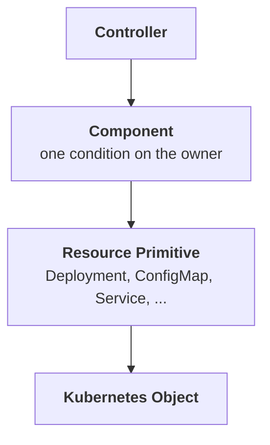
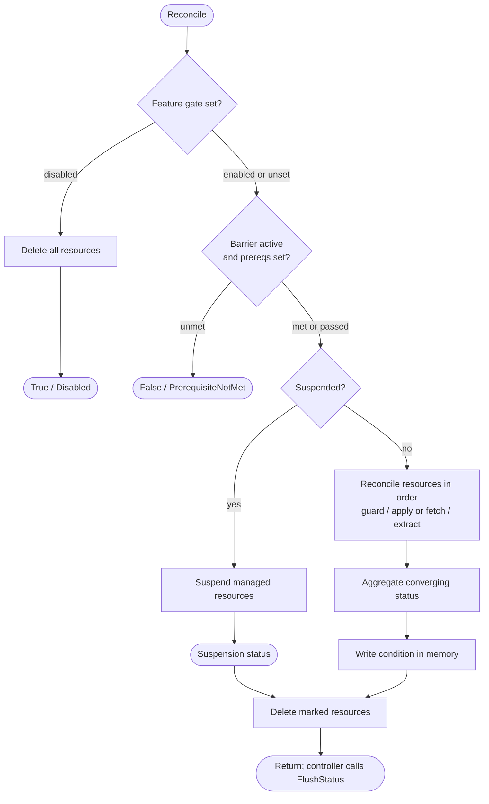
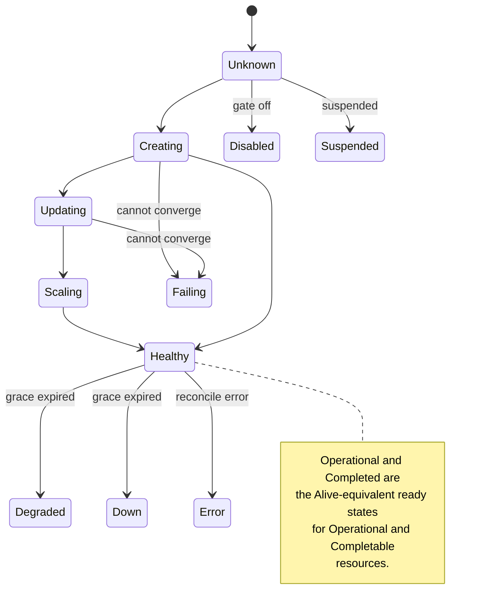

# Component

For operator authors implementing reconcilers. This page covers how a component is built, how it reconciles a set of
resources, and how their individual states aggregate into a single condition on the owner object.

A **Component** groups related Kubernetes resources into one behavioral unit. It reconciles those resources, manages
their shared lifecycle (feature gating, prerequisites, suspension, grace periods, guards), and reports their aggregate
health through a single condition on the owner CRD.



For the broader mental model and the primitive layer beneath a component, see the [Primitives Overview](primitives.md).
For operator-structuring advice (one component per condition, thin controllers, participation modes), see the
[Guidelines](guidelines.md).

## Building a Component

Components are constructed through a builder. The builder collects resource registrations, configuration, and lifecycle
flags, then produces an immutable `Component` ready for reconciliation.

```go
comp, err := component.NewComponentBuilder().
    WithName("frontend").
    WithConditionType("FrontendReady").
    WithFeatureGate(frontendFeature).                       // optional: disable to remove all resources
    WithPrerequisite(component.DependsOn("BackendReady")).  // optional: wait for another component
    WithResource(frontendConfig, component.ReadOnly()).
    WithResource(frontendDeployment).
    WithResource(frontendService).
    WithResource(legacyService, component.Delete()).
    WithGracePeriod(5 * time.Minute).
    Suspend(owner.Spec.Suspended).
    Build()
if err != nil {
    return err
}
```

### Resource registration options

Each resource is registered via `WithResource`. The second argument accepts zero or more `ResourceOption` values that
control how the component interacts with the resource. A `nil` option is ignored, so a conditionally-assigned option can
be passed without a guard.

| Option                                              | Behavior                                                                                                                                                                                                                                |
| --------------------------------------------------- | --------------------------------------------------------------------------------------------------------------------------------------------------------------------------------------------------------------------------------------- |
| (none)                                              | **Managed**: created or updated via Server-Side Apply; health contributes to the condition                                                                                                                                              |
| `component.ReadOnly()`                              | **Read-only**: fetched but never modified; health still contributes                                                                                                                                                                     |
| `component.Delete()` / `component.DeleteWhen(cond)` | **Delete**: removed from the cluster (unconditionally, or when `cond` is true); does not contribute to health                                                                                                                           |
| `component.GatedBy(gate)`                           | Deletes the resource when the feature gate is disabled; managed when enabled                                                                                                                                                            |
| `component.OrphanWhen(cond)`                        | **Orphan**: when `cond` is true, removes the component's owner reference and stops managing the resource, leaving the object in the cluster; does not contribute to health. Mutually exclusive with the deletion options and `ReadOnly` |
| `component.Unowned()`                               | **Unowned**: created and updated normally, but no owner reference is set; not garbage-collected on owner CR deletion                                                                                                                    |
| `component.Auxiliary()`                             | The resource's health does not contribute to the component condition (a blocked guard still does)                                                                                                                                       |
| `component.BlockOnAbsence()`                        | Read-only only: a NotFound records a blocked status and short-circuits the remaining resources                                                                                                                                          |
| `component.IgnoreIfAbsent()`                        | Read-only only: a NotFound is silently ignored and last-known state is preserved                                                                                                                                                        |
| `component.SuppressGraceInconsistencyWarning()`     | Suppresses the grace/convergence inconsistency warning                                                                                                                                                                                  |

A read-only resource is not owned by the component, so it is never deleted. `ReadOnly()` is mutually exclusive with
`Delete()`, `DeleteWhen()`, `GatedBy()`, and `OrphanWhen()`; combining them is a build error. `BlockOnAbsence()` and
`IgnoreIfAbsent()` each require `ReadOnly()` and are mutually exclusive with each other. To conditionally include a
read-only resource, use [`IncludeWhen`](#includewhen-vs-gatedby), which omits the resource without deleting it.

`Unowned()` resources are created and updated by the component but are not garbage-collected when the owner CR is
deleted, because no controller owner reference is set. This is intended for resources that must outlive the management
lifecycle — for example, backup records that should persist after the application CR is removed. An `Unowned` resource
is still subject to explicit deletion: `Delete()`, `DeleteWhen()`, `GatedBy()` (when the gate is disabled), and
suspension with `DeleteOnSuspend()` all delete it directly, regardless of the `Unowned` flag. Only Kubernetes GC
(triggered by owner CR deletion) is suppressed.

Options compose. Gate a resource and exclude it from health aggregation in one call:

```go
component.NewComponentBuilder().
    WithName("api").
    WithConditionType("ApiReady").
    WithResource(apiDeployment).
    WithResource(metricsExporter, component.GatedBy(tracingGate), component.Auxiliary()).
    Build()
```

When `tracingGate` is disabled, the exporter is deleted. When enabled, it is managed but does not block the component
from becoming ready.

### IncludeWhen vs. GatedBy

These two options look similar but answer different questions, and choosing the wrong one either deletes a resource you
do not own or fails to clean up one you do:

- **`GatedBy` / `DeleteWhen` conditionally render a resource the component owns.** When the condition turns off, the
  resource is **deleted** from the cluster. Reach for these to make an owned resource exist for some states and be
  removed for others.
- **`IncludeWhen` conditionally includes a resource and never deletes it.** When the condition is false the resource is
  omitted entirely: not created, read, or deleted, and its constructor is never called.

`IncludeWhen`'s primary purpose is optional, externally-owned resources that may or may not exist, most commonly a
read-only reference to a Secret or ConfigMap owned by the user or another operator behind an optional spec field.
Because construction is deferred behind the `func() Resource` closure, the builder may safely dereference the optional
input that determined inclusion.

```go
// Optional, externally-owned read-only reference. Construction is deferred, so
// the closure only dereferences ConfigRef when it is non-nil.
builder.IncludeWhen(spec.ConfigRef != nil, func() component.Resource {
    r := spec.ConfigRef
    res, _ := configmap.NewBuilder(&corev1.ConfigMap{
        ObjectMeta: metav1.ObjectMeta{Name: r.Name, Namespace: r.Namespace},
    }).Build()
    return res
}, component.ReadOnly(), component.BlockOnAbsence())
```

A secondary use is migrating a resource from tracked to untracked without deleting it. Moving a resource from
`WithResource` (or `IncludeWhen(true, ...)`) to `IncludeWhen(false, ...)` drops it from the component entirely: the
component no longer creates, updates, or deletes it, so an already-present resource is left in place, rather than
removed the way `GatedBy` or `DeleteWhen` would.

!!! note "Untracking vs. releasing"

    `IncludeWhen(false, ...)` only stops the component from touching the resource; it does not remove the owner reference
    the component set while the resource was managed, so Kubernetes still garbage-collects the resource when the owner is
    deleted. To release a resource so it outlives its owner (for example, to migrate it to a new owner), use
    [`OrphanWhen(cond)`](#resource-registration-options) instead: when the condition is true the component removes its
    owner reference and stops managing the resource, leaving the object in the cluster and no longer tied to the owner's
    lifecycle.

## Feature Gates

A component-level feature gate controls whether the component is active. When the gate is disabled, the component
deletes all of its resources and reports a `True` condition with reason `Disabled`. When enabled (or not set), the
component reconciles normally.

```go
comp, err := component.NewComponentBuilder().
    WithName("monitoring-sidecar").
    WithConditionType("MonitoringReady").
    WithFeatureGate(monitoringFeature).
    WithResource(exporterDeployment).
    WithResource(exporterService).
    Suspend(owner.Spec.Suspended).
    Build()
```

A disabled feature gate takes precedence over suspension. If the gate is disabled and the component is also marked
suspended, the component is treated as disabled (resources deleted), not suspended.

The condition when the gate is disabled:

```yaml
type: MonitoringReady
status: "True"
reason: Disabled
message: "Component is disabled."
```

The `True` status follows the convention that `True` means "in its expected state", consistent with how a `Suspended`
component also reports `True`.

!!! note

    If the gate's `Enabled()` evaluation returns an error, the component reports reason `FeatureGateError` rather than
    `Disabled` or a generic `Error`. This distinct reason lets the prerequisite barrier tell a pre-prerequisite failure
    apart from a post-prerequisite one.

## Prerequisites

Prerequisites are initialization barriers that prevent a component from reconciling until a condition is met. Unlike
resource-level [guards](#guards), prerequisites are evaluated only while the component's condition reason indicates it
has not yet proceeded past initialization. The barrier remains active while the condition reason is `Unknown`,
`PrerequisiteNotMet`, `Disabled`, or `FeatureGateError`. Once the reason changes to any other value, the barrier is
permanently passed and the prerequisite is never re-evaluated.

This makes prerequisites suitable for startup dependencies between components. If a dependency later becomes unhealthy,
the dependent component keeps reconciling its own resources. Prerequisites answer "can this component be created?", not
"should this component keep running?".

### Registering prerequisites

Prerequisites are registered with `WithPrerequisite`. Multiple may be registered; all must be satisfied before the
component proceeds.

```go
comp, err := component.NewComponentBuilder().
    WithName("frontend").
    WithConditionType("FrontendReady").
    WithPrerequisite(component.DependsOn("BackendReady")).
    WithPrerequisite(component.DependsOn("CacheReady")).
    WithResource(frontendDeployment).
    WithResource(frontendService).
    Suspend(owner.Spec.Suspended).
    Build()
```

The built-in `DependsOn` helper checks whether a named condition on the owner has `Status: True`. The owner is read from
the `ReconcileContext` passed to `Check`, so no cluster reads are performed.

For custom logic, implement the `Prerequisite` interface:

```go
type Prerequisite interface {
    Check(rec ReconcileContext) (PrerequisiteResult, error)
}
```

### Prerequisite behavior

- Prerequisites are evaluated before any resource is reconciled or suspended.
- The barrier is active while the condition reason is `Unknown`, `PrerequisiteNotMet`, `Disabled`, or
  `FeatureGateError`. Any other reason means the component has proceeded past initialization and the barrier is
  permanently passed.
- While the barrier is active, suspension is a no-op. No resources exist to suspend.
- A feature gate check runs before the prerequisite check. If the gate is disabled, prerequisites are not evaluated.
- Prerequisites are evaluated in registration order. The first unmet prerequisite short-circuits the check.
- A prerequisite error sets the component condition to `False` with reason `PrerequisiteNotMet`.

A blocked prerequisite produces a condition like:

```yaml
type: FrontendReady
status: "False"
reason: PrerequisiteNotMet
message:
  'Prerequisite not met: waiting for condition "BackendReady" to become True (currently False: Backend is still creating
  resources)'
```

## Reconciliation Lifecycle

`comp.Reconcile(ctx, recCtx)` runs the following steps on every call. They match the authoritative order in the
`Reconcile` GoDoc.

1. **Feature gate check.** If a feature gate is set and disabled, all managed resources are deleted and the condition is
   set to `True/Disabled`. No further processing occurs. A gate evaluation error sets `FeatureGateError`.
2. **Prerequisite check.** If prerequisites are registered and the initialization barrier is still active, all
   prerequisites are evaluated. If any is not met, the condition is set to `False/PrerequisiteNotMet` and no resources
   are reconciled or suspended.
3. **Suspension check.** If the component is marked suspended, `Suspend()` is called on all managed (non-read-only)
   resources, the condition is updated to reflect suspension progress, pending deletions are processed, and the
   remaining steps are skipped. Guards are not evaluated during suspension.
4. **Resource reconciliation.** All non-delete resources are processed sequentially in registration order, managed or
   read-only alike. For each resource: its guard (if any) is evaluated and a blocked guard stops that resource and all
   later ones; the resource is applied (managed) or fetched (read-only); its data extractors run immediately, making
   extracted data available to subsequent resources' guards and mutations.
5. **Status aggregation.** The converging status of every processed resource is collected, including any blocked-guard
   result.
6. **Condition update.** A new component condition is derived from the aggregate resource status, the previous
   condition, and the configured grace period, then written to the owner **in memory only**. `Reconcile` never calls the
   Kubernetes status API; the controller persists with [`FlushStatus`](#persisting-status-with-flushstatus).
7. **Resource deletion.** Resources registered for deletion are removed from the cluster.



A read-only resource registered before a managed one can extract data that feeds the managed resource's guard or
mutations within the same reconcile cycle. Read-only resources that implement `ObservationRecorder` have the fetched
object recorded back onto them so later inspection sees live cluster state; resources built from `generic.BaseResource`
do this automatically. Managed resources are applied with Server-Side Apply and receive a controller owner reference,
except where the owner is namespace-scoped and the resource is cluster-scoped (see
[Cluster-scoped resources](#cluster-scoped-resources)).

### Previewing desired state

`Component.Preview() ([]client.Object, error)` renders the desired state of every managed resource in registration order
without contacting the cluster. Read-only resources (fetched, not applied) and delete resources (removal markers) are
excluded.

`Preview` does not evaluate guards. Reconcile stops at the first resource whose guard is `Blocked` and skips it and all
later ones, but a guard's outcome usually depends on cluster state and earlier extracted data, neither of which exists
in a cluster-free render. `Preview` therefore returns the full desired set, including resources a given reconcile might
skip behind a blocked guard, which keeps the snapshot deterministic and focused on baseline construction, mutation
wiring, and registration order.

Each managed resource must implement [`concepts.Previewable`](primitives.md#lifecycle-interfaces) (`Preview()`). All
built-in primitives satisfy it through `generic.BaseResource`. A custom resource must implement it to be previewable;
without it, `Component.Preview` returns an error for that resource. `Preview` is the natural input for whole-component
golden snapshots via `golden.AssertComponentYAML`.

```go
objs, err := comp.Preview()
if err != nil {
    return err
}
for _, obj := range objs {
    fmt.Printf("%s/%s\n", obj.GetNamespace(), obj.GetName())
}
```

If you need the concrete Kubernetes type rather than `client.Object`, type-assert the returned value:

```go
dep, ok := objs[0].(*appsv1.Deployment)
```

`Component.Resource(identity string) (Resource, bool)` looks up a registered resource by its `Identity()` string,
covering managed, read-only, and delete resources. For namespaced resources the identity is
`<apiVersion>/<kind>/<namespace>/<name>` (for example `apps/v1/Deployment/default/frontend`); cluster-scoped resources
omit the namespace segment (for example `rbac.authorization.k8s.io/v1/ClusterRole/viewer`).

The component also satisfies `concepts.MutationInspector` (`RegisteredMutations()` and `FiringSet()`), which surfaces
the names of registered mutations and the subset that fire at the version the component was built at. A custom resource
implements the same interface so version-matrix golden generation can introspect it. See
[`concepts.MutationInspector`](primitives.md#lifecycle-interfaces) for the contract and the [Testing](testing.md) guide
for how it drives version-matrix goldens.

### Cluster-scoped resources

When a component manages cluster-scoped resources (such as `ClusterRole` or `PersistentVolume`) and the owner CRD is
namespace-scoped, the framework **automatically skips** setting a controller owner reference on those resources. A
namespace-scoped object cannot own a cluster-scoped object. The scope of both owner and resource is determined at
reconcile time using the cluster's REST mapper; no configuration is needed, and the framework logs an info-level
message.

!!! warning

    Without an owner reference, cluster-scoped resources are **not** garbage-collected when the owner is removed. To
    ensure cleanup, either register the resource with `component.Delete()` so it is removed during reconciliation, or
    add a finalizer on the owner CRD that cleans up cluster-scoped resources before the owner is deleted.

If the owner CRD is itself cluster-scoped, owner references are set normally on all resources regardless of scope.

## Status Model

A component reports one condition whose reason is a `component.Status` value. Which states are reachable depends on
which [lifecycle interfaces](primitives.md#lifecycle-interfaces) a resource implements: long-running workloads report
`Alive` states, run-to-completion resources report `Completable` states, externally-dependent resources report
`Operational` states, and resources implementing none of these are ready as long as they exist. The component aggregates
across all registered resources and surfaces the most critical state.

For the raw lifecycle-interface to status-string mapping, see
[Primitives Overview: Lifecycle Interfaces](primitives.md#lifecycle-interfaces). This page owns the priority and
aggregation behavior.



### Condition priority and aggregation

When several resources are aggregated into one condition, the framework selects the state with the highest priority.
`Status.Priority()` defines the order: a higher number wins. The table below lists every reason in descending priority,
so a reader can determine exactly how a failing or mixed-state component aggregates. `Error` and `FeatureGateError`
outrank everything; the ready states (`Healthy`, `Operational`, `Completed`) are the lowest non-zero priorities;
`Unknown` and any unrecognized reason are priority `0` and never influence aggregation.

| Priority | Reason(s)                                        | Condition status | Category                                   |
| -------- | ------------------------------------------------ | ---------------- | ------------------------------------------ |
| 20       | `Error`, `FeatureGateError`                      | `False`          | Reconcile or gate failure                  |
| 19       | `Down`                                           | `False`          | Grace expired, non-functional              |
| 18       | `Degraded`                                       | `False`          | Grace expired, partially functional        |
| 17       | `PendingSuspension`                              | `True`           | Suspension acknowledged, not started       |
| 16       | `Suspending`                                     | `True`           | Converging towards suspended               |
| 15       | `Suspended`                                      | `True`           | Fully suspended                            |
| 14       | `Disabled`                                       | `True`           | Feature gate disabled                      |
| 13       | `AliveFailing` (`Failing`)                       | `False`          | Workload cannot converge                   |
| 12       | `OperationFailing`                               | `False`          | Integration cannot become operational      |
| 11       | `CompletionFailing` (`TaskFailing`)              | `False`          | Task finished with an error                |
| 10       | `GuardBlocked` (`Blocked`), `PrerequisiteNotMet` | `False`          | Precondition not met                       |
| 9        | `AliveScaling` (`Scaling`)                       | `False`          | Workload converging                        |
| 8        | `CompletionRunning` (`TaskRunning`)              | `False`          | Task running                               |
| 7        | `AliveUpdating` (`Updating`)                     | `False`          | Workload converging                        |
| 6        | `AliveCreating` (`Creating`)                     | `False`          | Workload converging                        |
| 5        | `OperationPending`                               | `False`          | Integration waiting on a dependency        |
| 4        | `CompletionPending` (`TaskPending`)              | `False`          | Task waiting to start                      |
| 3        | `Healthy`                                        | `True`           | Workload ready                             |
| 2        | `Operational`                                    | `True`           | Integration ready                          |
| 1        | `Completed`                                      | `True`           | Task finished successfully                 |
| 0        | `Unknown` and unrecognized                       | `Unknown`        | Not yet reconciled; ignored in aggregation |

!!! note

    The reason string written to the condition is the runtime status value. Several `component.Status` constants alias a
    shared value: `AliveFailing` is `"Failing"`, `GuardBlocked` is `"Blocked"`, and the `Completion*` constants map to
    `"Completed"`, `"TaskRunning"`, `"TaskPending"`, and `"TaskFailing"`. The parentheses in the table give the runtime
    value where it differs from the constant name.

A resource registered with [`component.Auxiliary()`](#resource-registration-options) does not contribute its converging
health to this aggregation. A blocked guard on an auxiliary resource still contributes, because a blocked guard halts
the whole pipeline.

## Grace Period

The grace period defines how long a component may remain in a converging state (`Creating`, `Updating`, `Scaling`)
before escalating to `Degraded` or `Down`.

```go
component.NewComponentBuilder().
    WithGracePeriod(5 * time.Minute).
    // ...
```

During the grace period the component reports its real converging state, not a failure. After the period expires, if the
component is still not ready, a `Graceful` resource's `GraceStatus()` determines the post-expiry severity: `Healthy` (no
issue), `Degraded` (partially functional), or `Down` (non-functional). This prevents spurious failure alerts during
normal operations such as rolling updates. See the [Guidelines](guidelines.md) for choosing grace durations.

## Suspension

Suspension intentionally deactivates a component without deleting its configuration. When `Suspend(true)` is set on the
builder:

1. The component calls `Suspend()` on all `Suspendable` resources.
2. Each resource performs its suspension behavior, typically scaling to zero replicas.
3. The component polls `SuspensionStatus()` on each resource.
4. Once all resources report `Suspended`, the condition transitions to `Suspended`.

The progression reports `PendingSuspension`, then `Suspending`, then `Suspended` (all with condition status `True`).

Resources that do not yet exist in the cluster are created in their suspended state, with suspension mutations already
applied (a Deployment is created with zero replicas), so the resource is immediately available when suspension ends.
Resources with `DeleteOnSuspend` enabled are **not** created if already absent; their absence is treated as already
suspended, which avoids a create-then-delete loop on every reconcile while the component stays suspended. Resources that
are not `Suspendable` are left in place.

## ReconcileContext

`ReconcileContext` carries all dependencies for a reconciliation pass. Pass it from your controller on each call:

```go
recCtx := component.ReconcileContext{
    Client:   r.Client,    // sigs.k8s.io/controller-runtime/pkg/client
    Scheme:   r.Scheme,    // *runtime.Scheme
    Recorder: r.Recorder,  // record.EventRecorder
    Metrics:  r.Metrics,   // component.Recorder (condition metrics), optional
    Owner:    owner,       // the CRD that owns this component
}

err = comp.Reconcile(ctx, recCtx)
```

Dependencies are passed explicitly so components stay testable and decoupled from global state. The `Metrics` field is
optional; when set, the framework records Prometheus metrics for every condition reported during a reconcile, using the
recorder from [go-crd-condition-metrics](https://github.com/sourcehawk/go-crd-condition-metrics). Leave it `nil` to opt
out.

## Persisting Status with FlushStatus

`Component.Reconcile` only mutates the owner's status conditions in memory. The controller persists them by calling
`component.FlushStatus` once per reconcile, typically from a deferred call so that conditions set on error paths are
still written:

```go
func (r *WebAppReconciler) Reconcile(ctx context.Context, req reconcile.Request) (_ reconcile.Result, err error) {
    owner := &v1alpha1.WebApp{}
    if err := r.Get(ctx, req.NamespacedName, owner); err != nil {
        return reconcile.Result{}, client.IgnoreNotFound(err)
    }

    recCtx := component.ReconcileContext{
        Client:   r.Client,
        Scheme:   r.Scheme,
        Recorder: r.Recorder,
        Metrics:  r.Metrics,
        Owner:    owner,
    }
    defer func() {
        if flushErr := component.FlushStatus(ctx, recCtx); flushErr != nil && err == nil {
            err = flushErr
        }
    }()

    comp, err := buildFrontendComponent(owner)
    if err != nil {
        return reconcile.Result{}, err
    }
    return reconcile.Result{}, comp.Reconcile(ctx, recCtx)
}
```

`FlushStatus` performs one `Status().Update` call that writes every condition currently on the owner in memory, wrapped
in `retry.RetryOnConflict`. If another writer updated the owner between the controller's initial `Get` and this call,
`FlushStatus` refetches, reapplies the conditions staged during the reconcile, and retries. Conditions managed by other
writers on the same owner are preserved because `meta.SetStatusCondition` merges by condition type. After a successful
update, `FlushStatus` records metrics for every condition on the owner; if `Metrics` is `nil`, recording is skipped.

This split is what lets a controller with several components stage several conditions during one reconcile and persist
them in a single write. Persisting after each component would race the components' writes and produce 409 conflicts. See
[Keep Controllers Thin](guidelines.md#keep-controllers-thin) and
[One Component Per Logical Condition](guidelines.md#one-component-per-logical-condition).

## Guards

Guards let resources within a component express runtime dependencies on each other. A guard is a precondition function
registered on a resource and evaluated before the resource is applied. If the guard returns `Blocked`, the resource and
all resources registered after it are skipped for that reconcile cycle.

Combined with per-resource data extraction, guards enable indirect dependency graphs: resource A is applied first, its
data extractor populates a shared variable, and resource B's guard checks that variable before allowing B to proceed.

### Registering a guard

Guards are registered on the resource builder with `WithGuard`. The guard receives a copy of the resource object and
returns a `concepts.GuardStatusWithReason`. The following example shows the full pattern: a first resource extracts a
value after being applied, and a second resource guards against running before that value is available.

```go
func buildBackendComponent(owner *v1alpha1.WebApp, endpoint *string) (*component.Component, error) {
    // First resource: a config source. After it is applied, the data extractor
    // reads a value from the live object into *endpoint.
    configRes, err := static.NewBuilder(newBackendConfig(owner)).
        WithDataExtractor(func(obj uns.Unstructured) error {
            *endpoint = obj.Object["data"].(map[string]any)["endpoint"].(string)
            return nil
        }).
        Build()
    if err != nil {
        return nil, err
    }

    // Second resource: a consumer that needs the extracted endpoint. Its guard
    // blocks until *endpoint is populated earlier in this same reconcile cycle;
    // the mutation then injects the value at Mutate() time.
    consumerRes, err := static.NewBuilder(newBackendConsumer(owner)).
        WithGuard(func(_ uns.Unstructured) (concepts.GuardStatusWithReason, error) {
            if *endpoint == "" {
                return concepts.GuardStatusWithReason{
                    Status: concepts.GuardStatusBlocked,
                    Reason: "waiting for backend endpoint",
                }, nil
            }
            return concepts.GuardStatusWithReason{Status: concepts.GuardStatusUnblocked}, nil
        }).
        WithMutation(unstruct.Mutation{
            Name: "set-endpoint",
            Mutate: func(m *unstruct.Mutator) error {
                m.EditContent(func(e *editors.UnstructuredContentEditor) error {
                    return e.SetNestedString(*endpoint, "spec", "endpoint")
                })
                return nil
            },
        }).
        Build()
    if err != nil {
        return nil, err
    }

    // Registration order matters: the config source must be registered before the consumer.
    return component.NewComponentBuilder().
        WithName("backend").
        WithConditionType("BackendReady").
        WithResource(configRes).
        WithResource(consumerRes).
        Build()
}
```

The guard receives the resource's object but need not use it. Guards that only check external state (closure variables
populated by prior extractors) can ignore the parameter.

### Guard behavior

- Guards are evaluated in registration order, before each resource is applied.
- When a guard returns `Blocked`, the blocked resource contributes a `Blocked` status to the component condition
  regardless of its participation mode, and all resources after it are skipped entirely. This override exists because a
  blocked guard halts the entire pipeline; subsequent required resources would otherwise be silently absent from health
  aggregation.
- On the next reconcile, if the guard clears (`Unblocked`), the resource is applied normally.
- Guards are **not** evaluated during suspension. The suspension path always proceeds regardless of guard state.
- A guard evaluation error is treated as a reconciliation failure and sets the condition to `Error`.

A blocked guard produces a condition like:

```yaml
type: BackendReady
status: "False"
reason: Blocked
message: "waiting for backend endpoint"
```

The `Blocked` status is not sticky. It is self-reinforcing only because the guard re-evaluates on every reconcile; when
the guard clears, the status immediately transitions to the next applicable state (for example `Creating`).

!!! note

    `concepts.GuardStatusUnblocked` is an internal control signal returned by a guard to let reconciliation proceed. It
    is never written to a condition, so you will not see `Unblocked` as a condition reason.

## Component-Specific Guidance

General operator-structuring advice (one component per condition, keeping controllers thin, grouping by lifecycle,
naming conditions for their audience) lives in the [Guidelines](guidelines.md). The one piece specific to this page:

**Use `component.Auxiliary()` for non-critical resources.** A metrics-exporter sidecar should not block your primary
component from becoming ready. Every resource defaults to `ParticipationModeRequired`, so register a resource with
`component.Auxiliary()` when its health should not gate the component condition. A blocked guard on an auxiliary
resource still contributes, because a blocked guard halts the whole pipeline. See
[Understand Participation Modes](guidelines.md#understand-participation-modes) for the full discussion.
