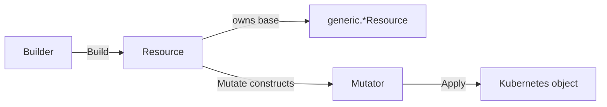

# Custom Resources

This guide is for operator authors who need to manage a Kubernetes object that the [built-in primitives](primitives.md)
do not cover. The built-in set handles the common kinds (Deployments, StatefulSets, ConfigMaps, Services, and more) and
is highly customizable through status handlers, suspension logic, mutations, and declared data. Reach for a custom
resource only when the kind you manage has no matching primitive:

- A **custom CRD** defined by your project or a third-party operator.
- A **standard Kubernetes kind** that the built-in set does not yet wrap.

The `pkg/generic` package provides the building blocks: it handles reconciliation mechanics, the plan-and-apply mutation
flow, suspension, guards, and data extraction. Your package wraps a generic resource with kind-specific identity,
status, and mutator logic, exactly the way the built-in primitives do.

!!! note "If your CRD has no typed Go struct"

    You can manage any CRD without writing a wrapper at all by using the unstructured static primitive
    (`pkg/primitives/unstructured/static`). See [Unstructured Primitives](primitives.md#unstructured-primitives). This
    guide covers the wrapper pattern, which gives you a typed, self-documenting API for a kind you manage often.

!!! tip "Generate this pattern"

    `ocf scaffold wrapper` generates the complete package this page describes: mutator, builder, resource, and tests,
    compiling and passing on a fresh scaffold. See the [CLI](cli.md) guide. This page stays the reference for what the
    generated code means and what to replace in it.

---

## Steps

1. [Choose a resource category](#1-choose-a-resource-category)
2. [Define the mutation type alias](#2-define-the-mutation-type-alias)
3. [Implement the mutator](#3-implement-the-mutator)
4. [Implement status handlers](#4-implement-status-handlers)
5. [Implement the builder](#5-implement-the-builder)
6. [Implement the resource](#6-implement-the-resource)
7. [Define feature mutations](#7-define-feature-mutations)
8. [Register with a component](#8-register-with-a-component)

A custom resource is three wrapped pieces. The builder configures and validates, producing a resource; the resource
delegates lifecycle methods to a generic base; the mutator records and applies changes to the Kubernetes object.



| Your type  | Wraps                                                         |
| ---------- | ------------------------------------------------------------- |
| `Builder`  | `generic.WorkloadBuilder[T, *Mutator]` (or one per category)  |
| `Resource` | `generic.WorkloadResource[T, *Mutator]` (or one per category) |
| `Mutator`  | Implements `generic.FeatureMutator`                           |

The examples below build a `MessageQueue` CRD (`messagequeues.example.io/v1`), a long-running broker with replica-based
health, so it is a **workload**. [Step 4](#4-implement-status-handlers) and the
[category notes](#category-specific-notes) show the other categories.

---

## Generated and hand-written files

`ocf scaffold wrapper` owns exactly four files in a wrapper package: `builder.go`, `builder_test.go`, `mutator.go`, and
`resource.go`. Every other file in the directory is yours. `--force` rewrites those four and leaves the rest alone, as
[Regenerating](cli.md#regenerating) describes.

This boundary is the package layout, not a workaround for one. Your real status handlers and your mutator helpers live
in files of their own beside the generated four, so a regeneration cannot touch them.

```text
messagequeue/
  builder.go        # generated
  builder_test.go   # generated
  mutator.go        # generated
  resource.go       # generated
  handlers.go       # hand-written: the real converge, grace and suspension handlers
  podtemplate.go    # hand-written: mutator helpers built on editors and selectors
```

To take a newer CLI's scaffold into an existing wrapper:

1. Commit or stash the working tree first, so the regeneration diff is readable.
2. Re-run `ocf scaffold wrapper` with the same `--type`, `--variant`, and `--group` values, plus `--force`.
3. Read the diff on the four generated files. Your own files are unchanged.
4. Point `NewBuilder` back at your handlers. The regenerated `builder.go` registers the scaffolded `Default*Handler`
   stubs again, because it carries both the stubs and their registration.
5. Run `go build ./...` and the package tests.

Step 4 is the only manual step, and it is the reason the real handlers belong in `handlers.go`. Regeneration replaces
the registration in `builder.go`, never the handlers you wrote.

---

## 1. Choose a resource category

The framework defines four resource categories. Each maps to a generic resource type with a different set of lifecycle
interfaces. For the full description of each interface and the runtime string values it reports, see
[Lifecycle Interfaces](primitives.md#lifecycle-interfaces).

| Category        | Generic type                  | Lifecycle interfaces                                                     | Use when                                               |
| --------------- | ----------------------------- | ------------------------------------------------------------------------ | ------------------------------------------------------ |
| **Workload**    | `generic.WorkloadResource`    | `Alive`, `Graceful`, `Suspendable`, `Guardable`, `DataExtractable`       | Long-running processes with replica-based health       |
| **Static**      | `generic.StaticResource`      | `Guardable`, `DataExtractable`                                           | Configuration objects with no runtime health semantics |
| **Task**        | `generic.TaskResource`        | `Completable`, `Suspendable`, `Guardable`, `DataExtractable`             | Run-to-completion workloads                            |
| **Integration** | `generic.IntegrationResource` | `Operational`, `Graceful`, `Suspendable`, `Guardable`, `DataExtractable` | External-dependency objects (services, ingresses)      |

In addition to the category-specific interfaces, every generic resource also satisfies
[`concepts.Previewable`](primitives.md#lifecycle-interfaces), `concepts.MutationInspector`, `concepts.DataProducer`, and
`concepts.DataConsumer`, and your wrapper exposes all four. They are covered in [Step 6](#6-implement-the-resource).

The rest of the guide uses Workload as the primary example. The pattern is identical for the other categories, with
fewer handlers to implement.

---

## 2. Define the mutation type alias

Create a type alias for `feature.Mutation` parameterized on your mutator. This gives callers a clean name when defining
feature mutations, mirroring the `Mutation` alias each built-in primitive exports.

```go
package messagequeue

import "github.com/sourcehawk/operator-component-framework/pkg/feature"

// Mutation defines a feature-gated mutation applied to a MessageQueue resource.
type Mutation = feature.Mutation[*Mutator]
```

---

## 3. Implement the mutator

The mutator records mutation intent and applies it in a single controlled pass. It must implement
`generic.FeatureMutator`:

```go
type FeatureMutator interface {
    Apply() error
    NextFeature()
}
```

`Apply()` executes all recorded mutations against the underlying object. `NextFeature()` advances to a new feature
scope; the framework calls it between each registered mutation to maintain per-feature ordering boundaries.

### Plan and apply

Mutator methods **record intent** rather than modifying the object directly. The framework calls `Apply()` once, after
all mutations have been recorded. This is the same plan-and-apply model the built-in primitives use; see
[The Mutation System](primitives.md#the-mutation-system) for the rationale and the ordering guarantees.

```go
package messagequeue

import (
    examplev1 "example.io/api/v1"
)

// featurePlan groups all mutation operations recorded by a single feature.
type featurePlan struct {
    replicaOps []func(*examplev1.MessageQueueSpec)
    configOps  []func(*examplev1.MessageQueueSpec)
}

// Mutator records mutation intent for a MessageQueue and applies changes in one pass.
//
// It maintains feature boundaries: each feature's mutations are planned together
// and applied in the order the features were registered.
type Mutator struct {
    current *examplev1.MessageQueue

    plans  []featurePlan
    active *featurePlan
}

// NewMutator creates a new Mutator for the given MessageQueue.
//
// The constructor creates the initial feature scope, so mutations can be
// registered immediately.
func NewMutator(current *examplev1.MessageQueue) *Mutator {
    m := &Mutator{current: current}
    m.NextFeature()
    return m
}

// NextFeature advances to a new feature planning scope. All subsequent mutation
// registrations are grouped into this scope until NextFeature is called again.
//
// The first scope is created automatically by NewMutator. The framework calls
// this method between mutations to maintain per-feature ordering semantics.
func (m *Mutator) NextFeature() {
    m.plans = append(m.plans, featurePlan{})
    m.active = &m.plans[len(m.plans)-1]
}

// SetMaxConnections records intent to set the maximum connection count.
func (m *Mutator) SetMaxConnections(count int32) {
    m.active.configOps = append(m.active.configOps, func(spec *examplev1.MessageQueueSpec) {
        spec.MaxConnections = count
    })
}

// SetReplicas records intent to set the replica count.
func (m *Mutator) SetReplicas(replicas int32) {
    m.active.replicaOps = append(m.active.replicaOps, func(spec *examplev1.MessageQueueSpec) {
        spec.Replicas = &replicas
    })
}

// Apply executes all recorded mutations against the MessageQueue.
// Features are applied in registration order. Within each feature,
// replica operations are applied before config operations.
func (m *Mutator) Apply() error {
    for _, plan := range m.plans {
        for _, op := range plan.replicaOps {
            op(&m.current.Spec)
        }
        for _, op := range plan.configOps {
            op(&m.current.Spec)
        }
    }

    return nil
}
```

!!! note "Mutator design"

    - **Record, don't mutate.** Methods like `SetMaxConnections` append to the active feature plan. They do not touch
      `current` directly.
    - **Scope per feature.** `NextFeature()` opens a new plan scope. The framework calls it between registered mutations
      so each feature's operations are grouped and applied in registration order. `Apply()` iterates plans
      sequentially, so each feature sees the object as modified by all previous features.
    - **Keep it typed.** Expose domain-specific methods (`SetMaxConnections`, `SetReplicas`) rather than generic ones.
      This makes feature mutations self-documenting and keeps callers on the plan-and-apply path. The built-in workload
      mutators follow the same approach, layering convenience wrappers such as `EnsureReplicas` over lower-level edits.

### Extending the mutator with editors and selectors

The mutator above is written by hand, so its seam is whatever you gave it: `SetReplicas`, `SetMaxConnections`. A
scaffolded mutator is the same contract with a different surface. It exposes a general `Edit(func(*T) error)` alongside
`EditObjectMetadata`, and the rest of this section extends that one.

`Edit` and `EditObjectMetadata` are enough for flat specs. They are not enough for a CRD that carries a pod template per
node group, which is a common shape once a CRD describes a clustered workload. Written by hand, every container mutation
repeats the same find-the-container-or-add-it loop, and each copy of that loop is a place to get the selector semantics
wrong.

Put the hand-written helpers in their own file beside the generated `mutator.go` (see
[Generated and hand-written files](#generated-and-hand-written-files)) and build them on `pkg/mutation/editors` and
`pkg/mutation/selectors`. Every editor has an exported constructor that takes a pointer to the field it edits, so an
editor works on any object that contains that field. `editors.NewContainerEditor(container *corev1.Container)` brings
`EnsureEnvVars`, `EnsureArgs`, `SetResourceLimit`, and the rest to a container nested anywhere in your CRD, and
`editors.NewPodSpecEditor(spec *corev1.PodSpec)` does the same for volumes, tolerations, and node selectors.

Record the helper through the generated `Edit` method rather than adding a field to `featurePlan`. `Edit` appends to the
active feature plan and the generated `Apply` runs it in registration order, so the helper lives entirely in your own
file and survives the next `--force`. Its GoDoc asks for exactly this: wrap frequently used edits in named methods on
the mutator.

```go
// podtemplate.go, hand-written beside the generated mutator.go.
package messagequeue

import (
    "github.com/sourcehawk/operator-component-framework/pkg/mutation/editors"
    "github.com/sourcehawk/operator-component-framework/pkg/mutation/selectors"
    examplev1 "example.io/api/v1"
)

// EditNodeSetContainers records intent to edit every container in the named
// node set's pod template that matches the selector.
func (m *Mutator) EditNodeSetContainers(
    nodeSet string, sel selectors.ContainerSelector, fn func(*editors.ContainerEditor) error,
) {
    m.Edit(func(mq *examplev1.MessageQueue) error {
        for i := range mq.Spec.NodeSets {
            if mq.Spec.NodeSets[i].Name != nodeSet {
                continue
            }
            containers := mq.Spec.NodeSets[i].PodTemplate.Spec.Containers
            for j := range containers {
                if !sel(j, &containers[j]) {
                    continue
                }
                if err := fn(editors.NewContainerEditor(&containers[j])); err != nil {
                    return err
                }
            }
        }
        return nil
    })
}
```

A feature mutation then reads the way a built-in primitive's does:

```go
m.EditNodeSetContainers("data", selectors.ContainerNamed("broker"), func(e *editors.ContainerEditor) error {
    e.EnsureEnvVars(app.Spec.ExtraEnv)
    return nil
})
```

Selector semantics come with the selector: `selectors.AllContainers()` needs no name and survives a container rename,
and `selectors.ContainerNamed` and `selectors.ContainersNamed` match by name. Reuse them rather than comparing names in
the loop, so the same vocabulary describes a wrapper and a built-in workload.

!!! warning "Matching is not identical to the built-in workloads"

    A built-in workload mutator takes one snapshot of the containers per feature, after that feature's presence
    operations and **before** any of its edits run, then matches every selector in the feature against that snapshot. A
    rename by one edit therefore cannot change what a later edit in the same feature selects.

    A helper recorded through `Edit` cannot reproduce that. Each `Edit` closure runs in turn against the live object, so
    a second helper call in the same feature sees the renames performed by the first. Getting true parity would mean
    reimplementing the per-feature snapshot inside the generated `mutator.go`, which regeneration would erase.

    The consequence is the one the
    [mutation ordering guideline](guidelines.md#mutation-ordering-and-container-name-dependencies) already warns about,
    only with a smaller blast radius: register name-specific helper calls **before** any call that renames a container,
    or use name-independent selectors such as `selectors.AllContainers()`. Within a single helper call the question does
    not arise, because each `ContainerEditor` is scoped to the container it was given.

---

## 4. Implement status handlers

Status handlers translate your CRD's runtime state into framework status types. Which handlers you need depends on the
category.

### Required versus optional handlers

The generic builder's `Build()` fails if the convergence handler is missing. For workload and task resources this is the
converging-status handler registered with `WithCustomConvergeStatus`; for integration resources it is the
operational-status handler registered with `WithCustomOperationalStatus`. Every other handler has a default at the
generic layer:

- Grace status defaults to `Healthy` (workload and integration only).
- Suspension status defaults to `Suspended`.
- The suspension mutation defaults to a no-op.
- The delete-on-suspend decision defaults to `false`.

These defaults are safe **as a set**, not individually: together they mean suspension does nothing at all. Replace one
and the rest stop protecting you, which is why overriding only the delete-on-suspend decision deletes an object nothing
has made safe to delete (see [Scale-to-zero or delete-on-suspend?](#scale-to-zero-or-delete-on-suspend)).

Register custom handlers only where your CRD has domain-specific behavior. The workload handlers below mirror what
`pkg/primitives/deployment` registers by default.

The **status** handlers (converge, operational, grace, and suspension status) receive the object as it stands **after**
the apply of the current reconcile. `Mutate` stores the mutated object on the resource, and the Server-Side Apply patch
decodes the API server's response into that same object, so those handlers read server-populated fields, `Generation`
and `Status` included, and can trust `status.observedGeneration` to tell them whether the object's own controller has
seen the spec just applied.

The converge and operational status handlers also receive a `concepts.ConvergingOperation` that says what the apply did:
`Created` when the object did not exist before, `Updated` when the apply changed an existing object, and `None` when it
left the object as it was. The framework decides this by comparing the object observed before the Server-Side Apply
(read through the client, usually the informer cache) with the API server's response, ignoring `status`,
`managedFields`, `resourceVersion` and `generation`. It does not depend on how the desired object was built, so a
wrapper reports `None` on a steady-state reconcile whether the operator keeps its resources across reconciles or
rebuilds them each pass. Use the operation to distinguish `Creating` from `Updating` while `status.observedGeneration`
lags, as the example below does; do not use it as a change detector for anything the apply cannot see, such as external
state.

Three handlers are outside that guarantee. The **guard** runs before the resource is applied, which is its whole
purpose, so it sees the desired object rather than the server's response. The suspension **mutation** handler takes the
mutator rather than the object and runs before the patch is sent. The **delete-on-suspend decision** may be consulted
twice in a suspension pass, and the first call happens before the apply, on the short-circuit that avoids recreating an
already-absent resource. Do not read post-apply status in a guard or a deletion decision: base them on the spec, on
declared data, and on inputs available when the resource was built.

```go
package messagequeue

import (
    "fmt"

    "github.com/sourcehawk/operator-component-framework/pkg/component/concepts"
    examplev1 "example.io/api/v1"
)

// DefaultConvergingStatusHandler reports whether the MessageQueue has reached its desired state.
func DefaultConvergingStatusHandler(
    op concepts.ConvergingOperation, mq *examplev1.MessageQueue,
) (concepts.AliveStatusWithReason, error) {
    desired := int32(1)
    if mq.Spec.Replicas != nil {
        desired = *mq.Spec.Replicas
    }

    // Defer to the generation check first, so readiness fields are not read while
    // the CRD's own controller is still behind the latest spec.
    if status := concepts.StaleGenerationStatus(
        op, mq.Status.ObservedGeneration, mq.Generation, "messagequeue",
    ); status != nil {
        return *status, nil
    }

    if mq.Status.ReadyReplicas == desired {
        return concepts.AliveStatusWithReason{
            Status: concepts.AliveConvergingStatusHealthy,
            Reason: "All replicas are ready",
        }, nil
    }

    var status concepts.AliveConvergingStatus
    switch op {
    case concepts.ConvergingOperationCreated:
        status = concepts.AliveConvergingStatusCreating
    case concepts.ConvergingOperationUpdated:
        status = concepts.AliveConvergingStatusUpdating
    default:
        status = concepts.AliveConvergingStatusScaling
    }

    return concepts.AliveStatusWithReason{
        Status: status,
        Reason: fmt.Sprintf("Waiting for replicas: %d/%d ready", mq.Status.ReadyReplicas, desired),
    }, nil
}

// DefaultGraceStatusHandler reports health once the grace period has expired.
func DefaultGraceStatusHandler(mq *examplev1.MessageQueue) (concepts.GraceStatusWithReason, error) {
    desired := int32(1)
    if mq.Spec.Replicas != nil {
        desired = *mq.Spec.Replicas
    }

    // Use == rather than >= so grace and convergence agree on replica state.
    // Both handlers evaluate the same object in the same reconcile loop, so grace
    // must not return Healthy for a state convergence considers non-healthy
    // (e.g. ReadyReplicas > desired during scale-down).
    if mq.Status.ReadyReplicas == desired {
        return concepts.GraceStatusWithReason{
            Status: concepts.GraceStatusHealthy,
            Reason: "All replicas are ready",
        }, nil
    }

    if mq.Status.ReadyReplicas > 0 {
        return concepts.GraceStatusWithReason{
            Status: concepts.GraceStatusDegraded,
            Reason: "MessageQueue partially available",
        }, nil
    }

    return concepts.GraceStatusWithReason{
        Status: concepts.GraceStatusDown,
        Reason: "No replicas are ready",
    }, nil
}

// DefaultSuspensionStatusHandler reports progress towards a suspended state.
func DefaultSuspensionStatusHandler(
    mq *examplev1.MessageQueue,
) (concepts.SuspensionStatusWithReason, error) {
    if mq.Status.Replicas == 0 {
        return concepts.SuspensionStatusWithReason{
            Status: concepts.SuspensionStatusSuspended,
            Reason: "MessageQueue scaled to zero",
        }, nil
    }

    return concepts.SuspensionStatusWithReason{
        Status: concepts.SuspensionStatusSuspending,
        Reason: fmt.Sprintf("%d replicas still running", mq.Status.Replicas),
    }, nil
}

// DefaultSuspendMutationHandler scales the MessageQueue to zero replicas.
func DefaultSuspendMutationHandler(m *Mutator) error {
    m.SetReplicas(0)
    return nil
}

// DefaultDeleteOnSuspendHandler returns false: keep the resource, just scale down.
func DefaultDeleteOnSuspendHandler(_ *examplev1.MessageQueue) bool {
    return false
}
```

### Scale-to-zero or delete-on-suspend?

The handlers above scale the object to zero and keep it. That is the right default for a workload whose storage outlives
its pods. It is the wrong default for an external CR whose operator reclaims volumes when the CR scales down, because
suspension then erases the data it exists to preserve.

One question decides it: **does the external operator destroy state when it is scaled down?** If it does, suspend by
deletion behind a safety-gated status handler. If it does not, scale to zero.

The behavior to watch for is common among operators that manage stateful clusters: **the operator reclaims a node's
PersistentVolumeClaim when that node is scaled away**. Under that behavior a suspension mutation that sets the replica
or node count to zero destroys exactly the data suspension exists to preserve. Deleting the CR is the safe operation
instead, provided its spec carries a policy that retains the claims when the object is removed. On resume the CR is
recreated and the operator reattaches the claims it kept.

Read the CRD's own documentation for which field expresses that policy and what its retaining value is. The shape of the
answer is what matters here, not the spelling: a spec field the wrapper can set, whose effect is observable on the
applied object.

The pattern has four parts, and the framework's ordering guarantee is what makes it safe. `Suspendable` states it
directly: the resource must reach `SuspensionStatusSuspended` before it is deleted.

1. **The suspension mutation ensures the retaining policy.** It does not scale anything down. It writes the field that
   makes deletion non-destructive.
2. **The status handler reports `concepts.SuspensionStatusSuspended` only when the applied CR is safe to delete.** Check
   that the policy is present on the object, that `status.observedGeneration` has caught up with `metadata.generation`,
   and that no data migration is in flight. Report `concepts.SuspensionStatusPending` or
   `concepts.SuspensionStatusSuspending` until all three hold.
3. **`DeleteOnSuspend()` returns true.**
4. **The framework deletes the object,** and only after the status handler has reported
   `concepts.SuspensionStatusSuspended`.

All three handlers are mandatory here, and the defaults listed under
[Required versus optional handlers](#required-versus-optional-handlers) are what makes that worth stating. Suspension
status defaults to `Suspended` and the suspension mutation defaults to a no-op, so a wrapper that registers only
`WithCustomSuspendDeletionDecision` deletes the object immediately and unconditionally, without ever ensuring the
retaining policy. `Build()` does not catch it: the only handler it hard-fails on is the convergence handler.

```go
// SuspendRetainVolumes records the retaining policy. It scales nothing down.
func SuspendRetainVolumes(m *Mutator) error {
    m.SetVolumeRetentionPolicy(examplev1.VolumeRetentionRetain)
    return nil
}

// SuspensionStatusHandler gates deletion on the policy being live on the object.
func SuspensionStatusHandler(mq *examplev1.MessageQueue) (concepts.SuspensionStatusWithReason, error) {
    if mq.Spec.VolumeRetentionPolicy != examplev1.VolumeRetentionRetain {
        return concepts.SuspensionStatusWithReason{
            Status: concepts.SuspensionStatusPending,
            Reason: "Waiting for the volume retention policy to be applied",
        }, nil
    }
    if mq.Status.ObservedGeneration != mq.Generation {
        return concepts.SuspensionStatusWithReason{
            Status: concepts.SuspensionStatusPending,
            Reason: "Waiting for the MessageQueue controller to observe the retention policy",
        }, nil
    }
    if dataMigrationInFlight(mq) {
        return concepts.SuspensionStatusWithReason{
            Status: concepts.SuspensionStatusSuspending,
            Reason: "Data migration in progress",
        }, nil
    }
    return concepts.SuspensionStatusWithReason{
        Status: concepts.SuspensionStatusSuspended,
        Reason: "Volumes are retained, the object is safe to delete",
    }, nil
}

// DeleteOnSuspendHandler opts the resource into deletion once it reports Suspended.
func DeleteOnSuspendHandler(_ *examplev1.MessageQueue) bool {
    return true
}
```

Two behaviors round the pattern out. While the component stays suspended and the object is already absent, the framework
short-circuits and reports `Suspended` without recreating it, so there is no create-then-delete loop. When suspension
ends, the component applies the CR again from its desired state, and the external operator reattaches the volumes it
kept.

!!! warning

    The retention policy must be observed on the object before `Suspended` is reported, not merely sent. Reporting
    `Suspended` straight from the desired state hands the framework permission to delete an object whose own controller
    has not yet acted on the policy, which is the destructive case the gate exists to prevent.

### Keeping convergence and grace consistent

The convergence handler and the grace handler evaluate the same object in the same reconcile loop, with no refetch
between them. When convergence returns `Healthy` the component is satisfied and grace is never called. For every other
state, grace must not contradict convergence by returning `Healthy`. The table below shows a consistent pair for a
workload with three desired replicas:

| Desired | Ready | Convergence | Grace        |
| ------- | ----- | ----------- | ------------ |
| 3       | 0     | Creating    | Down         |
| 3       | 1     | Scaling     | Degraded     |
| 3       | 3     | Healthy     | (not called) |
| 3       | 5     | Scaling     | Degraded     |

If grace reported `Healthy` in the last row, it would tell the component everything is fine while convergence still
considers the resource non-healthy (scaling down). The component logs a warning when it detects this. If the
inconsistency is intentional, pass the `component.SuppressGraceInconsistencyWarning()` resource option to `WithResource`
([Step 8](#8-register-with-a-component)) to silence the log.

### Status constants reference

These are the runtime **string values** each lifecycle status reports. They appear in the component's conditions and in
golden snapshots, so use the exact strings. [Lifecycle Interfaces](primitives.md#lifecycle-interfaces) gives the
authoritative interface-to-value mapping; the table here is the implementer's quick reference.

| Category              | Status type                      | Constant                        | String value        |
| --------------------- | -------------------------------- | ------------------------------- | ------------------- |
| Workload              | `concepts.AliveConvergingStatus` | `AliveConvergingStatusHealthy`  | `Healthy`           |
|                       |                                  | `AliveConvergingStatusCreating` | `Creating`          |
|                       |                                  | `AliveConvergingStatusUpdating` | `Updating`          |
|                       |                                  | `AliveConvergingStatusScaling`  | `Scaling`           |
|                       |                                  | `AliveConvergingStatusFailing`  | `Failing`           |
| Workload, Integration | `concepts.GraceStatus`           | `GraceStatusHealthy`            | `Healthy`           |
|                       |                                  | `GraceStatusDegraded`           | `Degraded`          |
|                       |                                  | `GraceStatusDown`               | `Down`              |
| Task                  | `concepts.CompletionStatus`      | `CompletionStatusCompleted`     | `Completed`         |
|                       |                                  | `CompletionStatusRunning`       | `TaskRunning`       |
|                       |                                  | `CompletionStatusPending`       | `TaskPending`       |
|                       |                                  | `CompletionStatusFailing`       | `TaskFailing`       |
| Integration           | `concepts.OperationalStatus`     | `OperationalStatusOperational`  | `Operational`       |
|                       |                                  | `OperationalStatusPending`      | `OperationPending`  |
|                       |                                  | `OperationalStatusFailing`      | `OperationFailing`  |
| All                   | `concepts.SuspensionStatus`      | `SuspensionStatusPending`       | `PendingSuspension` |
|                       |                                  | `SuspensionStatusSuspending`    | `Suspending`        |
|                       |                                  | `SuspensionStatusSuspended`     | `Suspended`         |
| All                   | `concepts.GuardStatus`           | `GuardStatusBlocked`            | `Blocked`           |
|                       |                                  | `GuardStatusUnblocked`          | `Unblocked`         |

!!! note "`Unblocked` is an internal signal"

    `GuardStatusUnblocked` is never written to a condition. It is the control value the framework uses to decide whether
    to proceed with a resource. Only `Blocked` surfaces in status.

---

## 5. Implement the builder

The builder wraps the generic builder, registers default handlers in its constructor, and exposes a fluent configuration
API. It validates and returns the concrete `Resource` from `Build()`.

The identity function is required and must produce a stable, unique identity for the object. The framework's convention,
used by every built-in primitive, is `<groupversion>/<Kind>/<namespace>/<name>` (for example
`apps/v1/Deployment/<namespace>/<name>`, or `v1/Service/<namespace>/<name>` for core-group kinds). Cluster-scoped kinds
omit the namespace segment. Follow this format so identities stay consistent and collision-free across your operator.

```go
package messagequeue

import (
    "fmt"

    "github.com/sourcehawk/operator-component-framework/pkg/component/concepts"
    "github.com/sourcehawk/operator-component-framework/pkg/feature"
    "github.com/sourcehawk/operator-component-framework/pkg/generic"
    examplev1 "example.io/api/v1"
)

// Builder configures and validates a MessageQueue resource.
type Builder struct {
    base *generic.WorkloadBuilder[*examplev1.MessageQueue, *Mutator]
}

// NewBuilder creates a Builder with the provided MessageQueue as the desired base state.
//
// The object must have Name and Namespace set.
func NewBuilder(mq *examplev1.MessageQueue) *Builder {
    identityFunc := func(mq *examplev1.MessageQueue) string {
        return fmt.Sprintf("messagequeues.example.io/v1/MessageQueue/%s/%s", mq.Namespace, mq.Name)
    }

    base := generic.NewWorkloadBuilder[*examplev1.MessageQueue, *Mutator](
        mq,
        identityFunc,
        NewMutator,
    )

    // Register domain-specific defaults.
    base.
        WithCustomConvergeStatus(DefaultConvergingStatusHandler).
        WithCustomGraceStatus(DefaultGraceStatusHandler).
        WithCustomSuspendStatus(DefaultSuspensionStatusHandler).
        WithCustomSuspendMutation(DefaultSuspendMutationHandler).
        WithCustomSuspendDeletionDecision(DefaultDeleteOnSuspendHandler)

    return &Builder{base: base}
}

// WithMutation registers one or more feature-gated mutations, applied in the order given.
// Pass a slice with the spread operator: b.WithMutation(factory()...)
func (b *Builder) WithMutation(ms ...Mutation) *Builder {
    for _, m := range ms {
        b.base.WithMutation(feature.Mutation[*Mutator](m))
    }
    return b
}

// WithGuard registers a guard precondition evaluated before the object is applied.
// If the guard returns Blocked, this resource and all resources after it in the
// component are skipped. Passing nil clears any previously registered guard.
func (b *Builder) WithGuard(
    guard func(examplev1.MessageQueue) (concepts.GuardStatusWithReason, error),
) *Builder {
    b.base.WithGuard(generic.WrapGuard(guard))
    return b
}

// WithDataGuard declares that the resource reads the given data cells and must not
// be applied until every one of them is set. The framework generates the guard and
// its reason; component Build validates that a producer for each cell is registered
// earlier. Data guards are evaluated before any custom guard.
func (b *Builder) WithDataGuard(cells ...concepts.DataCell) *Builder {
    b.base.WithDataGuard(cells...)
    return b
}

// WithOptionalData declares that the resource reads the given data cells without
// gating on them. Component Build still validates that a producer is registered
// earlier, and the dependency stays visible to introspection.
func (b *Builder) WithOptionalData(cells ...concepts.DataCell) *Builder {
    b.base.WithOptionalData(cells...)
    return b
}

// WithMetricsIdentifier sets the resource's identifier for resource-level metrics,
// used as the value of the `resource` label. It must be low-cardinality and stable
// across reconciles; when unset the framework labels the resource by kind.
func (b *Builder) WithMetricsIdentifier(identifier string) *Builder {
    b.base.WithMetricsIdentifier(identifier)
    return b
}

// WithCustomConvergeStatus overrides the default convergence status handler.
func (b *Builder) WithCustomConvergeStatus(
    handler func(concepts.ConvergingOperation, *examplev1.MessageQueue) (concepts.AliveStatusWithReason, error),
) *Builder {
    b.base.WithCustomConvergeStatus(handler)
    return b
}

// WithCustomGraceStatus overrides the default grace status handler.
func (b *Builder) WithCustomGraceStatus(
    handler func(*examplev1.MessageQueue) (concepts.GraceStatusWithReason, error),
) *Builder {
    b.base.WithCustomGraceStatus(handler)
    return b
}

// Build validates the configuration and returns the initialized Resource.
func (b *Builder) Build() (*Resource, error) {
    genericRes, err := b.base.Build()
    if err != nil {
        return nil, err
    }
    return &Resource{base: genericRes}, nil
}

// ExtractInto declares that this MessageQueue produces the value of cell. fn
// computes the value from a copy of the reconciled MessageQueue; the framework
// stores it in the cell and marks it present, immediately after the object is
// applied or fetched. This is a package-level function because a Go method
// cannot introduce the extra type parameter V.
func ExtractInto[V any](
    b *Builder, cell *concepts.Data[V], fn func(examplev1.MessageQueue) (V, error),
) {
    generic.ExtractInto(&b.base.BaseBuilder, cell, generic.WrapExtraction(fn))
}
```

The builder exposes `WithCustomSuspendStatus`, `WithCustomSuspendMutation`, and `WithCustomSuspendDeletionDecision` the
same way if callers need to override suspension behavior after construction; they are omitted above for brevity.

Callers then use the package-level form, mirroring every built-in primitive:

```go
replicas := concepts.NewData[int32]("queue-replicas")

builder := messagequeue.NewBuilder(mq)
messagequeue.ExtractInto(builder, replicas, func(q examplev1.MessageQueue) (int32, error) {
    return q.Status.ReadyReplicas, nil
})
```

!!! note "Builder conventions"

    - **`generic.WrapGuard` and `generic.WrapExtraction`** convert value-receiver callbacks (`func(T)` and
      `func(T) (V, error)`) into the pointer-receiver form (`func(*T)` and `func(*T) (V, error)`) the generic layer
      expects, so your public API can take the kind by value. The built-in builders use both.
    - **Reach the embedded base for `ExtractInto`.** `generic.ExtractInto` takes a `*generic.BaseBuilder`, so pass
      `&b.base.BaseBuilder`. Every category builder embeds it.
    - **Register defaults in the constructor.** Set the handlers your CRD has meaningful semantics for, then let callers
      override them per resource.
    - **Return `*Builder` from every method** for fluent chaining.
    - **Validate in `Build()`.** The generic build checks for a non-nil object, a name, a namespace (unless
      [cluster-scoped](#cluster-scoped-resources)), an identity function, a mutator factory, the required convergence
      handler, and that mutation names are unique. Add any custom validation after the generic build returns.

---

## 6. Implement the resource

The resource is a thin wrapper that delegates every interface method to the generic base. This layer exists so your
package exports a concrete type rather than a generic one. List the interfaces it satisfies in its GoDoc, matching how
the built-in `Resource` types document themselves.

```go
package messagequeue

import (
    "github.com/sourcehawk/operator-component-framework/pkg/component/concepts"
    "github.com/sourcehawk/operator-component-framework/pkg/generic"
    examplev1 "example.io/api/v1"
    "sigs.k8s.io/controller-runtime/pkg/client"
)

// Resource manages a MessageQueue within a component's reconciliation loop.
//
// It implements:
//   - component.Resource (Identity, Object, Mutate)
//   - concepts.Alive (ConvergingStatus)
//   - concepts.Graceful (GraceStatus)
//   - concepts.Suspendable (DeleteOnSuspend, Suspend, SuspensionStatus)
//   - concepts.Guardable (GuardStatus)
//   - concepts.DataExtractable (ExtractData)
//   - concepts.DataProducer (ProducedData)
//   - concepts.DataConsumer (ConsumedData)
//   - concepts.ObservationRecorder (RecordObservation)
//   - concepts.Previewable (Preview)
//   - concepts.MutationInspector (RegisteredMutations, FiringSet)
type Resource struct {
    base *generic.WorkloadResource[*examplev1.MessageQueue, *Mutator]
}

func (r *Resource) Identity() string {
    return r.base.Identity()
}

func (r *Resource) Object() (client.Object, error) {
    return r.base.Object()
}

func (r *Resource) Mutate(current client.Object) error {
    return r.base.Mutate(current)
}

func (r *Resource) ConvergingStatus(op concepts.ConvergingOperation) (concepts.AliveStatusWithReason, error) {
    return r.base.ConvergingStatus(op)
}

func (r *Resource) GraceStatus() (concepts.GraceStatusWithReason, error) {
    return r.base.GraceStatus()
}

func (r *Resource) DeleteOnSuspend() bool {
    return r.base.DeleteOnSuspend()
}

func (r *Resource) Suspend() error {
    return r.base.Suspend()
}

func (r *Resource) SuspensionStatus() (concepts.SuspensionStatusWithReason, error) {
    return r.base.SuspensionStatus()
}

func (r *Resource) GuardStatus() (concepts.GuardStatusWithReason, error) {
    return r.base.GuardStatus()
}

func (r *Resource) ExtractData() error {
    return r.base.ExtractData()
}

// ProducedData returns the cells this resource declares extractions into.
func (r *Resource) ProducedData() []concepts.DataCell {
    return r.base.ProducedData()
}

// ConsumedData returns the resource's declared data reads, blocking and optional alike.
func (r *Resource) ConsumedData() []concepts.DataConsumption {
    return r.base.ConsumedData()
}

func (r *Resource) RecordObservation(observed client.Object) error {
    return r.base.RecordObservation(observed)
}

// Preview renders the desired state with all feature mutations applied, without
// touching the resource's internal state or contacting the cluster.
func (r *Resource) Preview() (client.Object, error) {
    return r.base.Preview()
}

// RegisteredMutations returns the names of every mutation registered on the resource.
func (r *Resource) RegisteredMutations() []string {
    return r.base.RegisteredMutations()
}

// FiringSet returns the names of registered mutations whose gate fires at the built version.
func (r *Resource) FiringSet() ([]string, error) {
    return r.base.FiringSet()
}

// Compile-time guarantee that the wrapper exposes the inspection surface.
var _ concepts.MutationInspector = (*Resource)(nil)
var _ concepts.DataProducer = (*Resource)(nil)
var _ concepts.DataConsumer = (*Resource)(nil)
var _ concepts.MetricsIdentifiable = (*Resource)(nil)
```

!!! warning "Do not omit `Preview`"

    `Preview()` satisfies `concepts.Previewable`. Without it, `component.Preview()` fails at runtime and golden snapshot
    tests cannot render the resource. Every built-in resource delegates `Preview()` to its base; so must yours.

`RegisteredMutations()` and `FiringSet()` satisfy `concepts.MutationInspector`. Nothing in the reconcile path calls
them, but [version-matrix golden generation](testing.md) uses them to introspect which mutations a resource registers
and which fire at a given version. Delegate both to the base, as shown.

Forward `ProducedData` and `ConsumedData` whenever the resource can take part in a component's data flow, which is
always if your builder exposes `ExtractInto`, `WithDataGuard`, or `WithOptionalData`. They satisfy
`concepts.DataProducer` and `concepts.DataConsumer`. Without them the component sees no declarations, so
[build-time topology validation](component.md#build-time-validation) silently passes, `DataTopology()` omits the
resource, and its cells are never cleared at the start of a reconcile.

Forward `MetricsIdentifier` whenever your builder exposes `WithMetricsIdentifier`. It satisfies
`concepts.MetricsIdentifiable`, which is how the framework reads the identifier at apply time. Without it the builder
accepts an identifier and the framework silently labels the resource by kind instead. See
[Metrics](component.md#metrics).

Forward `RecordObservation` whenever the resource may be registered read-only and declares an extraction. The framework
feeds the fetched cluster object back to the resource before extraction runs; without it, the extraction would see the
inert base passed to the builder rather than live cluster state.

Which methods to include depends on the category:

| Category    | Methods to include                                                                                                                                                                                                                                    |
| ----------- | ----------------------------------------------------------------------------------------------------------------------------------------------------------------------------------------------------------------------------------------------------- |
| Workload    | `Identity`, `Object`, `Mutate`, `ConvergingStatus`, `GraceStatus`, `DeleteOnSuspend`, `Suspend`, `SuspensionStatus`, `GuardStatus`, `ExtractData`, `ProducedData`, `ConsumedData`, `RecordObservation`, `Preview`, `RegisteredMutations`, `FiringSet` |
| Static      | `Identity`, `Object`, `Mutate`, `GuardStatus`, `ExtractData`, `ProducedData`, `ConsumedData`, `RecordObservation`, `Preview`, `RegisteredMutations`, `FiringSet`                                                                                      |
| Task        | `Identity`, `Object`, `Mutate`, `ConvergingStatus`, `DeleteOnSuspend`, `Suspend`, `SuspensionStatus`, `GuardStatus`, `ExtractData`, `ProducedData`, `ConsumedData`, `RecordObservation`, `Preview`, `RegisteredMutations`, `FiringSet`                |
| Integration | `Identity`, `Object`, `Mutate`, `ConvergingStatus`, `GraceStatus`, `DeleteOnSuspend`, `Suspend`, `SuspensionStatus`, `GuardStatus`, `ExtractData`, `ProducedData`, `ConsumedData`, `RecordObservation`, `Preview`, `RegisteredMutations`, `FiringSet` |

For task and integration resources, `ConvergingStatus` returns `concepts.CompletionStatusWithReason` and
`concepts.OperationalStatusWithReason` respectively, matching the generic base method signature.

---

## 7. Define feature mutations

Feature mutations use the `Mutation` alias from [Step 2](#2-define-the-mutation-type-alias). Each declares a name, an
optional feature gate, and a function that calls mutator methods to record intent. Name every mutation: the name is what
gating and error reporting refer to, and the builder rejects duplicate names within a resource.

```go
package features

import (
    "github.com/sourcehawk/operator-component-framework/pkg/feature"
    "example.io/messagequeue"
)

// HighThroughputMode raises the connection ceiling for versions >= 2.0.0.
func HighThroughputMode(version string) messagequeue.Mutation {
    return messagequeue.Mutation{
        Name:    "high-throughput-mode",
        Feature: feature.NewVersionGate(version, versionConstraints),
        Mutate: func(m *messagequeue.Mutator) error {
            m.SetMaxConnections(2000)
            return nil
        },
    }
}

// ConstrainedMode caps connections when the flag is set.
func ConstrainedMode(version string, enabled bool) messagequeue.Mutation {
    return messagequeue.Mutation{
        Name:    "constrained-mode",
        Feature: feature.NewVersionGate(version, nil).When(enabled),
        Mutate: func(m *messagequeue.Mutator) error {
            m.SetMaxConnections(100)
            return nil
        },
    }
}

// DefaultSettings returns baseline mutations applied to every MessageQueue.
// The version parameter is forwarded to any version-aware mutations in the set.
func DefaultSettings(version string) []messagequeue.Mutation {
    return []messagequeue.Mutation{
        {
            Name:    "default-replicas",
            Feature: nil, // always applied
            Mutate: func(m *messagequeue.Mutator) error {
                m.SetReplicas(1)
                return nil
            },
        },
        {
            Name:    "default-max-connections",
            Feature: feature.NewVersionGate(version, nil),
            Mutate: func(m *messagequeue.Mutator) error {
                m.SetMaxConnections(500)
                return nil
            },
        },
    }
}
```

Mutations apply in registration order. When a mutation's `Feature` is nil or its gate reports enabled, its `Mutate`
function runs; otherwise it is skipped. For the gating model (version gates, boolean `When` conditions, and how the two
combine) see [Version-Gated Mutations](primitives.md#version-gated-mutations) and
[Boolean-Gated Mutations](primitives.md#boolean-gated-mutations).

---

## 8. Register with a component

Use your custom resource with the component builder exactly like a built-in primitive.

```go
func buildQueueComponent(owner *MyOperatorCR) (*component.Component, error) {
    mq := &examplev1.MessageQueue{
        ObjectMeta: metav1.ObjectMeta{
            Name:      "main-queue",
            Namespace: owner.Namespace,
        },
        Spec: examplev1.MessageQueueSpec{
            Replicas:       ptr.To(int32(3)),
            MaxConnections: 500,
        },
    }

    res, err := messagequeue.NewBuilder(mq).
        WithMutation(features.HighThroughputMode(owner.Spec.Version)).
        WithMutation(features.ConstrainedMode(owner.Spec.Version, owner.Spec.Constrained)).
        WithMutation(features.DefaultSettings(owner.Spec.Version)...). // spread a []Mutation slice
        Build()
    if err != nil {
        return nil, err
    }

    return component.NewComponentBuilder().
        WithName("message-queue").
        WithConditionType("MessageQueueReady").
        WithResource(res).
        WithGracePeriod(5 * time.Minute).
        Suspend(owner.Spec.Suspended).
        Build()
}
```

For the component reconciliation lifecycle, status aggregation, and resource options such as `ReadOnly()`,
`Auxiliary()`, and `BlockOnAbsence()`, see the [Component](component.md) page.

---

## When Server-Side Apply Rejects a Typed Object

A Go type can describe more than the CRD's schema declares. When it does, Server-Side Apply rejects the patch:

```text
failed to create typed patch object: .spec.nodeSets[0].volumeClaimTemplates[0].status:
field not declared in schema
```

The cause is a **core Kubernetes struct used as a field type**. Say `MessageQueue` declares
`spec.nodeSets[].volumeClaimTemplates` as `[]corev1.PersistentVolumeClaim`, the way a CRD does whenever it reuses a
Kubernetes type instead of restating it. Every marshalled `MessageQueue` then carries `status: {}` inside each volume
claim template, while the CRD's OpenAPI schema declares no `status` there. An `Update` prunes the field and says
nothing. An `Apply` is rejected, because the API server's field manager types the patch against the schema before it
merges anything.

`PersistentVolumeClaim.Status` does carry `json:"status,omitempty"`, so the tag is not the problem and looking for a
missing one is a dead end. `omitempty` has no effect on a struct value in `encoding/json`: it omits empty maps, slices,
strings, and zero numbers, but never a struct, so a zero `PersistentVolumeClaimStatus` still marshals as `{}`.

Any operator that moves from `Update`-based reconciliation to this framework meets the error on its first apply against
a real CRD. Nothing about it is specific to one vendor's kind: any wrapped typed CRD that uses a core struct as a field
type behaves the same way, whenever that struct has a struct-valued field the schema does not declare.

**The framework has no hook for this.** There is no builder option that rewrites the object between `Mutate` and the
patch. Two approaches work today.

### Sanitize the object in a client decorator

The framework owns the apply path. `applyResource` in `pkg/component/create.go` calls
`rec.Client.Patch(ctx, obj, client.Apply, ...)` on the very object that `Mutate` stored as the resource's desired state,
and the response is decoded back into that same object. Everything downstream depends on that write-back: the status,
grace, and suspension handlers read the server's `Generation` and `Status` from it on the same pass.

A sanitizer therefore cannot simply drop fields on the way out. It has to prune the request **and** put the server's
response back into the typed object. The only place that can do both today is a `client.Client` decorator installed in
`ReconcileContext.Client`.

```go
// applyClient prunes fields the CRD schema does not declare from Apply patches
// and decodes the server's response back into the caller's typed object.
type applyClient struct{ client.Client }

func (c applyClient) Patch(
    ctx context.Context, obj client.Object, patch client.Patch, opts ...client.PatchOption,
) error {
    if patch.Type() != types.ApplyPatchType {
        return c.Client.Patch(ctx, obj, patch, opts...)
    }

    content, err := runtime.DefaultUnstructuredConverter.ToUnstructured(obj)
    if err != nil {
        return err
    }
    u := &unstructured.Unstructured{Object: content}
    // The framework sets the GVK on the typed object before it patches, so it
    // carries over. Set it explicitly anyway: an unstructured object cannot have
    // its GVK inferred from the Go type, and any other Apply through this
    // decorator would otherwise fail before the request is sent.
    if u.GroupVersionKind().Empty() {
        gvk, err := apiutil.GVKForObject(obj, c.Client.Scheme())
        if err != nil {
            return err
        }
        u.SetGroupVersionKind(gvk)
    }
    pruneUndeclaredFields(u) // drop the nested status fields the schema omits

    if err := c.Client.Patch(ctx, u, patch, opts...); err != nil {
        return err
    }
    // Write the server's response back into obj: the resource keeps this object
    // as its desired state and the status handlers read it after the apply.
    return runtime.DefaultUnstructuredConverter.FromUnstructured(u.Object, obj)
}
```

Install it once, where the `ReconcileContext` is built:

```go
recCtx := component.ReconcileContext{
    Client: applyClient{r.Client},
    Scheme: r.Scheme,
    Owner:  owner,
}
```

`pruneUndeclaredFields` is specific to the kind and its CRD. Keep it narrow: delete the exact paths the schema omits,
for example `status` under each `spec.nodeSets[*].volumeClaimTemplates[*]`. A blanket "strip every empty map" pass will
eventually remove a field the operator meant to send. Confirm the paths against the object your wrapper actually
marshals rather than assuming: `json.Marshal` on the built desired state shows precisely which fields are on the wire.

### Manage the kind through the unstructured primitives

The other option removes the mismatch instead of correcting it. The
[unstructured primitives](primitives.md#unstructured-primitives) take a `*unstructured.Unstructured` as their baseline,
so the content map holds only the fields you put in it. No Go struct is marshalled, so no zero-value `status` appears,
and the apply carries exactly the fields the operator declares. The cost is the typed API: mutations edit the content
map through `editors.UnstructuredContentEditor` instead of typed setters.

Choose the decorator when the typed API is worth keeping and only a few paths are undeclared. Choose the unstructured
primitives when the CRD's Go type and its schema diverge widely, or when the typed struct exists only to be marshalled.

## Cluster-Scoped Resources

For cluster-scoped CRDs, call `MarkClusterScoped()` on the generic builder before building. Validation then rejects a
non-empty namespace instead of requiring one, and the identity function should omit the namespace segment.

```go
func NewBuilder(mq *examplev1.MessageQueue) *Builder {
    base := generic.NewWorkloadBuilder[*examplev1.MessageQueue, *Mutator](mq, identityFunc, NewMutator)
    base.MarkClusterScoped()
    // ... register handlers ...
    return &Builder{base: base}
}
```

See [Cluster-Scoped Primitives](primitives.md#cluster-scoped-primitives) for the ownership and garbage-collection
implications.

---

## Category-Specific Notes

### Static resources

Static resources have the simplest implementation. They do not participate in convergence, grace, or suspension
reporting. The builder uses `generic.NewStaticBuilder`, which supports `WithMutation`, `WithGuard`, `WithDataGuard`,
`WithOptionalData`, and `WithMetricsIdentifier`, plus a package-level `ExtractInto`. The resource wrapper needs only
`Identity`, `Object`, `Mutate`, `MetricsIdentifier`, `GuardStatus`, `ExtractData`, `ProducedData`, `ConsumedData`,
`RecordObservation`, `Preview`, `RegisteredMutations`, and `FiringSet`. `pkg/primitives/configmap` is a complete
reference.

### Task resources

Task resources use `generic.NewTaskBuilder` and report convergence as `concepts.CompletionStatusWithReason` instead of
`AliveStatusWithReason`. The converging handler, registered with `WithCustomConvergeStatus`, reports `Completed`,
`TaskRunning`, `TaskPending`, or `TaskFailing`.

### Integration resources

Integration resources use `generic.NewIntegrationBuilder` and report convergence as
`concepts.OperationalStatusWithReason`. The handler is registered with `WithCustomOperationalStatus` (not
`WithCustomConvergeStatus`) and reports `Operational`, `OperationPending`, or `OperationFailing`. Integration resources
also implement `Graceful`, defaulting to `Healthy`. The resource wrapper includes `GraceStatus` alongside the other
methods. A minimal integration builder for a `DNSRecord` CRD whose readiness depends on an external provider assigning a
record ID:

```go
package dnsrecord

import (
    "fmt"

    "github.com/sourcehawk/operator-component-framework/pkg/component/concepts"
    "github.com/sourcehawk/operator-component-framework/pkg/generic"
    examplev1 "example.io/api/v1"
)

// Builder configures and validates a DNSRecord integration resource.
type Builder struct {
    base *generic.IntegrationBuilder[*examplev1.DNSRecord, *Mutator]
}

// DefaultOperationalStatusHandler reports the DNSRecord operational once the
// external provider has assigned a record ID.
func DefaultOperationalStatusHandler(
    _ concepts.ConvergingOperation, r *examplev1.DNSRecord,
) (concepts.OperationalStatusWithReason, error) {
    if r.Status.RecordID != "" {
        return concepts.OperationalStatusWithReason{
            Status: concepts.OperationalStatusOperational,
            Reason: "Record provisioned by provider",
        }, nil
    }

    return concepts.OperationalStatusWithReason{
        Status: concepts.OperationalStatusPending,
        Reason: "Awaiting record ID from provider",
    }, nil
}

// NewBuilder creates a Builder with the provided DNSRecord as the desired base state.
func NewBuilder(record *examplev1.DNSRecord) *Builder {
    identityFunc := func(r *examplev1.DNSRecord) string {
        return fmt.Sprintf("dnsrecords.example.io/v1/DNSRecord/%s/%s", r.Namespace, r.Name)
    }

    base := generic.NewIntegrationBuilder[*examplev1.DNSRecord, *Mutator](
        record,
        identityFunc,
        NewMutator,
    )

    base.WithCustomOperationalStatus(DefaultOperationalStatusHandler)

    return &Builder{base: base}
}

// Build validates the configuration and returns the initialized Resource.
func (b *Builder) Build() (*Resource, error) {
    genericRes, err := b.base.Build()
    if err != nil {
        return nil, err
    }
    return &Resource{base: genericRes}, nil
}
```

`pkg/primitives/service` is a complete integration reference, including a grace handler that mirrors the operational
logic.

---

## Reference

| Package                  | Contains                                                                       |
| ------------------------ | ------------------------------------------------------------------------------ |
| `pkg/generic`            | Generic resource types, builders, `ExtractInto`, `WrapGuard`, `WrapExtraction` |
| `pkg/feature`            | `Mutation`, `Gate`, `VersionGate`, `NewVersionGate`                            |
| `pkg/component/concepts` | Lifecycle interfaces, status type constants, `NewData`, `DataCell`             |
| `pkg/component`          | Component builder, resource registration, reconciliation                       |
| `pkg/primitives/*`       | Built-in implementations to use as references                                  |

For a complete, runnable wrapper of a third-party CRD (using the unstructured static builder rather than a typed
struct), see `examples/custom-resource`. </content> </invoke>
