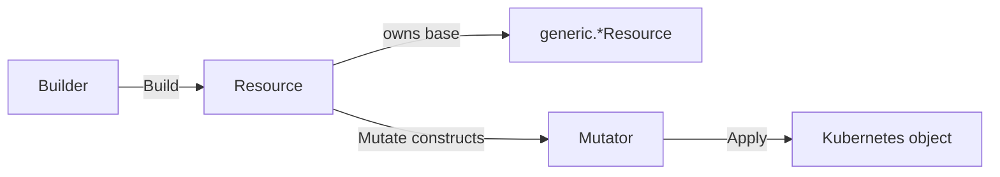

# Custom Resources

This guide is for operator authors who need to manage a Kubernetes object that the [built-in primitives](primitives.md)
do not cover. The built-in set handles the common kinds (Deployments, StatefulSets, ConfigMaps, Services, and more) and
is highly customizable through status handlers, suspension logic, mutations, and declared data. Reach for a custom
resource only when the kind you manage has no matching primitive:

- A **custom CRD** defined by your project or a third-party operator.
- A **standard Kubernetes kind** that the built-in set does not yet wrap.

The `pkg/generic` package provides the building blocks: it handles reconciliation mechanics, the plan-and-apply mutation
flow, suspension, guards, and data extraction. Your package wraps a generic resource with kind-specific identity,
status, and mutator logic, exactly the way the built-in primitives do.

!!! note "If your CRD has no typed Go struct"

    You can manage any CRD without writing a wrapper at all by using the unstructured static primitive
    (`pkg/primitives/unstructured/static`). See [Unstructured Primitives](primitives.md#unstructured-primitives). This
    guide covers the wrapper pattern, which gives you a typed, self-documenting API for a kind you manage often.

!!! tip "Generate this pattern"

    `ocf scaffold wrapper` generates the complete package this page describes: mutator, builder, resource, and tests,
    compiling and passing on a fresh scaffold. See the [CLI](cli.md) guide. This page stays the reference for what the
    generated code means and what to replace in it.

---

## Steps

1. [Choose a resource category](#1-choose-a-resource-category)
2. [Define the mutation type alias](#2-define-the-mutation-type-alias)
3. [Implement the mutator](#3-implement-the-mutator)
4. [Implement status handlers](#4-implement-status-handlers)
5. [Implement the builder](#5-implement-the-builder)
6. [Implement the resource](#6-implement-the-resource)
7. [Define feature mutations](#7-define-feature-mutations)
8. [Register with a component](#8-register-with-a-component)

A custom resource is three wrapped pieces. The builder configures and validates, producing a resource; the resource
delegates lifecycle methods to a generic base; the mutator records and applies changes to the Kubernetes object.



| Your type  | Wraps                                                         |
| ---------- | ------------------------------------------------------------- |
| `Builder`  | `generic.WorkloadBuilder[T, *Mutator]` (or one per category)  |
| `Resource` | `generic.WorkloadResource[T, *Mutator]` (or one per category) |
| `Mutator`  | Implements `generic.FeatureMutator`                           |

The examples below build a `MessageQueue` CRD (`messagequeues.example.io/v1`), a long-running broker with replica-based
health, so it is a **workload**. [Step 4](#4-implement-status-handlers) and the
[category notes](#category-specific-notes) show the other categories.

---

## 1. Choose a resource category

The framework defines four resource categories. Each maps to a generic resource type with a different set of lifecycle
interfaces. For the full description of each interface and the runtime string values it reports, see
[Lifecycle Interfaces](primitives.md#lifecycle-interfaces).

| Category        | Generic type                  | Lifecycle interfaces                                                     | Use when                                               |
| --------------- | ----------------------------- | ------------------------------------------------------------------------ | ------------------------------------------------------ |
| **Workload**    | `generic.WorkloadResource`    | `Alive`, `Graceful`, `Suspendable`, `Guardable`, `DataExtractable`       | Long-running processes with replica-based health       |
| **Static**      | `generic.StaticResource`      | `Guardable`, `DataExtractable`                                           | Configuration objects with no runtime health semantics |
| **Task**        | `generic.TaskResource`        | `Completable`, `Suspendable`, `Guardable`, `DataExtractable`             | Run-to-completion workloads                            |
| **Integration** | `generic.IntegrationResource` | `Operational`, `Graceful`, `Suspendable`, `Guardable`, `DataExtractable` | External-dependency objects (services, ingresses)      |

In addition to the category-specific interfaces, every generic resource also satisfies
[`concepts.Previewable`](primitives.md#lifecycle-interfaces), `concepts.MutationInspector`, `concepts.DataProducer`, and
`concepts.DataConsumer`, and your wrapper exposes all four. They are covered in [Step 6](#6-implement-the-resource).

The rest of the guide uses Workload as the primary example. The pattern is identical for the other categories, with
fewer handlers to implement.

---

## 2. Define the mutation type alias

Create a type alias for `feature.Mutation` parameterized on your mutator. This gives callers a clean name when defining
feature mutations, mirroring the `Mutation` alias each built-in primitive exports.

```go
package messagequeue

import "github.com/sourcehawk/operator-component-framework/pkg/feature"

// Mutation defines a feature-gated mutation applied to a MessageQueue resource.
type Mutation = feature.Mutation[*Mutator]
```

---

## 3. Implement the mutator

The mutator records mutation intent and applies it in a single controlled pass. It must implement
`generic.FeatureMutator`:

```go
type FeatureMutator interface {
    Apply() error
    NextFeature()
}
```

`Apply()` executes all recorded mutations against the underlying object. `NextFeature()` advances to a new feature
scope; the framework calls it between each registered mutation to maintain per-feature ordering boundaries.

### Plan and apply

Mutator methods **record intent** rather than modifying the object directly. The framework calls `Apply()` once, after
all mutations have been recorded. This is the same plan-and-apply model the built-in primitives use; see
[The Mutation System](primitives.md#the-mutation-system) for the rationale and the ordering guarantees.

```go
package messagequeue

import (
    examplev1 "example.io/api/v1"
)

// featurePlan groups all mutation operations recorded by a single feature.
type featurePlan struct {
    replicaOps []func(*examplev1.MessageQueueSpec)
    configOps  []func(*examplev1.MessageQueueSpec)
}

// Mutator records mutation intent for a MessageQueue and applies changes in one pass.
//
// It maintains feature boundaries: each feature's mutations are planned together
// and applied in the order the features were registered.
type Mutator struct {
    current *examplev1.MessageQueue

    plans  []featurePlan
    active *featurePlan
}

// NewMutator creates a new Mutator for the given MessageQueue.
//
// The constructor creates the initial feature scope, so mutations can be
// registered immediately.
func NewMutator(current *examplev1.MessageQueue) *Mutator {
    m := &Mutator{current: current}
    m.NextFeature()
    return m
}

// NextFeature advances to a new feature planning scope. All subsequent mutation
// registrations are grouped into this scope until NextFeature is called again.
//
// The first scope is created automatically by NewMutator. The framework calls
// this method between mutations to maintain per-feature ordering semantics.
func (m *Mutator) NextFeature() {
    m.plans = append(m.plans, featurePlan{})
    m.active = &m.plans[len(m.plans)-1]
}

// SetMaxConnections records intent to set the maximum connection count.
func (m *Mutator) SetMaxConnections(count int32) {
    m.active.configOps = append(m.active.configOps, func(spec *examplev1.MessageQueueSpec) {
        spec.MaxConnections = count
    })
}

// SetReplicas records intent to set the replica count.
func (m *Mutator) SetReplicas(replicas int32) {
    m.active.replicaOps = append(m.active.replicaOps, func(spec *examplev1.MessageQueueSpec) {
        spec.Replicas = &replicas
    })
}

// Apply executes all recorded mutations against the MessageQueue.
// Features are applied in registration order. Within each feature,
// replica operations are applied before config operations.
func (m *Mutator) Apply() error {
    for _, plan := range m.plans {
        for _, op := range plan.replicaOps {
            op(&m.current.Spec)
        }
        for _, op := range plan.configOps {
            op(&m.current.Spec)
        }
    }

    return nil
}
```

!!! note "Mutator design"

    - **Record, don't mutate.** Methods like `SetMaxConnections` append to the active feature plan. They do not touch
      `current` directly.
    - **Scope per feature.** `NextFeature()` opens a new plan scope. The framework calls it between registered mutations
      so each feature's operations are grouped and applied in registration order. `Apply()` iterates plans
      sequentially, so each feature sees the object as modified by all previous features.
    - **Keep it typed.** Expose domain-specific methods (`SetMaxConnections`, `SetReplicas`) rather than generic ones.
      This makes feature mutations self-documenting and keeps callers on the plan-and-apply path. The built-in workload
      mutators follow the same approach, layering convenience wrappers such as `EnsureReplicas` over lower-level edits.

---

## 4. Implement status handlers

Status handlers translate your CRD's runtime state into framework status types. Which handlers you need depends on the
category.

### Required versus optional handlers

The generic builder's `Build()` fails if the convergence handler is missing. For workload and task resources this is the
converging-status handler registered with `WithCustomConvergeStatus`; for integration resources it is the
operational-status handler registered with `WithCustomOperationalStatus`. Every other handler defaults to a safe value
at the generic layer:

- Grace status defaults to `Healthy` (workload and integration only).
- Suspension status defaults to `Suspended`.
- The suspension mutation defaults to a no-op.
- The delete-on-suspend decision defaults to `false`.

Register custom handlers only where your CRD has domain-specific behavior. The workload handlers below mirror what
`pkg/primitives/deployment` registers by default.

```go
package messagequeue

import (
    "fmt"

    "github.com/sourcehawk/operator-component-framework/pkg/component/concepts"
    examplev1 "example.io/api/v1"
)

// DefaultConvergingStatusHandler reports whether the MessageQueue has reached its desired state.
func DefaultConvergingStatusHandler(
    op concepts.ConvergingOperation, mq *examplev1.MessageQueue,
) (concepts.AliveStatusWithReason, error) {
    desired := int32(1)
    if mq.Spec.Replicas != nil {
        desired = *mq.Spec.Replicas
    }

    // Defer to the generation check first, so readiness fields are not read while
    // the CRD's own controller is still behind the latest spec.
    if status := concepts.StaleGenerationStatus(
        op, mq.Status.ObservedGeneration, mq.Generation, "messagequeue",
    ); status != nil {
        return *status, nil
    }

    if mq.Status.ReadyReplicas == desired {
        return concepts.AliveStatusWithReason{
            Status: concepts.AliveConvergingStatusHealthy,
            Reason: "All replicas are ready",
        }, nil
    }

    var status concepts.AliveConvergingStatus
    switch op {
    case concepts.ConvergingOperationCreated:
        status = concepts.AliveConvergingStatusCreating
    case concepts.ConvergingOperationUpdated:
        status = concepts.AliveConvergingStatusUpdating
    default:
        status = concepts.AliveConvergingStatusScaling
    }

    return concepts.AliveStatusWithReason{
        Status: status,
        Reason: fmt.Sprintf("Waiting for replicas: %d/%d ready", mq.Status.ReadyReplicas, desired),
    }, nil
}

// DefaultGraceStatusHandler reports health once the grace period has expired.
func DefaultGraceStatusHandler(mq *examplev1.MessageQueue) (concepts.GraceStatusWithReason, error) {
    desired := int32(1)
    if mq.Spec.Replicas != nil {
        desired = *mq.Spec.Replicas
    }

    // Use == rather than >= so grace and convergence agree on replica state.
    // Both handlers evaluate the same object in the same reconcile loop, so grace
    // must not return Healthy for a state convergence considers non-healthy
    // (e.g. ReadyReplicas > desired during scale-down).
    if mq.Status.ReadyReplicas == desired {
        return concepts.GraceStatusWithReason{
            Status: concepts.GraceStatusHealthy,
            Reason: "All replicas are ready",
        }, nil
    }

    if mq.Status.ReadyReplicas > 0 {
        return concepts.GraceStatusWithReason{
            Status: concepts.GraceStatusDegraded,
            Reason: "MessageQueue partially available",
        }, nil
    }

    return concepts.GraceStatusWithReason{
        Status: concepts.GraceStatusDown,
        Reason: "No replicas are ready",
    }, nil
}

// DefaultSuspensionStatusHandler reports progress towards a suspended state.
func DefaultSuspensionStatusHandler(
    mq *examplev1.MessageQueue,
) (concepts.SuspensionStatusWithReason, error) {
    if mq.Status.Replicas == 0 {
        return concepts.SuspensionStatusWithReason{
            Status: concepts.SuspensionStatusSuspended,
            Reason: "MessageQueue scaled to zero",
        }, nil
    }

    return concepts.SuspensionStatusWithReason{
        Status: concepts.SuspensionStatusSuspending,
        Reason: fmt.Sprintf("%d replicas still running", mq.Status.Replicas),
    }, nil
}

// DefaultSuspendMutationHandler scales the MessageQueue to zero replicas.
func DefaultSuspendMutationHandler(m *Mutator) error {
    m.SetReplicas(0)
    return nil
}

// DefaultDeleteOnSuspendHandler returns false: keep the resource, just scale down.
func DefaultDeleteOnSuspendHandler(_ *examplev1.MessageQueue) bool {
    return false
}
```

### Keeping convergence and grace consistent

The convergence handler and the grace handler evaluate the same object in the same reconcile loop, with no refetch
between them. When convergence returns `Healthy` the component is satisfied and grace is never called. For every other
state, grace must not contradict convergence by returning `Healthy`. The table below shows a consistent pair for a
workload with three desired replicas:

| Desired | Ready | Convergence | Grace        |
| ------- | ----- | ----------- | ------------ |
| 3       | 0     | Creating    | Down         |
| 3       | 1     | Scaling     | Degraded     |
| 3       | 3     | Healthy     | (not called) |
| 3       | 5     | Scaling     | Degraded     |

If grace reported `Healthy` in the last row, it would tell the component everything is fine while convergence still
considers the resource non-healthy (scaling down). The component logs a warning when it detects this. If the
inconsistency is intentional, pass the `component.SuppressGraceInconsistencyWarning()` resource option to `WithResource`
([Step 8](#8-register-with-a-component)) to silence the log.

### Status constants reference

These are the runtime **string values** each lifecycle status reports. They appear in the component's conditions and in
golden snapshots, so use the exact strings. [Lifecycle Interfaces](primitives.md#lifecycle-interfaces) gives the
authoritative interface-to-value mapping; the table here is the implementer's quick reference.

| Category              | Status type                      | Constant                        | String value        |
| --------------------- | -------------------------------- | ------------------------------- | ------------------- |
| Workload              | `concepts.AliveConvergingStatus` | `AliveConvergingStatusHealthy`  | `Healthy`           |
|                       |                                  | `AliveConvergingStatusCreating` | `Creating`          |
|                       |                                  | `AliveConvergingStatusUpdating` | `Updating`          |
|                       |                                  | `AliveConvergingStatusScaling`  | `Scaling`           |
|                       |                                  | `AliveConvergingStatusFailing`  | `Failing`           |
| Workload, Integration | `concepts.GraceStatus`           | `GraceStatusHealthy`            | `Healthy`           |
|                       |                                  | `GraceStatusDegraded`           | `Degraded`          |
|                       |                                  | `GraceStatusDown`               | `Down`              |
| Task                  | `concepts.CompletionStatus`      | `CompletionStatusCompleted`     | `Completed`         |
|                       |                                  | `CompletionStatusRunning`       | `TaskRunning`       |
|                       |                                  | `CompletionStatusPending`       | `TaskPending`       |
|                       |                                  | `CompletionStatusFailing`       | `TaskFailing`       |
| Integration           | `concepts.OperationalStatus`     | `OperationalStatusOperational`  | `Operational`       |
|                       |                                  | `OperationalStatusPending`      | `OperationPending`  |
|                       |                                  | `OperationalStatusFailing`      | `OperationFailing`  |
| All                   | `concepts.SuspensionStatus`      | `SuspensionStatusPending`       | `PendingSuspension` |
|                       |                                  | `SuspensionStatusSuspending`    | `Suspending`        |
|                       |                                  | `SuspensionStatusSuspended`     | `Suspended`         |
| All                   | `concepts.GuardStatus`           | `GuardStatusBlocked`            | `Blocked`           |
|                       |                                  | `GuardStatusUnblocked`          | `Unblocked`         |

!!! note "`Unblocked` is an internal signal"

    `GuardStatusUnblocked` is never written to a condition. It is the control value the framework uses to decide whether
    to proceed with a resource. Only `Blocked` surfaces in status.

---

## 5. Implement the builder

The builder wraps the generic builder, registers default handlers in its constructor, and exposes a fluent configuration
API. It validates and returns the concrete `Resource` from `Build()`.

The identity function is required and must produce a stable, unique identity for the object. The framework's convention,
used by every built-in primitive, is `<groupversion>/<Kind>/<namespace>/<name>` (for example
`apps/v1/Deployment/<namespace>/<name>`, or `v1/Service/<namespace>/<name>` for core-group kinds). Cluster-scoped kinds
omit the namespace segment. Follow this format so identities stay consistent and collision-free across your operator.

```go
package messagequeue

import (
    "fmt"

    "github.com/sourcehawk/operator-component-framework/pkg/component/concepts"
    "github.com/sourcehawk/operator-component-framework/pkg/feature"
    "github.com/sourcehawk/operator-component-framework/pkg/generic"
    examplev1 "example.io/api/v1"
)

// Builder configures and validates a MessageQueue resource.
type Builder struct {
    base *generic.WorkloadBuilder[*examplev1.MessageQueue, *Mutator]
}

// NewBuilder creates a Builder with the provided MessageQueue as the desired base state.
//
// The object must have Name and Namespace set.
func NewBuilder(mq *examplev1.MessageQueue) *Builder {
    identityFunc := func(mq *examplev1.MessageQueue) string {
        return fmt.Sprintf("messagequeues.example.io/v1/MessageQueue/%s/%s", mq.Namespace, mq.Name)
    }

    base := generic.NewWorkloadBuilder[*examplev1.MessageQueue, *Mutator](
        mq,
        identityFunc,
        NewMutator,
    )

    // Register domain-specific defaults.
    base.
        WithCustomConvergeStatus(DefaultConvergingStatusHandler).
        WithCustomGraceStatus(DefaultGraceStatusHandler).
        WithCustomSuspendStatus(DefaultSuspensionStatusHandler).
        WithCustomSuspendMutation(DefaultSuspendMutationHandler).
        WithCustomSuspendDeletionDecision(DefaultDeleteOnSuspendHandler)

    return &Builder{base: base}
}

// WithMutation registers one or more feature-gated mutations, applied in the order given.
// Pass a slice with the spread operator: b.WithMutation(factory()...)
func (b *Builder) WithMutation(ms ...Mutation) *Builder {
    for _, m := range ms {
        b.base.WithMutation(feature.Mutation[*Mutator](m))
    }
    return b
}

// WithGuard registers a guard precondition evaluated before the object is applied.
// If the guard returns Blocked, this resource and all resources after it in the
// component are skipped. Passing nil clears any previously registered guard.
func (b *Builder) WithGuard(
    guard func(examplev1.MessageQueue) (concepts.GuardStatusWithReason, error),
) *Builder {
    b.base.WithGuard(generic.WrapGuard(guard))
    return b
}

// WithDataGuard declares that the resource reads the given data cells and must not
// be applied until every one of them is set. The framework generates the guard and
// its reason; component Build validates that a producer for each cell is registered
// earlier. Data guards are evaluated before any custom guard.
func (b *Builder) WithDataGuard(cells ...concepts.DataCell) *Builder {
    b.base.WithDataGuard(cells...)
    return b
}

// WithOptionalData declares that the resource reads the given data cells without
// gating on them. Component Build still validates that a producer is registered
// earlier, and the dependency stays visible to introspection.
func (b *Builder) WithOptionalData(cells ...concepts.DataCell) *Builder {
    b.base.WithOptionalData(cells...)
    return b
}

// WithCustomConvergeStatus overrides the default convergence status handler.
func (b *Builder) WithCustomConvergeStatus(
    handler func(concepts.ConvergingOperation, *examplev1.MessageQueue) (concepts.AliveStatusWithReason, error),
) *Builder {
    b.base.WithCustomConvergeStatus(handler)
    return b
}

// WithCustomGraceStatus overrides the default grace status handler.
func (b *Builder) WithCustomGraceStatus(
    handler func(*examplev1.MessageQueue) (concepts.GraceStatusWithReason, error),
) *Builder {
    b.base.WithCustomGraceStatus(handler)
    return b
}

// Build validates the configuration and returns the initialized Resource.
func (b *Builder) Build() (*Resource, error) {
    genericRes, err := b.base.Build()
    if err != nil {
        return nil, err
    }
    return &Resource{base: genericRes}, nil
}

// ExtractInto declares that this MessageQueue produces the value of cell. fn
// computes the value from a copy of the reconciled MessageQueue; the framework
// stores it in the cell and marks it present, immediately after the object is
// applied or fetched. This is a package-level function because a Go method
// cannot introduce the extra type parameter V.
func ExtractInto[V any](
    b *Builder, cell *concepts.Data[V], fn func(examplev1.MessageQueue) (V, error),
) {
    generic.ExtractInto(&b.base.BaseBuilder, cell, generic.WrapExtraction(fn))
}
```

The builder exposes `WithCustomSuspendStatus`, `WithCustomSuspendMutation`, and `WithCustomSuspendDeletionDecision` the
same way if callers need to override suspension behavior after construction; they are omitted above for brevity.

Callers then use the package-level form, mirroring every built-in primitive:

```go
replicas := concepts.NewData[int32]("queue-replicas")

builder := messagequeue.NewBuilder(mq)
messagequeue.ExtractInto(builder, replicas, func(q examplev1.MessageQueue) (int32, error) {
    return q.Status.ReadyReplicas, nil
})
```

!!! note "Builder conventions"

    - **`generic.WrapGuard` and `generic.WrapExtraction`** convert value-receiver callbacks (`func(T)` and
      `func(T) (V, error)`) into the pointer-receiver form (`func(*T)` and `func(*T) (V, error)`) the generic layer
      expects, so your public API can take the kind by value. The built-in builders use both.
    - **Reach the embedded base for `ExtractInto`.** `generic.ExtractInto` takes a `*generic.BaseBuilder`, so pass
      `&b.base.BaseBuilder`. Every category builder embeds it.
    - **Register defaults in the constructor.** Set the handlers your CRD has meaningful semantics for, then let callers
      override them per resource.
    - **Return `*Builder` from every method** for fluent chaining.
    - **Validate in `Build()`.** The generic build checks for a non-nil object, a name, a namespace (unless
      [cluster-scoped](#cluster-scoped-resources)), an identity function, a mutator factory, the required convergence
      handler, and that mutation names are unique. Add any custom validation after the generic build returns.

---

## 6. Implement the resource

The resource is a thin wrapper that delegates every interface method to the generic base. This layer exists so your
package exports a concrete type rather than a generic one. List the interfaces it satisfies in its GoDoc, matching how
the built-in `Resource` types document themselves.

```go
package messagequeue

import (
    "github.com/sourcehawk/operator-component-framework/pkg/component/concepts"
    "github.com/sourcehawk/operator-component-framework/pkg/generic"
    examplev1 "example.io/api/v1"
    "sigs.k8s.io/controller-runtime/pkg/client"
)

// Resource manages a MessageQueue within a component's reconciliation loop.
//
// It implements:
//   - component.Resource (Identity, Object, Mutate)
//   - concepts.Alive (ConvergingStatus)
//   - concepts.Graceful (GraceStatus)
//   - concepts.Suspendable (DeleteOnSuspend, Suspend, SuspensionStatus)
//   - concepts.Guardable (GuardStatus)
//   - concepts.DataExtractable (ExtractData)
//   - concepts.DataProducer (ProducedData)
//   - concepts.DataConsumer (ConsumedData)
//   - concepts.ObservationRecorder (RecordObservation)
//   - concepts.Previewable (Preview)
//   - concepts.MutationInspector (RegisteredMutations, FiringSet)
type Resource struct {
    base *generic.WorkloadResource[*examplev1.MessageQueue, *Mutator]
}

func (r *Resource) Identity() string {
    return r.base.Identity()
}

func (r *Resource) Object() (client.Object, error) {
    return r.base.Object()
}

func (r *Resource) Mutate(current client.Object) error {
    return r.base.Mutate(current)
}

func (r *Resource) ConvergingStatus(op concepts.ConvergingOperation) (concepts.AliveStatusWithReason, error) {
    return r.base.ConvergingStatus(op)
}

func (r *Resource) GraceStatus() (concepts.GraceStatusWithReason, error) {
    return r.base.GraceStatus()
}

func (r *Resource) DeleteOnSuspend() bool {
    return r.base.DeleteOnSuspend()
}

func (r *Resource) Suspend() error {
    return r.base.Suspend()
}

func (r *Resource) SuspensionStatus() (concepts.SuspensionStatusWithReason, error) {
    return r.base.SuspensionStatus()
}

func (r *Resource) GuardStatus() (concepts.GuardStatusWithReason, error) {
    return r.base.GuardStatus()
}

func (r *Resource) ExtractData() error {
    return r.base.ExtractData()
}

// ProducedData returns the cells this resource declares extractions into.
func (r *Resource) ProducedData() []concepts.DataCell {
    return r.base.ProducedData()
}

// ConsumedData returns the resource's declared data reads, blocking and optional alike.
func (r *Resource) ConsumedData() []concepts.DataConsumption {
    return r.base.ConsumedData()
}

func (r *Resource) RecordObservation(observed client.Object) error {
    return r.base.RecordObservation(observed)
}

// Preview renders the desired state with all feature mutations applied, without
// touching the resource's internal state or contacting the cluster.
func (r *Resource) Preview() (client.Object, error) {
    return r.base.Preview()
}

// RegisteredMutations returns the names of every mutation registered on the resource.
func (r *Resource) RegisteredMutations() []string {
    return r.base.RegisteredMutations()
}

// FiringSet returns the names of registered mutations whose gate fires at the built version.
func (r *Resource) FiringSet() ([]string, error) {
    return r.base.FiringSet()
}

// Compile-time guarantee that the wrapper exposes the inspection surface.
var _ concepts.MutationInspector = (*Resource)(nil)
var _ concepts.DataProducer = (*Resource)(nil)
var _ concepts.DataConsumer = (*Resource)(nil)
```

!!! warning "Do not omit `Preview`"

    `Preview()` satisfies `concepts.Previewable`. Without it, `component.Preview()` fails at runtime and golden snapshot
    tests cannot render the resource. Every built-in resource delegates `Preview()` to its base; so must yours.

`RegisteredMutations()` and `FiringSet()` satisfy `concepts.MutationInspector`. Nothing in the reconcile path calls
them, but [version-matrix golden generation](testing.md) uses them to introspect which mutations a resource registers
and which fire at a given version. Delegate both to the base, as shown.

Forward `ProducedData` and `ConsumedData` whenever the resource can take part in a component's data flow, which is
always if your builder exposes `ExtractInto`, `WithDataGuard`, or `WithOptionalData`. They satisfy
`concepts.DataProducer` and `concepts.DataConsumer`. Without them the component sees no declarations, so
[build-time topology validation](component.md#build-time-validation) silently passes, `DataTopology()` omits the
resource, and its cells are never cleared at the start of a reconcile.

Forward `RecordObservation` whenever the resource may be registered read-only and declares an extraction. The framework
feeds the fetched cluster object back to the resource before extraction runs; without it, the extraction would see the
inert base passed to the builder rather than live cluster state.

Which methods to include depends on the category:

| Category    | Methods to include                                                                                                                                                                                                                                    |
| ----------- | ----------------------------------------------------------------------------------------------------------------------------------------------------------------------------------------------------------------------------------------------------- |
| Workload    | `Identity`, `Object`, `Mutate`, `ConvergingStatus`, `GraceStatus`, `DeleteOnSuspend`, `Suspend`, `SuspensionStatus`, `GuardStatus`, `ExtractData`, `ProducedData`, `ConsumedData`, `RecordObservation`, `Preview`, `RegisteredMutations`, `FiringSet` |
| Static      | `Identity`, `Object`, `Mutate`, `GuardStatus`, `ExtractData`, `ProducedData`, `ConsumedData`, `RecordObservation`, `Preview`, `RegisteredMutations`, `FiringSet`                                                                                      |
| Task        | `Identity`, `Object`, `Mutate`, `ConvergingStatus`, `DeleteOnSuspend`, `Suspend`, `SuspensionStatus`, `GuardStatus`, `ExtractData`, `ProducedData`, `ConsumedData`, `RecordObservation`, `Preview`, `RegisteredMutations`, `FiringSet`                |
| Integration | `Identity`, `Object`, `Mutate`, `ConvergingStatus`, `GraceStatus`, `DeleteOnSuspend`, `Suspend`, `SuspensionStatus`, `GuardStatus`, `ExtractData`, `ProducedData`, `ConsumedData`, `RecordObservation`, `Preview`, `RegisteredMutations`, `FiringSet` |

For task and integration resources, `ConvergingStatus` returns `concepts.CompletionStatusWithReason` and
`concepts.OperationalStatusWithReason` respectively, matching the generic base method signature.

---

## 7. Define feature mutations

Feature mutations use the `Mutation` alias from [Step 2](#2-define-the-mutation-type-alias). Each declares a name, an
optional feature gate, and a function that calls mutator methods to record intent. Name every mutation: the name is what
gating and error reporting refer to, and the builder rejects duplicate names within a resource.

```go
package features

import (
    "github.com/sourcehawk/operator-component-framework/pkg/feature"
    "example.io/messagequeue"
)

// HighThroughputMode raises the connection ceiling for versions >= 2.0.0.
func HighThroughputMode(version string) messagequeue.Mutation {
    return messagequeue.Mutation{
        Name:    "high-throughput-mode",
        Feature: feature.NewVersionGate(version, versionConstraints),
        Mutate: func(m *messagequeue.Mutator) error {
            m.SetMaxConnections(2000)
            return nil
        },
    }
}

// ConstrainedMode caps connections when the flag is set.
func ConstrainedMode(version string, enabled bool) messagequeue.Mutation {
    return messagequeue.Mutation{
        Name:    "constrained-mode",
        Feature: feature.NewVersionGate(version, nil).When(enabled),
        Mutate: func(m *messagequeue.Mutator) error {
            m.SetMaxConnections(100)
            return nil
        },
    }
}

// DefaultSettings returns baseline mutations applied to every MessageQueue.
// The version parameter is forwarded to any version-aware mutations in the set.
func DefaultSettings(version string) []messagequeue.Mutation {
    return []messagequeue.Mutation{
        {
            Name:    "default-replicas",
            Feature: nil, // always applied
            Mutate: func(m *messagequeue.Mutator) error {
                m.SetReplicas(1)
                return nil
            },
        },
        {
            Name:    "default-max-connections",
            Feature: feature.NewVersionGate(version, nil),
            Mutate: func(m *messagequeue.Mutator) error {
                m.SetMaxConnections(500)
                return nil
            },
        },
    }
}
```

Mutations apply in registration order. When a mutation's `Feature` is nil or its gate reports enabled, its `Mutate`
function runs; otherwise it is skipped. For the gating model (version gates, boolean `When` conditions, and how the two
combine) see [Version-Gated Mutations](primitives.md#version-gated-mutations) and
[Boolean-Gated Mutations](primitives.md#boolean-gated-mutations).

---

## 8. Register with a component

Use your custom resource with the component builder exactly like a built-in primitive.

```go
func buildQueueComponent(owner *MyOperatorCR) (*component.Component, error) {
    mq := &examplev1.MessageQueue{
        ObjectMeta: metav1.ObjectMeta{
            Name:      "main-queue",
            Namespace: owner.Namespace,
        },
        Spec: examplev1.MessageQueueSpec{
            Replicas:       ptr.To(int32(3)),
            MaxConnections: 500,
        },
    }

    res, err := messagequeue.NewBuilder(mq).
        WithMutation(features.HighThroughputMode(owner.Spec.Version)).
        WithMutation(features.ConstrainedMode(owner.Spec.Version, owner.Spec.Constrained)).
        WithMutation(features.DefaultSettings(owner.Spec.Version)...). // spread a []Mutation slice
        Build()
    if err != nil {
        return nil, err
    }

    return component.NewComponentBuilder().
        WithName("message-queue").
        WithConditionType("MessageQueueReady").
        WithResource(res).
        WithGracePeriod(5 * time.Minute).
        Suspend(owner.Spec.Suspended).
        Build()
}
```

For the component reconciliation lifecycle, status aggregation, and resource options such as `ReadOnly()`,
`Auxiliary()`, and `BlockOnAbsence()`, see the [Component](component.md) page.

---

## Cluster-Scoped Resources

For cluster-scoped CRDs, call `MarkClusterScoped()` on the generic builder before building. Validation then rejects a
non-empty namespace instead of requiring one, and the identity function should omit the namespace segment.

```go
func NewBuilder(mq *examplev1.MessageQueue) *Builder {
    base := generic.NewWorkloadBuilder[*examplev1.MessageQueue, *Mutator](mq, identityFunc, NewMutator)
    base.MarkClusterScoped()
    // ... register handlers ...
    return &Builder{base: base}
}
```

See [Cluster-Scoped Primitives](primitives.md#cluster-scoped-primitives) for the ownership and garbage-collection
implications.

---

## Category-Specific Notes

### Static resources

Static resources have the simplest implementation. They do not participate in convergence, grace, or suspension
reporting. The builder uses `generic.NewStaticBuilder`, which supports `WithMutation`, `WithGuard`, `WithDataGuard`, and
`WithOptionalData`, plus a package-level `ExtractInto`. The resource wrapper needs only `Identity`, `Object`, `Mutate`,
`GuardStatus`, `ExtractData`, `ProducedData`, `ConsumedData`, `RecordObservation`, `Preview`, `RegisteredMutations`, and
`FiringSet`. `pkg/primitives/configmap` is a complete reference.

### Task resources

Task resources use `generic.NewTaskBuilder` and report convergence as `concepts.CompletionStatusWithReason` instead of
`AliveStatusWithReason`. The converging handler, registered with `WithCustomConvergeStatus`, reports `Completed`,
`TaskRunning`, `TaskPending`, or `TaskFailing`.

### Integration resources

Integration resources use `generic.NewIntegrationBuilder` and report convergence as
`concepts.OperationalStatusWithReason`. The handler is registered with `WithCustomOperationalStatus` (not
`WithCustomConvergeStatus`) and reports `Operational`, `OperationPending`, or `OperationFailing`. Integration resources
also implement `Graceful`, defaulting to `Healthy`. The resource wrapper includes `GraceStatus` alongside the other
methods. A minimal integration builder for a `DNSRecord` CRD whose readiness depends on an external provider assigning a
record ID:

```go
package dnsrecord

import (
    "fmt"

    "github.com/sourcehawk/operator-component-framework/pkg/component/concepts"
    "github.com/sourcehawk/operator-component-framework/pkg/generic"
    examplev1 "example.io/api/v1"
)

// Builder configures and validates a DNSRecord integration resource.
type Builder struct {
    base *generic.IntegrationBuilder[*examplev1.DNSRecord, *Mutator]
}

// DefaultOperationalStatusHandler reports the DNSRecord operational once the
// external provider has assigned a record ID.
func DefaultOperationalStatusHandler(
    _ concepts.ConvergingOperation, r *examplev1.DNSRecord,
) (concepts.OperationalStatusWithReason, error) {
    if r.Status.RecordID != "" {
        return concepts.OperationalStatusWithReason{
            Status: concepts.OperationalStatusOperational,
            Reason: "Record provisioned by provider",
        }, nil
    }

    return concepts.OperationalStatusWithReason{
        Status: concepts.OperationalStatusPending,
        Reason: "Awaiting record ID from provider",
    }, nil
}

// NewBuilder creates a Builder with the provided DNSRecord as the desired base state.
func NewBuilder(record *examplev1.DNSRecord) *Builder {
    identityFunc := func(r *examplev1.DNSRecord) string {
        return fmt.Sprintf("dnsrecords.example.io/v1/DNSRecord/%s/%s", r.Namespace, r.Name)
    }

    base := generic.NewIntegrationBuilder[*examplev1.DNSRecord, *Mutator](
        record,
        identityFunc,
        NewMutator,
    )

    base.WithCustomOperationalStatus(DefaultOperationalStatusHandler)

    return &Builder{base: base}
}

// Build validates the configuration and returns the initialized Resource.
func (b *Builder) Build() (*Resource, error) {
    genericRes, err := b.base.Build()
    if err != nil {
        return nil, err
    }
    return &Resource{base: genericRes}, nil
}
```

`pkg/primitives/service` is a complete integration reference, including a grace handler that mirrors the operational
logic.

---

## Reference

| Package                  | Contains                                                                       |
| ------------------------ | ------------------------------------------------------------------------------ |
| `pkg/generic`            | Generic resource types, builders, `ExtractInto`, `WrapGuard`, `WrapExtraction` |
| `pkg/feature`            | `Mutation`, `Gate`, `VersionGate`, `NewVersionGate`                            |
| `pkg/component/concepts` | Lifecycle interfaces, status type constants, `NewData`, `DataCell`             |
| `pkg/component`          | Component builder, resource registration, reconciliation                       |
| `pkg/primitives/*`       | Built-in implementations to use as references                                  |

For a complete, runnable wrapper of a third-party CRD (using the unstructured static builder rather than a typed
struct), see `examples/custom-resource`. </content> </invoke>
