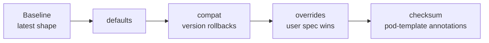

# Guidelines

Recommendations for structuring production operators built with the framework. These are recommendations, not hard
rules. They reflect patterns that hold up well at scale and pitfalls that are easy to walk into. Where a topic has its
own reference depth, this page links to it rather than restating it.

The examples use a neutral domain throughout: a `WebApp` owner CRD with a `backend` (StatefulSet) component and
`frontend` and `cache` (Deployment) components, each fronted by a Service and configured by a ConfigMap or Secret.

## Represent Desired State in the Baseline Object

The object you pass to a primitive builder should already describe the latest desired shape of the resource. Put
everything that is always present (name, namespace, labels, selector, replicas, security context, probes, ports, primary
container) in the baseline. Mutations layer orthogonal and conditional concerns on top of a complete, valid object.

```go
func backendStatefulSet(app *v1alpha1.WebApp) *appsv1.StatefulSet {
    return &appsv1.StatefulSet{
        ObjectMeta: metav1.ObjectMeta{
            Name:      app.Name + "-backend",
            Namespace: app.Namespace,
            Labels:    map[string]string{"app": app.Name, "component": "backend"},
        },
        Spec: appsv1.StatefulSetSpec{
            Replicas: ptr.To(app.Spec.Backend.Replicas),
            Selector: &metav1.LabelSelector{
                MatchLabels: map[string]string{"app": app.Name, "component": "backend"},
            },
            Template: corev1.PodTemplateSpec{
                ObjectMeta: metav1.ObjectMeta{
                    Labels: map[string]string{"app": app.Name, "component": "backend"},
                },
                Spec: corev1.PodSpec{
                    SecurityContext: restrictedPodSecurityContext(),
                    Containers: []corev1.Container{{
                        Name:           "backend",
                        Ports:          []corev1.ContainerPort{{Name: "http", ContainerPort: 8080}},
                        ReadinessProbe: httpProbe("/healthz", 8080),
                        // Image is intentionally left empty; a mutation owns it.
                    }},
                },
            },
        },
    }
}
```

A baseline that reads as the real resource is readable on its own, so a contributor can glance at the literal and know
the shape without replaying a stack of mutations. It also keeps mutations genuinely independent, because each one
operates on an already-valid object rather than on a half-built shell whose validity depends on earlier mutations having
run.

Heuristic for the boundary: if a field is always present regardless of version or feature flags, it belongs in the
baseline. If it is conditional, it belongs in a mutation.

## Mutations Are Pure Functions of the Spec

A mutation must be a pure function of the owner spec and other inputs available at build time. It must never read the
resource's live cluster state to decide what to write.

This is not only a style preference. Within a single resource, the framework applies mutations **before** data
extraction runs, so a cell written by an extraction declared on the same builder is still unset when that resource's
mutations execute. Declared data passes observed state from an **earlier** resource to a **later** resource, not back
into a resource's own mutations.

A mutation that produces the same desired object for the same spec, regardless of what currently exists in the cluster,
aligns with Server-Side Apply's declarative model and keeps reconciliation predictable. If you find yourself wanting to
read live state inside a mutation, the mutation is encoding observation rather than intent; reconsider the design.

## Leave Version-Dependent Fields Empty in the Baseline

Each field should have exactly one owner. When a field's value depends on the spec version (most commonly the container
image), leave it empty in the baseline and let a single mutation set it. Splitting ownership between the baseline and a
mutation makes it ambiguous which value wins.

```go
func backendImage(app *v1alpha1.WebApp) deployment.Mutation {
    return deployment.Mutation{
        Name: "BackendImage",
        Mutate: func(m *deployment.Mutator) error {
            m.EditContainers(selectors.ContainerNamed("backend"), func(e *editors.ContainerEditor) error {
                e.Raw().Image = fmt.Sprintf("registry.example.com/backend:%s", app.Spec.Version)
                return nil
            })
            return nil
        },
    }
}
```

The baseline owns structure; the image mutation owns the version-dependent value. When the version changes, exactly one
mutation produces the new image and nothing in the baseline contradicts it.

## One Component Per Logical Condition

Each component reports exactly one condition on the owner's status. If users would ask "is the backend ready?" and "is
the frontend ready?" as separate questions, those are separate components.

```go
backendComp, err := component.NewComponentBuilder().
    WithName("backend").
    WithConditionType("BackendReady").
    WithResource(backendService).
    WithResource(backendStatefulSet).
    Build()

frontendComp, err := component.NewComponentBuilder().
    WithName("frontend").
    WithConditionType("FrontendReady").
    WithResource(frontendService).
    WithResource(frontendDeployment).
    Build()
```

Separate components give users and monitoring granular observability: "the backend is down" is a different signal from
"the frontend is scaling," and a problem in one does not mask the status of another.

**Split** when users would ask about the parts separately, when parts can be independently healthy or degraded, or when
a failure in one should not mask another. **Combine** when resources only make sense as a unit (a Deployment and the
Service that fronts it have no useful readiness independent of each other), or when separate conditions would add noise
without actionable information.

Controllers typically reconcile every component and fold the per-component conditions into one top-level aggregate, for
example a `Ready` condition that names the components that are not ready. The component conditions stay granular for
debugging; the aggregate gives a single signal to gate on. See [Keep Controllers Thin](#keep-controllers-thin) for the
aggregation pattern.

## Keep Controllers Thin

A controller should fetch the owner, decide which components to build, reconcile each one, and defer a single
[`component.FlushStatus`](component.md#persisting-status-with-flushstatus) to persist status. Resource construction,
feature decisions, and mutation logic belong in component-building functions, which then test as pure functions: owner
in, component out, no cluster required.

When a controller owns several components, reconcile them all, collect the first error but **continue on error** so one
failing component does not stall the rest, and flush once at the end.

```go
func (r *WebAppReconciler) Reconcile(ctx context.Context, req reconcile.Request) (_ reconcile.Result, err error) {
    app := &v1alpha1.WebApp{}
    if err := r.Get(ctx, req.NamespacedName, app); err != nil {
        return reconcile.Result{}, client.IgnoreNotFound(err)
    }

    recCtx := component.ReconcileContext{
        Client:        r.Client,
        Scheme:        r.Scheme,
        EventRecorder: r.EventRecorder,
        Metrics:       r.Metrics,
        Owner:         app,
    }
    // Persist all staged conditions exactly once, even on the error path.
    defer func() {
        if flushErr := component.FlushStatus(ctx, recCtx); flushErr != nil && err == nil {
            err = flushErr
        }
    }()

    comps, buildErr := buildComponents(app)
    if buildErr != nil {
        return reconcile.Result{}, buildErr
    }

    var firstErr error
    for _, comp := range comps {
        if rErr := comp.Reconcile(ctx, recCtx); rErr != nil && firstErr == nil {
            firstErr = rErr
        }
    }
    return reconcile.Result{}, firstErr
}
```

`Component.Reconcile` mutates the owner's conditions **in memory only**. Persisting them is the controller's job, via
one `FlushStatus` per reconcile, deferred so that conditions set on error paths are still written when `Reconcile`
returns an error.

!!! warning

    Do not call `FlushStatus` between component reconciles. With several components per controller, the point of the
    split is to stage every condition in memory and write them once at the end. Flushing between components reintroduces
    the 409 conflict pattern the split exists to avoid.

If you do not want condition metrics, leave `ReconcileContext.Metrics` as `nil`; `FlushStatus` tolerates a nil recorder
and skips metric emission.

Building the component set from a pure resolver `(spec, version) -> []*component.Component` keeps the loop stable:
enabling an optional feature changes which components the resolver returns without touching the reconcile loop.

## Reconciler Error Handling and Requeueing

The framework distinguishes between conditions and errors. A resource that is merely converging (a rolling Deployment, a
`Blocked` guard) reports its state through its condition and does **not** return an error; the framework re-queues the
owner through controller-runtime's normal watch and resync mechanics. A returned error is for a genuine fault: an API
call failed, a mutation could not be applied, a version is below the supported floor.

Return the error from `Reconcile` and let controller-runtime apply exponential backoff. Avoid setting an explicit
`reconcile.Result{RequeueAfter: ...}` unless you have a concrete reason to poll on a fixed cadence; in most cases the
combination of resource watches and the manager's resync period already re-queues at the right time. Because
`FlushStatus` is deferred, the owner's conditions are written before the error propagates, so the failure is visible in
status even while controller-runtime backs off.

## Resource Registration Order Is Execution Order

Resources reconcile in the exact order they are registered with `WithResource`. This is deliberate: guards and declared
data extraction depend on it, and reading the calls top to bottom tells you the order with no implicit dependency graph
to reconstruct.

Register dependencies before dependents. A common per-component bundle reads as a dependency chain: read-only Secret
references first (with [`BlockOnAbsence`](component.md#resource-registration-options) so an absent Secret blocks the
rest rather than erroring), then the ServiceAccount for workloads that need an identity, then the Service, then the
workload last.

```go
comp, err := component.NewComponentBuilder().
    WithName("backend").
    WithConditionType("BackendReady").
    WithResource(dbCredentialsSecret, component.ReadOnly(), component.BlockOnAbsence()). // must exist first
    WithResource(backendServiceAccount).
    WithResource(backendService).
    WithResource(backendStatefulSet). // applied last; depends on everything above
    Build()
```

Reordering these calls breaks data flow between a resource that extracts a value and a later one that reads it. Where
the flow is declared with [data cells](#use-data-extraction-and-guards-for-intra-component-dependencies), `Build()`
turns that mistake into a build error instead of a resource that waits forever.

## Mutation Ordering and Container-Name Dependencies

Mutations within a resource also apply in registration order, and each one sees the resource as modified by all earlier
mutations. This is invisible while mutations are independent. It becomes visible when a compat mutation renames a
container and a later mutation targets that container by name.

Two rules eliminate the problem:

- **Use broad selectors for version-independent mutations.** `selectors.AllContainers()`, or the mutator's
  `EnsureContainerEnvVar` / `EnsureContainerArg`, never reference a name, so they apply regardless of a rename and need
  no ordering constraint.
- **Register name-specific mutations before the compat mutation that renames the container.** Placed before the rename,
  the mutation sees the baseline name, and its edits carry through because the compat mutation overwrites only specific
  fields (such as `Name` and `Ports`), not the whole container.

```go
res, err := deployment.NewBuilder(frontendDeployment(app)).
    WithMutation(debugLogging(app)).      // targets ContainerNamed("frontend") by name
    WithMutation(compatV1Container(app)). // renames "frontend" -> "web" for versions < 2.0
    WithMutation(tracingSidecar(app)).    // AllContainers, order-insensitive
    Build()
```

Do not work around ordering by matching multiple names (`ContainersNamed("frontend", "web")`); that couples the mutation
to every name the container has ever had. The primitives overview covers the
[ordering semantics within a feature](primitives.md#ordering-within-a-feature) in full.

## Layer Mutations in a Fixed Order

Order a resource's mutations into fixed layers so the pipeline reads the same way for every workload:

1. **defaults**: the operator's desired state for the current version (image, default env, sidecars).
2. **compat**: version-gated rollbacks that restore older shapes (see below).
3. **overrides**: values from the user's spec, applied last among the value-producing layers so user input wins.
4. **checksum**: a final annotation mutation that stamps content hashes onto the pod template (see
   [Provide a User-Override Escape Hatch](#provide-a-user-override-escape-hatch-as-the-last-mutation) and the rotation
   pattern below).



A field whose shape changed between versions is best handled by a **pair of mutually exclusive version gates** (`>= V`
and `< V`), so exactly one fires and the two layers never disagree.

```go
geV := feature.NewVersionGate(app.Spec.Version, []feature.VersionConstraint{atLeast("2.0.0")})
ltV := feature.NewVersionGate(app.Spec.Version, []feature.VersionConstraint{lessThan("2.0.0")})
```

This layering keeps every override decision in one place and makes the compat layer self-contained, so it can shrink as
old versions drop out.

## Prefer Reverting Compat Mutations Over Forward Mutations

When a structural version change lands, update the baseline to the new shape and add a **revert** mutation gated on the
older versions, rather than holding the baseline at the old shape and patching it forward. The revert direction is
easier to maintain:

- **Adding a revert mutation does not change existing ones.** Each revert handles one version step (the v2 revert turns
  v3 back into v2; the v1 revert turns v2 into v1). Dropping support for a version deletes exactly one mutation.
- **Forward mutations grow fragile ordering dependencies.** A v3 forward patch may assume a v2 patch already ran;
  deleting the v2 patch later breaks v3 silently.
- **You read the baseline far more often than you change it.** Baseline-as-latest shows the current shape at a glance;
  baseline-as-original forces a contributor to replay every forward patch mentally.

The cost is one new revert mutation per structural version change. That friction is a forcing function: it makes the
backward-compatibility decision explicit instead of letting old shapes silently persist as the baseline drifts.

```go
func compatV1Container(app *v1alpha1.WebApp) deployment.Mutation {
    return deployment.Mutation{
        Name:    "CompatV1Container",
        Feature: feature.NewVersionGate(app.Spec.Version, []feature.VersionConstraint{lessThan("2.0.0")}),
        Mutate: func(m *deployment.Mutator) error {
            m.EditContainers(selectors.ContainerNamed("frontend"), func(e *editors.ContainerEditor) error {
                e.Raw().Name = "web" // legacy name before 2.0
                return nil
            })
            return nil
        },
    }
}
```

A compat mutation should only **roll back**, never introduce a new field. The number of revert mutations is bounded by
the number of supported versions, and each one deletes cleanly when its version falls out of support.

## Use Data Extraction and Guards for Intra-Component Dependencies

When one resource depends on data from another resource in the **same** component, declare the flow rather than passing
a variable between two closures. A `concepts.Data[T]` cell is a named, typed, presence-aware container: the producer
declares an extraction into it, the consumer declares its read, and `Build()` verifies the two are registered in an
order that can actually work.

```go
func buildDatabaseComponent(app *v1alpha1.WebApp) (*component.Component, error) {
    dbHost := concepts.NewData[string]("db-host")

    cmBuilder := configmap.NewBuilder(dbConfig(app))
    configmap.ExtractInto(cmBuilder, dbHost, func(cm corev1.ConfigMap) (string, error) {
        return cm.Data["db-host"], nil
    })
    cmRes, err := cmBuilder.Build()
    if err != nil {
        return nil, err
    }

    secretBuilder := secret.NewBuilder(dbCredentials(app))
    secretBuilder.WithDataGuard(dbHost)
    secretBuilder.WithMutation(secret.Mutation{
        Name: "db-host-entry",
        Mutate: func(m *secret.Mutator) error {
            host, err := dbHost.Require()
            if err != nil {
                return err
            }
            m.SetStringData("db-host", host)
            return nil
        },
    })
    secretRes, err := secretBuilder.Build()
    if err != nil {
        return nil, err
    }

    // The producer must be registered before the consumer; Build() enforces it.
    return component.NewComponentBuilder().
        WithName("database").
        WithConditionType("DatabaseReady").
        WithResource(cmRes).
        WithResource(secretRes).
        Build()
}
```

Create cells inside the component assembly function so they stay scoped to a single reconcile. The component clears
every declared cell before it reconciles anything, so a cell that somehow outlives its assembly function still cannot
carry a value into the next pass. Sharing one cell across components is unsupported: validation and reset are per
component.

`WithDataGuard` generates both the guard and its reason, so the message a user reads (`waiting for data "db-host"`)
cannot drift from the real dependency. A blocked data guard surfaces as the same `Blocked` condition reason any guard
produces. Keep `WithGuard` for preconditions that are not "a value exists", such as a status phase reaching a specific
value.

Three consumption modes cover the useful cases:

| Mode                       | Declaration        | Accessor  | Behavior when absent                              |
| -------------------------- | ------------------ | --------- | ------------------------------------------------- |
| Block until present        | `WithDataGuard`    | `Require` | Resource waits, the condition explains why        |
| Proceed, enrich when ready | `WithOptionalData` | `Get`     | Mutation skips; the field appears on a later pass |
| Proceed, fail loudly       | `WithOptionalData` | `Require` | Mutation errors, the component reports a failure  |

`WithOptionalData` never gates. Declare it anyway: the build-time check then still verifies that some earlier resource
produces the cell, because an optional read with no producer can never be satisfied and is almost always a mistake, and
the dependency stays visible to introspection.

Prefer **stable** values. A guard re-evaluates every reconcile, so a value that can transiently disappear (a replica
count, a field cleared during a rolling update) will re-block a resource that is already running. Good targets appear
once and persist: a status field written by a controller, a provisioned IP, a generated credential reference. This
applies doubly to optional enrichment, which has no guard to hold the resource back: a source value that comes and goes
makes the enriched field flap, rewriting the consuming resource on every swing.

## Use Prerequisites for Cross-Component Dependencies

When one component cannot start until **another component** is ready, attach a prerequisite rather than orchestrating
ordering in the controller.

```go
frontendComp, err := component.NewComponentBuilder().
    WithName("frontend").
    WithConditionType("FrontendReady").
    WithPrerequisite(component.DependsOn("BackendReady")).
    WithResource(frontendService).
    WithResource(frontendDeployment).
    Build()
```

The frontend reconciles no resources until `BackendReady` on the owner is `True`. Once the component passes through to
normal reconciliation for the first time, the prerequisite is permanently satisfied and never re-evaluated.

Prerequisites are for **startup** ordering, not ongoing health. If the backend goes down after the frontend is already
running, the frontend keeps reconciling its own resources; the two conditions reflect their own health independently.
Contrast with [guards](#use-data-extraction-and-guards-for-intra-component-dependencies), which work within a single
component and re-evaluate every reconcile. See the [prerequisite behavior](component.md#prerequisite-behavior) section
for the full lifecycle.

## Use Feature Gates for Optional Components and Conditional Resources

Gate optional pieces with a feature gate rather than branching in the controller. The framework then owns the full
lifecycle, including deletion when the gate flips off.

For an entire optional component, use a **component** gate:

```go
cacheComp, err := component.NewComponentBuilder().
    WithName("cache").
    WithConditionType("CacheReady").
    WithFeatureGate(feature.NewVersionGate(app.Spec.Version, nil).When(app.Spec.Cache.Enabled)).
    WithResource(cacheService).
    WithResource(cacheDeployment).
    Build()
```

When the gate is disabled the framework deletes the component's resources and reports `True/Disabled`. A disabled gate
takes precedence over suspension.

For a single optional resource the component owns, use [`component.GatedBy`](component.md#feature-gates) on
`WithResource`:

```go
comp, _ := component.NewComponentBuilder().
    WithName("frontend").
    WithConditionType("FrontendReady").
    WithResource(frontendDeployment).
    WithResource(tracingConfigMap, component.GatedBy(tracingGate)). // deleted when the gate is off
    Build()
```

A disabled `GatedBy` gate deletes the resource on the next reconcile. For an optional resource the component does
**not** own (a read-only Secret reference behind an optional spec field), use `IncludeWhen`, which omits the resource
without ever deleting it. The [IncludeWhen vs. GatedBy](component.md#includewhen-vs-gatedby) section covers the
distinction.

## Provide a User-Override Escape Hatch as the Last Mutation

Give users a documented way to override operator-emitted values, applied as the last value-producing mutation so their
input shadows the defaults. A common shape is an optional `spec.ExtraEnv` applied through `EnsureEnvVars` behind a
`.When` gate.

```go
func extraEnv(app *v1alpha1.WebApp) deployment.Mutation {
    envs := app.Spec.Frontend.ExtraEnv
    return deployment.Mutation{
        Name:    "ExtraEnv",
        Feature: feature.NewVersionGate(app.Spec.Version, nil).When(len(envs) > 0),
        Mutate: func(m *deployment.Mutator) error {
            m.EditContainers(selectors.ContainerNamed("frontend"), func(e *editors.ContainerEditor) error {
                e.EnsureEnvVars(envs)
                return nil
            })
            return nil
        },
    }
}
```

Because `EnsureEnvVars` replaces existing entries by name, registering this mutation after the operator's own env
mutations lets a user value shadow an operator-emitted one without you enumerating every overridable field.

A related use of a final mutation is **secret-rotation restart**: each read-only Secret declares an extraction that
hashes its contents into a cell, the workload declares those cells with `WithOptionalData`, and a final mutation stamps
the hashes it can read onto the pod template as annotations through `EditPodTemplateMetadata`. A Secret rotation changes
a hash, which changes the pod template, which triggers a rolling restart. Optional reads keep the workload moving when a
Secret has not been fetched yet, and cells are unset in a cluster-free preview, so golden snapshots stay stable without
any special casing.

```go
func checksumAnnotations(hashes map[string]*concepts.Data[string]) deployment.Mutation {
    return deployment.Mutation{
        Name: "ChecksumAnnotations",
        Mutate: func(m *deployment.Mutator) error {
            m.EditPodTemplateMetadata(func(e *editors.ObjectMetaEditor) error {
                for name, cell := range hashes {
                    if hash, ok := cell.Get(); ok {
                        e.EnsureAnnotation("checksum/"+name, hash)
                    }
                }
                return nil
            })
            return nil
        },
    }
}
```

## Fail Loudly Below the Supported Version Floor

A version below the supported floor should produce a loud error, not a silently wrong workload. When a compat mutation
cannot faithfully represent a version, return an error from `Mutate` rather than emitting an approximation.

```go
func compatV1Container(app *v1alpha1.WebApp) deployment.Mutation {
    return deployment.Mutation{
        Name:    "CompatV1Container",
        Feature: feature.NewVersionGate(app.Spec.Version, []feature.VersionConstraint{lessThan("2.0.0")}),
        Mutate: func(m *deployment.Mutator) error {
            if belowFloor(app.Spec.Version, "1.0.0") {
                return fmt.Errorf("version %s is below the supported floor 1.0.0", app.Spec.Version)
            }
            // ... roll back to the legacy shape
            return nil
        },
    }
}
```

The error propagates out of `Component.Reconcile`, and because [`FlushStatus`](#keep-controllers-thin) is deferred, the
failure is recorded on the owner's condition where an operator can see it.

## Name Mutations for Golden Introspection

Give every mutation a `Name`. Names appear in error reporting, and version-matrix golden manifests reference them in
their `requires` and `forbids` lists, so descriptive names keep those manifests self-documenting. Name compat mutations
after what they restore (`CompatV1Container`), so a reader scanning a builder chain understands each entry without
opening its implementation. See [testing.md](testing.md#firing-set-classification) for how named mutations drive
firing-set classification.

## Understand Participation Modes

[`component.Auxiliary()`](component.md#resource-registration-options) means "reconciled but not required for health." It
does not mean "skipped." A failing auxiliary resource still fails the reconciliation; the only difference is that its
health does not affect whether the component condition becomes Ready.

```go
comp, _ := component.NewComponentBuilder().
    WithName("frontend").
    WithConditionType("FrontendReady").
    WithResource(frontendDeployment).                    // required for Ready
    WithResource(metricsExporter, component.Auxiliary()). // not required for Ready
    Build()
```

Use `Auxiliary` for supporting resources (metrics exporters, debug sidecars, optional integrations) whose health should
not block the component from reporting Ready.

!!! note

    A blocked guard always contributes to the condition regardless of participation mode. A blocked guard halts the
    reconciliation pipeline, and that must be visible in the condition.

## Grace Periods Are Convergence Time

A component in `Creating` or `Updating` for a few minutes during a rolling update is normal, not a failure. The grace
period gives a component time to converge before the framework escalates the condition to `Degraded` or `Down`.

```go
comp, _ := component.NewComponentBuilder().
    WithName("backend").
    WithConditionType("BackendReady").
    WithResource(backendStatefulSet).
    WithGracePeriod(5 * time.Minute).
    Build()
```

Set the grace period to how long the resource legitimately takes to converge. A workload with a large image pull or a
slow readiness probe needs a longer grace period than a ConfigMap update. A very long grace period delays detection of
genuine failures, so choose a value that reflects expected convergence time, not a safety margin.

## Handle Cluster-Scoped Resources Explicitly

When a namespace-scoped owner manages cluster-scoped resources (`ClusterRole`, `ClusterRoleBinding`), Kubernetes does
not allow cross-scope ownership, so the framework cannot set an owner reference. It detects this, skips the reference,
and logs the skip with its garbage-collection implication.

The consequence is that those resources are **not** garbage-collected when the owner is deleted. Clean them up
explicitly with [`component.Delete()`](component.md#resource-registration-options) (or `DeleteWhen`) and a finalizer on
the owner CRD that keeps the owner alive until its cluster-scoped resources are removed.

```go
comp, _ := component.NewComponentBuilder().
    WithName("rbac").
    WithConditionType("RBACReady").
    WithResource(clusterRole, component.Delete()).
    Build()
```

The [cluster-scoped resources](component.md#cluster-scoped-resources) section covers the ownership and deletion behavior
in full.

## Name Resources to Avoid Multi-Tenant Collisions

A single operator typically reconciles many owner instances in many namespaces. Derive every managed resource's name
from the owner so two owners never collide. Prefix namespace-scoped resources with the owner name
(`app.Name + "-backend"`), and for **cluster-scoped** resources, which share one global namespace, include the owner's
namespace too (`app.Namespace + "-" + app.Name + "-reader"`).

```go
clusterRoleName := fmt.Sprintf("%s-%s-reader", app.Namespace, app.Name)
```

A cluster-scoped resource named after the owner alone collides the moment two namespaces hold an owner with the same
name. Encoding the namespace in the name keeps each instance's resources distinct.

## Name Conditions for the Audience Reading Them

Condition types appear in `kubectl get` output and on dashboards. Name them for the person or system consuming that
output, after the capability, not the Kubernetes resource type backing it.

**Prefer:** `BackendReady`, `FrontendReady`, `MigrationComplete`.

**Avoid:** `StatefulSetHealthy`, `DeploymentReconciled`, `JobFinished`.

A condition named `DeploymentReconciled` tells a user nothing about which capability is affected. `BackendReady` does.

## Pin Rendered Output Across Supported Versions

Every supported version's rendered output should be covered by a golden, so that when you change the baseline you can
prove older versions still render what they did before and that the change touched only the version you intended. This
is the safety net that lets you keep the baseline at the latest shape (see
[Represent Desired State in the Baseline Object](#represent-desired-state-in-the-baseline-object)) without silently
regressing older ones.

Use `goldengen.Resource` rather than a hand-written loop with one golden per version. It sweeps the versions, collapses
them into firing regimes (one golden per distinct set of firing mutations, not one per version), asserts which mutations
fire at each version, and proves through `AssertComplete` that every registered mutation is covered. A new version that
fires the same mutations as an existing one adds no golden; a version that crosses a gate boundary gets its own. See
[Testing](testing.md) for the mechanics.

After a deliberate baseline change, regenerate with `go test ./path -update` and review the diff. Only the regimes you
meant to change should move. If an older regime's golden shifts, a compat mutation broke, and the diff shows exactly
what.

## Further Reading

For a deeper look at the structural problems these guidelines address, see
[The Missing Layers in Your Kubernetes Operator](https://medium.com/@sourcehawk/the-missing-layers-in-your-kubernetes-operator-306ee8633350).
</content> </invoke>
