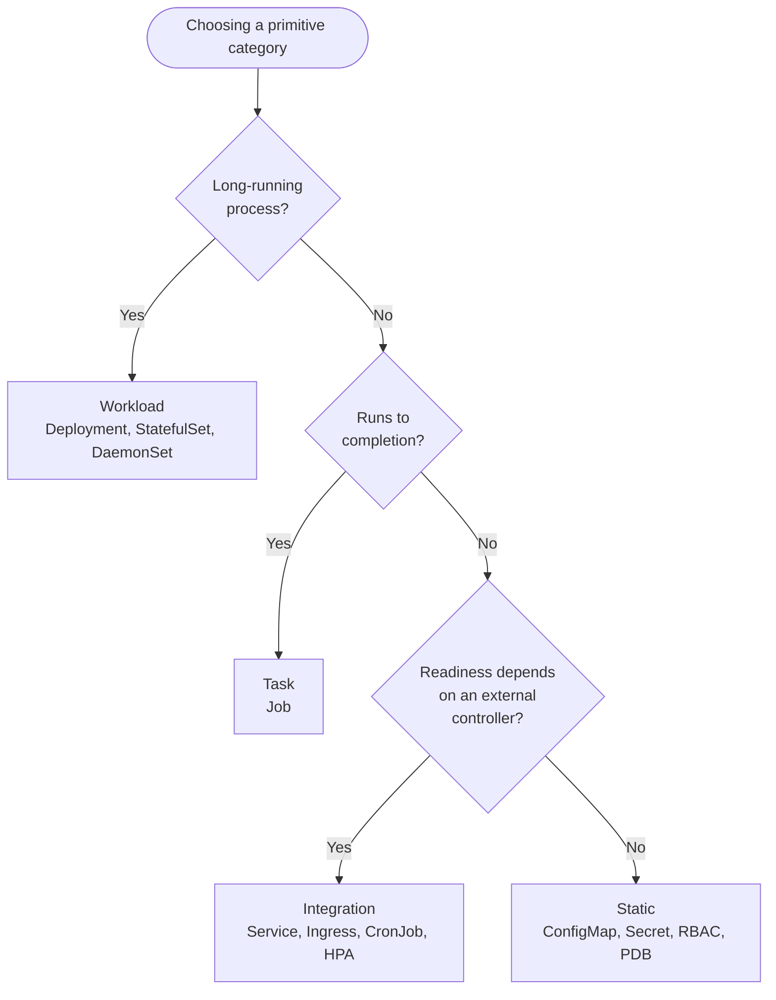
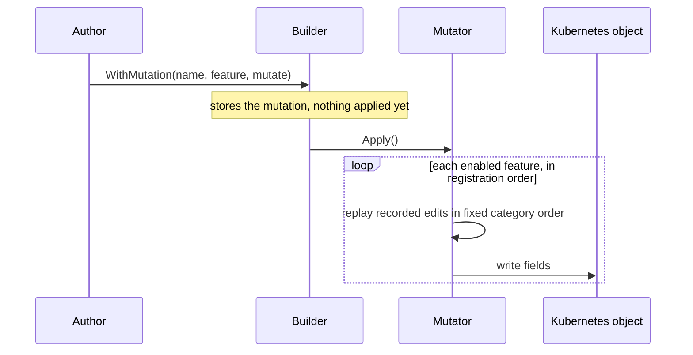

# Primitives Overview

The `primitives` packages provide reusable, type-safe wrappers for individual Kubernetes objects. A primitive sits
between the [Component layer](component.md) and a raw Kubernetes resource, handling state synchronization, mutation, and
lifecycle so operator authors do not have to.

This page is the canonical reference for the concepts shared across every primitive: the lifecycle interfaces and the
status values they report, the mutation system, editors and selectors, Server-Side Apply, and cluster-scoped handling.
Individual [primitive pages](#built-in-primitives) link here rather than repeating these explanations, and document only
their kind-specific surface.

## What a Primitive Is

A primitive wraps a specific Kubernetes kind (for example `Deployment` or `ConfigMap`) and encapsulates:

- **A desired-state baseline.** The object you hand the builder, representing the resource's intended shape.
- **A mutation surface.** Typed editors that record changes to the baseline, gated by features or version constraints.
- **Lifecycle integration.** Readiness detection, grace handling, and suspension, depending on the kind.
- **Server-Side Apply.** Desired state is applied via SSA, preserving server defaults and fields owned by other
  controllers.

Every primitive implements the `component.Resource` interface, and may additionally implement one or more
[lifecycle interfaces](#lifecycle-interfaces) to participate in component status aggregation.

## Primitive Categories

The framework groups primitives by runtime behavior. The category determines which lifecycle interfaces a primitive
implements and therefore how it contributes to a component's aggregate status.



### Static

Examples: `ConfigMap`, `Secret`, `ServiceAccount`, RBAC objects, `PodDisruptionBudget`.

The desired state is mostly fixed. These resources are created or updated from configuration but have no complex runtime
convergence, so they are considered `Ready` as soon as they exist. They may optionally expose data through
`DataExtractable`.

### Workload

Examples: `Deployment`, `StatefulSet`, `DaemonSet`.

Long-running processes that require runtime convergence (pods being scheduled and becoming ready). They implement
`Alive`, `Graceful`, and `Suspendable`, supporting health tracking, grace periods, and scaling to zero.

### Task

Examples: `Job`.

Short-lived operations that run to completion (migrations, backups, initialization steps). They implement `Completable`
and `Suspendable`. When suspended, a task is paused if its kind supports it, or deleted and recreated when resumed.

### Integration

Examples: `Service`, `Ingress`, `CronJob`, `HPA`.

Integration points with external or cluster-level systems (networking, load balancers, schedules, autoscaling). Their
readiness depends on controllers the operator does not own, so it may be delayed or partial. They implement
`Operational`, and may also implement `Graceful` or `Suspendable`.

## Lifecycle Interfaces

A primitive participates in status aggregation by implementing one or more lifecycle interfaces from
`pkg/component/concepts`. Each interface reports a small, fixed set of status values. The values below are the runtime
**strings** that appear in conditions, not the Go constant identifiers.

!!! note "This table is the single source of truth"

    Other documentation links here for the interface-to-status mapping. The [component page](component.md) owns how
    these values are prioritized and aggregated; the [custom resource guide](custom-resource.md) owns the Go constant
    reference for implementers.

| Interface         | Reported status values                                   | Typical kinds                                    |
| ----------------- | -------------------------------------------------------- | ------------------------------------------------ |
| `Alive`           | `Healthy`, `Creating`, `Updating`, `Scaling`, `Failing`  | Deployments, StatefulSets, DaemonSets            |
| `Graceful`        | `Healthy`, `Degraded`, `Down`                            | Workloads and integrations with slow convergence |
| `Suspendable`     | `PendingSuspension`, `Suspending`, `Suspended`           | Any resource with a deactivation behavior        |
| `Completable`     | `Completed`, `TaskRunning`, `TaskPending`, `TaskFailing` | Jobs and task primitives                         |
| `Operational`     | `Operational`, `OperationPending`, `OperationFailing`    | Services, Ingresses, CronJobs                    |
| `Guardable`       | `Blocked`                                                | Resources with runtime preconditions             |
| `DataExtractable` | _(no status, side-effecting)_                            | Resources that publish post-sync values to cells |

!!! warning "`Guardable` reports only `Blocked`"

    A guard's other result, `Unblocked`, is an internal control signal that lets the framework proceed. It is never
    written to a condition. Only `Blocked` surfaces, with the reason explaining what the resource is waiting for.

Custom resource wrappers can implement any subset of these interfaces to opt into the corresponding component behaviors.

## Cluster-Scoped Primitives

Some Kubernetes kinds are cluster-scoped and have no namespace, for example `ClusterRole`, `ClusterRoleBinding`, and
`PersistentVolume`.

A primitive for a cluster-scoped kind must call `MarkClusterScoped()` on its `BaseBuilder` during construction. This
inverts the namespace check in `ValidateBase()`: instead of requiring a non-empty namespace, the builder rejects one.

```text
object namespace cannot be empty
```

If you build a cluster-scoped primitive without marking it, `Build()` fails with the error above, because the validator
still expects a namespace. With `MarkClusterScoped()` set, supplying a namespace fails the other way:

```text
cluster-scoped object must not have a namespace
```

A cluster-scoped builder also provides an identity function that omits the namespace segment (for example
`rbac.authorization.k8s.io/v1/ClusterRole/my-role`). At reconcile time the framework detects scope mismatches between
the owner CRD and managed resources using the cluster's REST mapper. See
[Cluster-Scoped Resources](component.md#cluster-scoped-resources) for owner-reference and garbage-collection behavior.

## Server-Side Apply

The framework reconciles resources with **Server-Side Apply** (SSA). Each primitive builds its desired state (the
baseline with all active mutations applied) and patches it with `client.Apply`. Only the fields the operator declares
are sent; server-managed defaults, fields set by other controllers (HPAs, sidecar injectors, annotation-based tooling),
and values written by webhooks are left untouched.

The API server tracks field ownership automatically. The field manager name is derived from the owner and component as
`"{Owner.GetKind()}/{componentName}/{Owner.GetUID()}"`, for example
`ExampleApp/web-interface/3d8a9d5e-1c2b-4f6e-9a7d-0b1c2d3e4f5a`. The framework applies with forced ownership, so it
takes control of conflicting fields from other managers, while fields it does not include stay with their current
owners.

The API server rejects a field manager longer than 128 characters, and neither the kind nor the component name has a
bounded length. When the readable form would exceed the limit, the manager is the hex-encoded SHA-256 of that readable
form instead: 64 characters, deterministic for the owner and component, and still distinct per owner. Such a manager
shows in `managedFields` as a hash rather than a name, so keep component names short if you rely on reading them there.

The owner's UID is part of the manager name so that every owner is a distinct manager. Two custom resources of one kind
whose components render the same object therefore do not share a manager. When the framework sets a controller reference
on the object (the default), the second owner's apply carries a second controller reference, which the API server
rejects, so that owner's component reports an error instead of silently taking the object's fields from the first. With
a manager shared across owners, each forced apply would relinquish the other owner's fields wholesale, both would report
converged, and neither would ever see a conflict. Naming the owner also makes
`kubectl get -o yaml --show-managed-fields` say which custom resource wrote a field.

The rejection depends on the controller reference. For a resource registered with `Unowned()`, or one whose owner
reference cannot be set because of a scope mismatch, nothing stops the second owner's forced apply from taking the
fields it declares, and the fields move between the two owners' managers on every reconcile. `managedFields` then names
the owner that wrote each field, but the framework does not detect the contention. A shared name between two owners is
the operator's responsibility in that case; a [guard](component.md#guards) that reads the live object and blocks when
another owner controls it is the way to make it explicit.

!!! note "Upgrading from a release without the UID in the manager name"

    Releases before the UID was added used `"{Owner.GetKind()}/{componentName}"`. On the first reconcile after
    upgrading, the new manager takes over every field it declares from the old one through forced ownership, so
    managed objects converge without intervention. Fields the old manager owned that are no longer part of the desired
    state stay in `managedFields` under the old manager name and are not pruned; they were already stale before the
    upgrade.

This removes the perpetual-update problem that arises when an operator strips server defaults every cycle, and it lets
primitives coexist with other controllers that touch the same resources.

!!! warning "A Go type that overstates the CRD schema breaks Apply"

    The API server's field manager types a patch against the target's OpenAPI schema before it merges anything, so a
    field the schema does not declare fails the whole apply and the server returns:

    ```text
    failed to create typed patch object: .spec.nodeSets[0].volumeClaimTemplates[0].status:
    field not declared in schema
    ```

    This happens when a CRD's Go type **uses a core struct as a field type**. A CRD that declares
    `spec.nodeSets[].volumeClaimTemplates` as `[]corev1.PersistentVolumeClaim`, reusing the Kubernetes type rather than
    restating it, marshals `status: {}` inside every template while its own schema declares no `status` there. An
    `Update` prunes the field silently, which is why the error only appears after a move to SSA.

    The struct tag is not the missing piece: `PersistentVolumeClaim.Status` does carry `json:"status,omitempty"`.
    `omitempty` simply has no effect on a struct value in `encoding/json`, so a zero status still marshals as `{}`.

    The built-in primitives are unaffected: their kinds are built-in, and the API server's schema for them matches the
    Go types. The failure belongs to wrapped third-party CRDs. The framework offers no hook to rewrite an object
    between mutation and apply, so the two honest options are to sanitize the object in a `client.Client` decorator
    installed in `ReconcileContext.Client`, or to manage the kind through the
    [unstructured primitives](#unstructured-primitives), whose content map holds only the fields you put in it. See
    [When Server-Side Apply Rejects a Typed Object](custom-resource.md#when-server-side-apply-rejects-a-typed-object)
    for both, including why a decorator must decode the server's response back into the typed object.

## The Mutation System

Mutations let independent features contribute changes to a primitive's baseline without knowing about each other. A
mutation is a `feature.Mutation[T]`, where `T` is the primitive's mutator type:

```go
type Mutation[T any] struct {
    Name    string     // unique within the resource; used in gating and error reporting
    Feature Gate       // optional; nil means apply unconditionally
    Mutate  func(T) error
}
```

Each primitive package defines its own concrete alias (`deployment.Mutation`, `statefulset.Mutation`, and so on) over
this generic type. Register mutations with the builder's variadic `WithMutation`, which preserves the order given:

```go
b.WithMutation(first, second, third)
```

Calling `WithMutation()` with no arguments is a no-op, which composes cleanly with factories that return `[]Mutation`.
Mutation names must be unique within a resource: `Build()` returns an error if two registered mutations share a `Name`,
because the name is what gating and error reporting refer to, and a collision would mask a mis-targeted mutation. The
check compares names only and evaluates no feature gates.

### Plan and apply

Mutations do not touch the Kubernetes object directly. Each `Mutate` function records its intent through typed editors,
and the framework replays every recorded edit in a single controlled pass when it calls the mutator's `Apply()`.



This staging buys three things: changes are recorded before any object is touched, independent features compose without
coupling, and the editors handle presence operations and stable container selection internally instead of leaving slice
surgery to the author.

### Ordering within a feature

Features apply in registration order. Within a single feature's apply pass, edits run in a fixed category order so the
result is deterministic regardless of the order methods were called inside `Mutate`. For the pod-workload mutators the
order is:

1. Object metadata edits
2. Spec edits (for example `EditDeploymentSpec`)
3. Pod-template metadata edits
4. Pod-spec edits
5. Container presence operations (add / remove)
6. Container edits
7. Init-container presence operations
8. Init-container edits

Within each category, edits run in the order they were recorded. Later features observe the object as modified by all
earlier ones.

## Boolean-Gated Mutations

A mutation can be enabled by a runtime condition rather than a version. Use `NewBooleanGate` for a gate whose result is
driven purely by a boolean:

```go
import "github.com/sourcehawk/operator-component-framework/pkg/feature"

gate := feature.NewBooleanGate(len(spec.ExtraEnv) > 0)
```

`NewBooleanGate(b)` is shorthand for `NewVersionGate("", nil).When(b)`: a gate with no version constraints whose result
depends only on the boolean. It returns a `*VersionGate`, so further conditions can be added with `When`, and every
value passed must be true for the gate to enable. This is the idiomatic way to make a mutation conditional on the
owner's spec, for example applying a user-override mutation only when the user supplied values.

## Version-Gated Mutations

To enable a mutation only for certain versions, pass the current version and a slice of `feature.VersionConstraint` to
`NewVersionGate`:

```go
gate := feature.NewVersionGate(currentVersion, []feature.VersionConstraint{
    semver.MustConstraint(">= 2.0.0"),
})
```

A `VersionGate` is enabled only when every constraint matches `currentVersion` **and** every `When` condition is true.
`nil` constraints are ignored, so version and boolean gating combine freely:

```go
gate := feature.NewVersionGate(currentVersion, constraints).When(spec.FeatureFlag)
```

A common pattern pairs mutually exclusive gates (`>= V` and `< V`) for a field whose shape changed between versions, so
exactly one fires for any given version.

!!! note "VersionConstraint is an interface"

    `feature.VersionConstraint` is an interface (`Enabled(version string) (bool, error)`). The framework does not ship a
    semver implementation; supply one from your version package. The `semver.MustConstraint` call above is illustrative.

## Mutation Editors

Editors provide scoped, typed APIs for modifying one part of a resource. A mutator hands an editor to your callback; you
record changes; the framework applies them during the [plan-and-apply pass](#plan-and-apply). Editors fall into a few
groups:

- **Container editors** (`ContainerEditor`) for env vars, args, resources, probes, and the like, selected by a
  [container selector](#container-selectors).
- **Pod-shaping editors** (`PodSpecEditor`, `ObjectMetaEditor`) shared by all pod-workload kinds.
- **Kind-specific spec editors** (`DeploymentSpecEditor`, `ServiceSpecEditor`, `IngressSpecEditor`, and so on), one per
  kind.
- **Data editors** (`ConfigMapDataEditor`, `SecretDataEditor`) and **RBAC editors** (`PolicyRulesEditor`,
  `BindingSubjectsEditor`).

Every editor exposes a `.Raw()` method returning a pointer to the underlying Kubernetes struct, for the cases the typed
API does not cover. Using `.Raw()` is safe because the mutation stays scoped to that editor's target and still runs
inside the controlled apply pass.

Each primitive page documents the editors relevant to its kind. For the full method list of any editor, see the
[Go API reference on pkg.go.dev](https://pkg.go.dev/github.com/sourcehawk/operator-component-framework/pkg/mutation/editors).

## Container Selectors

A container selector decides which containers an editor targets, which matters for multi-container pods. The selectors
live in `pkg/mutation/selectors`:

```go
selectors.AllContainers()                    // every container in the pod
selectors.ContainerNamed("app")              // a single container by name
selectors.ContainersNamed("web", "api")      // several containers by name
selectors.ContainerNotNamed("sidecar")       // all containers except one
selectors.ContainersNotNamed("agent", "log") // all containers except several
selectors.ContainerAtIndex(0)                // the container at a given index
```

Within a feature's apply pass, a selector is evaluated against a snapshot of the containers taken at the start of the
container phase, after that same feature's presence operations have run. Matching against the snapshot keeps selection
stable even if an earlier edit renames a container, and it lets a single mutation add a container and then configure it
in the same pass.

## Workload-Kind-Agnostic Mutations

`*deployment.Mutator`, `*statefulset.Mutator`, and `*daemonset.Mutator` share the same container, init-container,
pod-spec, pod-template-metadata, object-metadata, environment-variable, and argument editing methods.
`primitives.WorkloadMutator` is the interface covering exactly that shared surface, so one mutation can target any
pod-workload kind.

Write the emitter once against the interface, then lift it onto each kind's builder with that package's `LiftMutation`
adapter:

```go
import (
    corev1 "k8s.io/api/core/v1"

    "github.com/sourcehawk/operator-component-framework/pkg/feature"
    "github.com/sourcehawk/operator-component-framework/pkg/primitives"
    "github.com/sourcehawk/operator-component-framework/pkg/primitives/daemonset"
    "github.com/sourcehawk/operator-component-framework/pkg/primitives/deployment"
    "github.com/sourcehawk/operator-component-framework/pkg/primitives/statefulset"
)

// One emitter, written against the shared interface.
func authEnv() feature.Mutation[primitives.WorkloadMutator] {
    return feature.Mutation[primitives.WorkloadMutator]{
        Name: "auth-env",
        Mutate: func(m primitives.WorkloadMutator) error {
            m.EnsureContainerEnvVar(corev1.EnvVar{Name: "AUTH_MODE", Value: "oidc"})
            return nil
        },
    }
}

// Lifted onto each typed builder.
backend.WithMutation(statefulset.LiftMutation(authEnv()))
frontend.WithMutation(deployment.LiftMutation(authEnv()))
agent.WithMutation(daemonset.LiftMutation(authEnv()))
```

Each `LiftMutation` returns that package's own `Mutation` type, which is what the builder's `WithMutation` accepts. The
lift bridges the interface-typed emitter to the kind's concrete mutation type, carrying the `Name` and `Feature` gate
through unchanged, so a lifted mutation gates and composes alongside natively typed mutations on the same builder.

The interface deliberately omits operations that are not common to all three kinds: the per-kind spec editors
(`EditDeploymentSpec`, `EditStatefulSetSpec`, `EditDaemonSetSpec`), `EnsureReplicas` (the DaemonSet mutator has no
replica field), and the StatefulSet-only VolumeClaimTemplate methods. Reach for the concrete mutator type when you need
those.

## Metrics Identifier

Every primitive builder exposes `WithMetricsIdentifier`, which sets the value of the `resource` label on the framework's
per-resource apply counters:

```go
res, err := secret.NewBuilder(tlsSecret).
    WithMetricsIdentifier("tls").
    Build()
```

When unset, the framework labels the resource with its lowercased kind (`secret`, `deployment`), so the counters work
without configuration. Set an identifier to tell two resources of the same kind apart within one component, or when the
object's name carries a generated suffix.

The identifier is a Prometheus label value, not a Kubernetes name, so it must be low-cardinality and stable across
reconciles. Never derive it from a per-owner value such as the owning custom resource's name. `Build` rejects a blank
identifier; omit the call to accept the default. See [Metrics](component.md#metrics) for the series, their labels, and
the cardinality contract.

## Built-in Primitives

| Primitive                           | Category    | Documentation                                             |
| ----------------------------------- | ----------- | --------------------------------------------------------- |
| `pkg/primitives/deployment`         | Workload    | [deployment.md](primitives/deployment.md)                 |
| `pkg/primitives/statefulset`        | Workload    | [statefulset.md](primitives/statefulset.md)               |
| `pkg/primitives/replicaset`         | Workload    | [replicaset.md](primitives/replicaset.md)                 |
| `pkg/primitives/daemonset`          | Workload    | [daemonset.md](primitives/daemonset.md)                   |
| `pkg/primitives/pod`                | Workload    | [pod.md](primitives/pod.md)                               |
| `pkg/primitives/job`                | Task        | [job.md](primitives/job.md)                               |
| `pkg/primitives/cronjob`            | Integration | [cronjob.md](primitives/cronjob.md)                       |
| `pkg/primitives/configmap`          | Static      | [configmap.md](primitives/configmap.md)                   |
| `pkg/primitives/secret`             | Static      | [secret.md](primitives/secret.md)                         |
| `pkg/primitives/role`               | Static      | [role.md](primitives/role.md)                             |
| `pkg/primitives/rolebinding`        | Static      | [rolebinding.md](primitives/rolebinding.md)               |
| `pkg/primitives/pdb`                | Static      | [pdb.md](primitives/pdb.md)                               |
| `pkg/primitives/clusterrole`        | Static      | [clusterrole.md](primitives/clusterrole.md)               |
| `pkg/primitives/clusterrolebinding` | Static      | [clusterrolebinding.md](primitives/clusterrolebinding.md) |
| `pkg/primitives/serviceaccount`     | Static      | [serviceaccount.md](primitives/serviceaccount.md)         |
| `pkg/primitives/service`            | Integration | [service.md](primitives/service.md)                       |
| `pkg/primitives/pv`                 | Integration | [pv.md](primitives/pv.md)                                 |
| `pkg/primitives/pvc`                | Integration | [pvc.md](primitives/pvc.md)                               |
| `pkg/primitives/hpa`                | Integration | [hpa.md](primitives/hpa.md)                               |
| `pkg/primitives/ingress`            | Integration | [ingress.md](primitives/ingress.md)                       |
| `pkg/primitives/networkpolicy`      | Static      | [networkpolicy.md](primitives/networkpolicy.md)           |

## Usage Examples

The example below builds a frontend `Deployment` for a hypothetical `WebApp` operator, adds a version-gated sidecar
mutation, targets multiple containers, guards on a value declared and extracted by an earlier resource, and registers
the result with a component.

=== "Building and registering a primitive"

    ```go
    import (
        appsv1 "k8s.io/api/apps/v1"
        corev1 "k8s.io/api/core/v1"
        metav1 "k8s.io/apimachinery/pkg/apis/meta/v1"

        "github.com/sourcehawk/operator-component-framework/pkg/component"
        "github.com/sourcehawk/operator-component-framework/pkg/component/concepts"
        "github.com/sourcehawk/operator-component-framework/pkg/feature"
        "github.com/sourcehawk/operator-component-framework/pkg/mutation/editors"
        "github.com/sourcehawk/operator-component-framework/pkg/mutation/selectors"
        "github.com/sourcehawk/operator-component-framework/pkg/primitives/deployment"
    )

    // 1. Baseline: the resource's intended shape. Version-dependent fields
    //    (such as the image) are left empty and owned by a mutation.
    base := &appsv1.Deployment{
        ObjectMeta: metav1.ObjectMeta{
            Name:      "frontend",
            Namespace: owner.Namespace,
        },
        Spec: appsv1.DeploymentSpec{
            Template: corev1.PodTemplateSpec{
                Spec: corev1.PodSpec{
                    Containers: []corev1.Container{
                        {Name: "web"},
                        {Name: "api"},
                    },
                },
            },
        },
    }

    // apiEndpoint is created by the component assembly function and written by
    // an earlier resource's declared extraction.
    apiEndpoint := concepts.NewData[string]("api-endpoint")

    res, err := deployment.NewBuilder(base).
        // 2. A mutation: add a sidecar, gated on a version constraint, and
        //    configure it. The sidecar is added then edited in one pass.
        WithMutation(deployment.Mutation{
            Name:    "add-proxy-sidecar",
            Feature: feature.NewVersionGate(version, proxyConstraints),
            Mutate: func(m *deployment.Mutator) error {
                m.EnsureContainer(corev1.Container{
                    Name:  "proxy",
                    Image: "envoyproxy/envoy:v1.29",
                })
                m.EditContainers(selectors.ContainerNamed("proxy"), func(e *editors.ContainerEditor) error {
                    e.EnsureEnvVar(corev1.EnvVar{Name: "PROXY_ADMIN_PORT", Value: "9901"})
                    return nil
                })
                return nil
            },
        }).
        // 3. Target multiple containers in a single edit.
        WithMutation(deployment.Mutation{
            Name: "json-logging",
            Mutate: func(m *deployment.Mutator) error {
                m.EditContainers(selectors.ContainersNamed("web", "api"), func(e *editors.ContainerEditor) error {
                    e.EnsureArg("--log-format=json")
                    return nil
                })
                return nil
            },
        }).
        // 4. A data guard: do not apply until the earlier resource has extracted
        //    the endpoint. The framework generates the blocked reason from the
        //    cell name, here `waiting for data "api-endpoint"`.
        WithDataGuard(apiEndpoint).
        Build()
    if err != nil {
        return nil, err
    }

    // 5. Register the primitive with a component.
    comp, err := component.NewComponentBuilder().
        WithName("frontend").
        WithConditionType("FrontendReady").
        WithResource(res).
        Build()
    ```

=== "Targeting multiple containers"

    ```go
    m.EditContainers(selectors.ContainersNamed("web", "api"), func(e *editors.ContainerEditor) error {
        e.EnsureArg("--log-format=json")
        return nil
    })
    ```

!!! note "Guards versus prerequisites"

    A [guard](component.md#guards) handles a dependency **within** one component: an earlier resource extracts a value
    into a [data cell](component.md#declared-data) after it is applied, and a later resource blocks on that cell before
    proceeding. For a dependency **between** components (the frontend cannot start until the backend is ready), use
    [prerequisites](component.md#prerequisites) on the component builder instead. See
    [Guards](component.md#guards) for the full behavioral contract.

## Unstructured Primitives

| Primitive                                 | Category    | Documentation                                 |
| ----------------------------------------- | ----------- | --------------------------------------------- |
| `pkg/primitives/unstructured/static`      | Static      | [unstructured.md](primitives/unstructured.md) |
| `pkg/primitives/unstructured/workload`    | Workload    | [unstructured.md](primitives/unstructured.md) |
| `pkg/primitives/unstructured/integration` | Integration | [unstructured.md](primitives/unstructured.md) |
| `pkg/primitives/unstructured/task`        | Task        | [unstructured.md](primitives/unstructured.md) |

The unstructured primitives are an escape hatch for managing arbitrary Kubernetes objects that have no Go type, for
example external CRDs or any object known only at runtime. One variant exists per [category](#primitive-categories),
each implementing the matching lifecycle interfaces.

Because the framework cannot know the semantics of an unstructured object, it infers no domain-specific defaults. The
builders configure generic safe defaults instead: omit a grace handler and the resource is treated as Healthy; omit
suspension handlers and it reports `Suspended` with a no-op suspend mutation. Only the converge or operational status
handler is required at build time. All variants share a single `Mutator` and use an `UnstructuredContentEditor` for
nested-field edits. See [unstructured.md](primitives/unstructured.md) for details.

## Implementing a Custom Resource

When the built-in primitives do not cover your kind, implement a custom resource wrapper for any Kubernetes object,
including your own CRDs. The framework provides generic building blocks in `pkg/generic` that handle reconciliation
mechanics, mutation sequencing, and suspension, so you supply only the type-specific logic.

See the [Custom Resource Implementation Guide](custom-resource.md) for a complete walkthrough covering mutator design,
status handlers, builders, and component registration.
