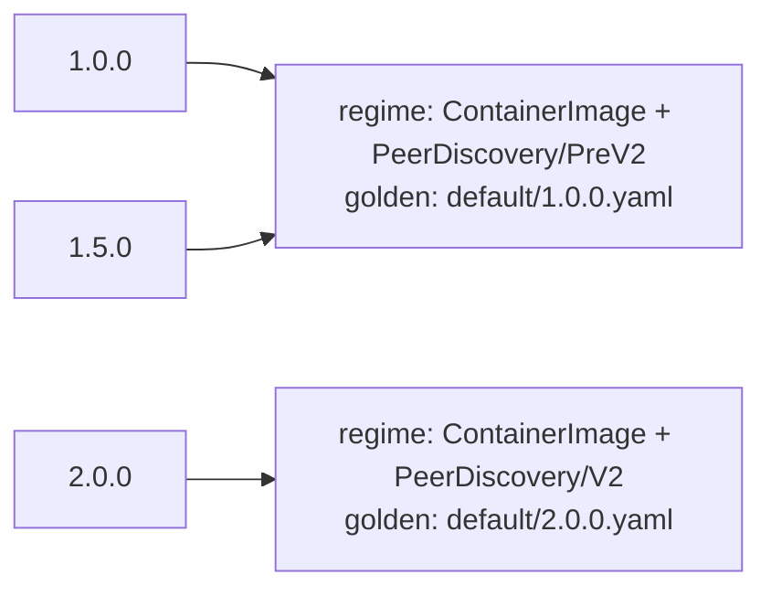

# Testing

The framework ships two test-only packages: `pkg/testing/golden` for single-build snapshot tests and
`pkg/testing/goldengen` for declarative coverage across versions and specs. Both are opt-in and import nothing into the
reconcile path, so a consumer that does not test against them pays nothing. This page organizes them around the testing
layers.

## The testing layers

Test an operator from the inside out. Each layer asserts something the layer below cannot:

| Layer          | What you assert                                                        | Tool                                                       |
| -------------- | ---------------------------------------------------------------------- | ---------------------------------------------------------- |
| **Mutation**   | one mutation makes the field changes you intend, on a baseline         | testify, against `Preview()`                               |
| **Resource**   | the right mutations fire for a spec, and the rendered output is pinned | `golden` for a snapshot, `goldengen.Resource` for coverage |
| **Component**  | the whole component renders the resources you expect, applied together | `golden.AssertComponentYAML`, or `goldengen.Component`     |
| **Controller** | reconciliation against a real API server writes the status you expect  | `envtest`, plus a harness you write                        |

The first three layers render desired state and need no cluster. The fourth applies it. `envtest` runs a real API server
and etcd with no controllers behind them, which is what makes a controller test deterministic and also what makes the
[recipe below](#controller-tests-with-envtest) necessary: nothing in the test cluster moves a resource towards ready
unless the test does it.

The
[`mutations-and-gating` example](https://github.com/sourcehawk/operator-component-framework/tree/main/examples/mutations-and-gating)
demonstrates the first three layers, and the
[`version-matrix` example](https://github.com/sourcehawk/operator-component-framework/tree/main/examples/version-matrix)
is a focused walkthrough of `goldengen`.

## Mutation tests

Unit-test a mutation in isolation: build a minimal baseline primitive with only that mutation, preview it, and assert
the fields it changed. There is no golden file at this layer; the assertion states intent directly.

```go
func TestDebugLoggingMutation(t *testing.T) {
    res, err := deployment.NewBuilder(baseDeployment()).
        WithMutation(features.DebugLoggingMutation(true)).
        Build()
    require.NoError(t, err)

    dep, err := res.Preview()
    require.NoError(t, err)

    container := dep.(*appsv1.Deployment).Spec.Template.Spec.Containers[0]
    assert.Contains(t, container.Env, corev1.EnvVar{Name: "LOG_LEVEL", Value: "debug"})
}
```

Share the minimal `baseDeployment()` / `baseConfigMap()` baselines across a package's mutation tests in a
`helpers_test.go` so each test declares only what it exercises.

## Golden snapshots

`golden` renders a built primitive or component to canonical YAML and compares it against a checked-in file. The
serialization resolves `TypeMeta` (from the object or a supplied scheme) and strips zero-value noise fields, so the
golden reflects only the meaningful desired state.

### golden.WithScheme is effectively mandatory

Typed Kubernetes objects (all built-in primitives and standard `k8s.io/api` types) do not populate `TypeMeta` by
default. Attempting to serialize such an object without a scheme produces an error:

```
object *v1.Deployment has incomplete TypeMeta (kind="", apiVersion="") and no scheme was provided
```

Pass `golden.WithScheme(scheme)` to every `AssertYAML` and `AssertComponentYAML` call. The scheme only needs to register
the types you are serializing; the same scheme you use in your controller's manager is normally sufficient.

```go
var scheme = runtime.NewScheme()

func init() {
    _ = appsv1.AddToScheme(scheme)
    _ = corev1.AddToScheme(scheme)
}
```

### The Previewer and ComponentPreviewer contracts

`AssertYAML` accepts a `golden.Previewer`:

```go
type Previewer interface {
    Preview() (client.Object, error)
}
```

`AssertComponentYAML` accepts a `golden.ComponentPreviewer`:

```go
type ComponentPreviewer interface {
    Preview() ([]client.Object, error)
}
```

All built-in primitives satisfy `Previewer` through `generic.BaseResource`. A built `*component.Component` satisfies
`ComponentPreviewer` through its `Preview` method. If you are implementing a custom resource wrapper, your built
resource must also satisfy `Previewer` for golden tests to work. See [Custom Resources](custom-resource.md) for how to
implement `Preview` on a custom resource.

### Assert a single resource

`AssertYAML` previews a built primitive, serializes it, and fails the test on any difference from the golden file. The
test helpers live in `github.com/sourcehawk/operator-component-framework/pkg/testing/golden`; `app` and `resources` are
your own packages, and `scheme` is the package-level scheme from the section above.

```go
import (
    "flag"
    "testing"

    "github.com/sourcehawk/operator-component-framework/pkg/testing/golden"
    "github.com/stretchr/testify/require"

    "your.module/app"
    "your.module/resources"
)

var update = flag.Bool("update", false, "update golden files")

func TestDeploymentGolden(t *testing.T) {
    owner := &app.ExampleApp{Spec: app.ExampleAppSpec{Version: "2.0.0", EnableDebugLogging: true}}
    owner.Name = "my-app"
    owner.Namespace = "default"

    res, err := resources.NewDeploymentResource(owner)
    require.NoError(t, err)

    previewer, ok := res.(golden.Previewer)
    require.True(t, ok)
    golden.AssertYAML(t, "testdata/deployment.yaml", previewer,
        golden.WithScheme(scheme), golden.Update(*update))
}
```

`resources.NewDeploymentResource` returns a `component.Resource`, the lean interface the reconciler uses. Rendering is a
separate capability, so the test asserts to `golden.Previewer` (the contract shown above); for any built-in primitive
the assertion always succeeds, since `generic.BaseResource` implements `Preview`.

`golden.Update(*update)` overwrites the golden file (creating intermediate directories) instead of comparing. Generate
the golden once, inspect it, then commit it:

```bash
go test ./path/to/pkg -run TestDeploymentGolden -update
go test ./path/to/pkg -run TestDeploymentGolden
```

!!! note

    The `-update` flag goes **after** the package path, not before it. `go test -update ./...` passes `-update` to
    `go test` itself, which rejects it. The correct form is `go test ./path/to/pkg -update`.

Golden files live in a `testdata/` directory next to the test file. Go excludes `testdata/` from the build by
convention, so the files are invisible to the compiler.

### Assert a component

`AssertComponentYAML` previews every resource a component would apply and serializes them into one multi-document YAML
stream (`---` separated, in apply order). `buildComponent` here is your own helper that assembles the component with
`component.NewComponentBuilder` (see [Getting Started](getting-started.md#step-5-wire-the-reconciler) for building one);
extract it from your reconciler so the test and the controller build the component the same way. A built
`*component.Component` satisfies `golden.ComponentPreviewer` directly, so no type assertion is needed.

```go
func TestComponentGolden(t *testing.T) {
    owner := &app.ExampleApp{Spec: app.ExampleAppSpec{Version: "2.0.0", EnableDebugLogging: true}}
    owner.Name = "my-app"
    owner.Namespace = "default"

    comp, err := buildComponent(owner) // your component-building helper
    require.NoError(t, err)

    golden.AssertComponentYAML(t, "testdata/component.yaml", comp,
        golden.WithScheme(scheme), golden.Update(*update))
}
```

Generate and verify with the same `-update` pattern:

```bash
go test ./path/to/pkg -run TestComponentGolden -update
go test ./path/to/pkg -run TestComponentGolden
```

### Non-testing variants and out-of-band serialization

Both helpers have non-`testing.T` variants that return a `*MismatchError` (carrying a unified diff) instead of failing a
test, for use outside a test body:

- `CompareYAML(path string, p Previewer, opts ...Option) error`
- `CompareComponentYAML(path string, c ComponentPreviewer, opts ...Option) error`

When you need the canonical YAML bytes directly (to feed a custom comparison or generate goldens from a tool), call the
serializers directly:

```go
data, err := golden.Serialize(obj, scheme)             // one object
stream, err := golden.SerializeComponent(objs, scheme) // multi-document stream
```

`goldengen` is built on exactly these two functions.

## Coverage with goldengen

`goldengen` is the declarative way to do the resource and component layers when you want coverage rather than a single
snapshot. It sweeps a set of versions and specs, asserts which mutations fire at each, writes one golden per distinct
firing group, and proves through `AssertComplete` that no registered mutation went untested.

It works at either granularity through one `Unit` abstraction: wrap a built resource with
`goldengen.Resource(res, scheme)` for resource-level coverage, or a built component with
`goldengen.Component(comp, scheme)` for component-level coverage. Everything below (fixtures, gating assertions, the
manifest, completeness) applies the same to both.

!!! note

    `goldengen` classifies firing and checks completeness by reading each unit's `RegisteredMutations()` and
    `FiringSet()`, the `concepts.MutationInspector` interface every built resource and component implements. You rarely
    call it directly; `goldengen` is the supported way to assert which mutations fire.

A resource with version-gated mutations behaves differently across versions, but not at every version: behavior changes
only where a gate flips. Asserting one golden per version is wasteful and obscures where behavior actually changes.
`goldengen` groups the swept versions by which mutations fire and writes one golden per distinct group.

The worked example lives at
[`examples/version-matrix`](https://github.com/sourcehawk/operator-component-framework/tree/main/examples/version-matrix)
(a single resource); the
[`mutations-and-gating` example](https://github.com/sourcehawk/operator-component-framework/tree/main/examples/mutations-and-gating)
applies the same harness at both the resource and component layers. The walkthrough below follows the version-matrix
example.

### Declare the matrix

A `Config[T]` declares the whole matrix. `T` is your fixture spec type (a custom resource, or any value your build
function accepts).

```go
var gen = goldengen.New(goldengen.Config[*app.ExampleApp]{
    Dir:      "testdata/version_matrix",
    Versions: []string{"1.0.0", "1.5.0", "2.0.0"},
    Fixtures: []goldengen.Fixture[*app.ExampleApp]{{
        Name: "default",
        Spec: defaultCluster(),
        Requires: []goldengen.Expect{
            {Name: "ContainerImage"},
            {Name: "PeerDiscovery/PreV2", For: "1.5.0"},
            {Name: "PeerDiscovery/V2", For: "2.0.0"},
        },
        Forbids: []goldengen.Expect{
            {Name: "PeerDiscovery/V2", For: "1.5.0"},
            {Name: "PeerDiscovery/PreV2", For: "2.0.0"},
        },
    }},
    Build: func(version string, spec *app.ExampleApp) (goldengen.Unit, error) {
        c := spec.DeepCopyObject().(*app.ExampleApp)
        c.Spec.Version = version
        res, err := resources.NewStatefulSetResource(c)
        if err != nil {
            return nil, err
        }
        return goldengen.Resource(res, scheme), nil
    },
})
```

The fields:

- **`Dir`** roots the generated goldens and the manifest.
- **`Versions`** is the version universe to sweep, in the order you supply (see [version ordering](#version-ordering)).
- **`Fixtures`** are the specs to build and assert. Each names its own golden subdirectory.
- **`Exclude`** (omitted above) lists registered mutation names you deliberately leave unasserted, so they do not fail
  the [completeness check](#completeness-accounting). It does not affect gating or golden generation.
- **`Build`** materializes a `Unit` from a fixture spec at a version. It must apply the version to the spec so the gates
  evaluate against it. Copy the spec before mutating it, since `Build` is called once per version for the same fixture.

`Build` returns a `Unit`, the introspectable-and-renderable handle the generator works with. Adapt a built primitive
with `goldengen.Resource(res, scheme)` or a built component with `goldengen.Component(comp, scheme)`. Both delegate
rendering to `golden.Serialize` / `golden.SerializeComponent`. For component-level coverage, build the whole component
in `Build` and wrap it instead; everything else (fixtures, gating assertions, the manifest, `AssertComplete`) is
identical:

```go
Build: func(version string, spec *app.ExampleApp) (goldengen.Unit, error) {
    c := spec.DeepCopyObject().(*app.ExampleApp)
    c.Spec.Version = version
    comp, err := buildComponent(c) // returns *component.Component, as your reconciler builds it
    if err != nil {
        return nil, err
    }
    return goldengen.Component(comp, scheme), nil
},
```

A component's registered and firing sets are the union of its resources' mutations, deduplicated. So at the component
layer, `Requires`/`Forbids` and `AssertComplete` range over every mutation any resource in the component registers, not
a separate component-level set.

`goldengen.Resource` requires that the primitive satisfies both `concepts.MutationInspector` (for `RegisteredMutations`
and `FiringSet`) and `concepts.Previewable` (for `Preview`); `goldengen.Component` requires the equivalent on a
`*component.Component`. All built-in primitives satisfy both through `generic.BaseResource`, and a built component
satisfies them by aggregating its resources. For custom resources, see [Custom Resources](custom-resource.md) for how to
implement `MutationInspector`.

### Run the sweep

Wire a `-update` flag through `WithUpdate` and call `Run` from a normal test:

```go
var update = flag.Bool("update", false, "update golden files")

func TestVersionMatrix(t *testing.T) {
    gen.WithUpdate(*update)
    gen.Run(t)
}
```

`Run` validates the config, builds every fixture at every version, asserts the gating, then writes (under `-update`) or
compares one golden per regime plus the manifest. Generate the goldens once, inspect them, then commit:

```bash
go test ./examples/version-matrix/ -run TestVersionMatrix -update
go test ./examples/version-matrix/
```

### Firing-set classification

The firing set at a version is the set of registered mutations whose gate is enabled there (a mutation with no gate
fires unconditionally). A **regime** is a maximal group of swept versions sharing an identical firing set. `goldengen`
writes one golden per regime, named after the regime's representative, instead of one golden per version.

In the example, the universe `1.0.0`, `1.5.0`, `2.0.0` collapses to two regimes:



`1.0.0` and `1.5.0` fire the same set, so they share one golden; `2.0.0` crosses the `PeerDiscovery` boundary into its
own regime. Two goldens cover three versions, and adding more versions inside an existing regime adds no goldens.

### Version ordering

The representative of a regime is the first version in supplied order that belongs to it. Listing `Versions` ascending
therefore puts each representative on the **lower inclusive boundary** of its gating range, so the golden's filename
marks exactly where the regime begins. In the example, `default/2.0.0.yaml` is named for the first version at which the
newer peer-discovery regime takes effect. List versions ascending unless you have a specific reason not to.

### The four assertions

Per fixture you assert gating with `Requires` and `Forbids`, each a list of `Expect{Name, For}`. `For` is optional; when
set it must be a version drawn from `Versions`.

| Assertion             | `For` set | Meaning                                        |
| --------------------- | --------- | ---------------------------------------------- |
| `Requires{Name}`      | no        | the mutation fires at **some** swept version   |
| `Requires{Name, For}` | yes       | the mutation fires **at that version**         |
| `Forbids{Name}`       | no        | the mutation fires at **no** swept version     |
| `Forbids{Name, For}`  | yes       | the mutation **does not** fire at that version |

Pin both sides of a boundary to assert it precisely: in the example `PeerDiscovery/V2` is required at `2.0.0` and
forbidden at `1.5.0`, which locks the gate to exactly the `2.0.0` boundary rather than merely "fires somewhere".

### Completeness accounting

`AssertComplete` proves no registered mutation slips through unasserted. Call it from `TestMain`, passing the result of
`m.Run()`:

```go
func TestMain(m *testing.M) {
    os.Exit(gen.AssertComplete(m.Run()))
}
```

With more than one generator in a package (say a resource matrix and a component matrix), there is still one `TestMain`;
chain the accounting so a violation in either fails the package:

```go
func TestMain(m *testing.M) {
    code := m.Run()
    code = resourceGen.AssertComplete(code)
    code = componentGen.AssertComplete(code)
    os.Exit(code)
}
```

Accounting holds when the universe of registered mutation names across all fixtures equals
`union(Requires names) ∪ Exclude`. `AssertComplete` returns the incoming code unchanged when the tests already failed (a
nonzero code) or when accounting holds; otherwise it prints the violations to stderr and returns a nonzero code. The
violations are:

- a registered mutation that is neither required by a fixture nor listed in `Exclude` (an unasserted mutation),
- a name in `Requires` or `Exclude` that no fixture actually registers (a stale assertion), and
- a registered mutation with an empty name.

The effect: registering a new version-gated mutation fails the suite until you either assert it with a `Requires` or
deliberately set it aside with `Exclude`.

`AssertComplete` checks coverage, not firing. It confirms every registered mutation is named in a `Requires` or
`Exclude`; it never evaluates whether a mutation fired. Firing is verified separately, when `Run` checks each `Requires`
during the sweep. The two compose: `AssertComplete` forces every mutation to be asserted, and the `Requires` it forces
you to write then proves the mutation actually fires.

| Check            | Runs             | Fails when                                                   |
| ---------------- | ---------------- | ------------------------------------------------------------ |
| `Requires{Name}` | during the sweep | the named mutation does **not** fire                         |
| `Forbids{Name}`  | during the sweep | the named mutation **does** fire                             |
| `AssertComplete` | from `TestMain`  | a registered mutation is in neither `Requires` nor `Exclude` |

`Requires` and `Forbids` assert behavior (firing); `AssertComplete` asserts coverage, on registration. Nothing fails
merely because a mutation fired without a matching `Requires`. The coverage net is registration-based: every registered
mutation must be required or excluded.

### The manifest

Alongside the goldens, `Run` writes `<Dir>/manifest.yaml`, a reviewable coverage map: per fixture, each regime with its
representative version, the versions it covers, and the shared firing set.

```yaml
fixtures:
  - name: default
    regimes:
      - representative: 1.0.0
        versions:
          - 1.0.0
          - 1.5.0
        firing:
          - ContainerImage
          - PeerDiscovery/PreV2
      - representative: 2.0.0
        versions:
          - 2.0.0
        firing:
          - ContainerImage
          - PeerDiscovery/V2
```

Reviewing the manifest diff in a pull request shows at a glance how the gating coverage changed: a new regime, a moved
boundary, or a mutation that started or stopped firing.

## YAML matrix loader

The matrix can be declared in YAML instead of Go, keeping the version universe and fixtures as data while the build
function stays in code. `LoadMatrix` reads the file and returns a ready-to-run `Config[T]`:

```go
func LoadMatrix[T any](
    path string,
    newSpec func() T,
    build func(version string, spec T) (Unit, error),
) (Config[T], error)
```

`newSpec` returns a fresh, empty spec to unmarshal a fixture into, called once per fixture at load time, not per build.
`build` is the same callback you would set on a Go `Config`, including the deep copy: it receives the loaded fixture
spec, which `goldengen` reuses across every version in the sweep, so it must copy the spec before setting the version,
exactly as the [Go `Config.Build`](#declare-the-matrix) does. It supplies the scheme by passing the built unit through
`goldengen.Resource` or `goldengen.Component`. The returned config is validated before it is returned.

A matrix file mirrors `Config` minus the Go-only `build`. Each fixture supplies its spec either inline under `spec:` or
from an external file under `specFile:` (resolved relative to the matrix file), exactly one of the two:

```yaml
dir: testdata/version_matrix
versions:
  - "1.0.0"
  - "1.5.0"
  - "2.0.0"
exclude: []
fixtures:
  - name: default
    spec: # inline custom resource
      apiVersion: apps.example.io/v1
      kind: ExampleApp
      metadata:
        name: demo
        namespace: default
      spec:
        version: 1.0.0
    requires:
      - { name: ContainerImage }
      - { name: PeerDiscovery/PreV2, for: "1.5.0" }
      - { name: PeerDiscovery/V2, for: "2.0.0" }
    forbids:
      - { name: PeerDiscovery/V2, for: "1.5.0" }
  - name: tls
    specFile: fixtures/tls.yaml # external custom resource
    requires:
      - { name: ContainerImage }
```

```go
// buildUnit is the same function you would set as Config.Build: it copies the
// loaded spec (shared across the sweep), applies the version, builds the
// resource, and wraps it as a Unit.
func buildUnit(version string, spec *app.ExampleApp) (goldengen.Unit, error) {
    c := spec.DeepCopyObject().(*app.ExampleApp)
    c.Spec.Version = version
    res, err := resources.NewStatefulSetResource(c)
    if err != nil {
        return nil, err
    }
    return goldengen.Resource(res, scheme), nil
}

cfg, err := goldengen.LoadMatrix(
    "testdata/matrix.yaml",
    func() *app.ExampleApp { return &app.ExampleApp{} },
    buildUnit,
)
require.NoError(t, err)

gen := goldengen.New(cfg).WithUpdate(*update)
gen.Run(t)
```

`LoadMatrix` does not call `buildUnit` itself. It loads the fixtures and versions from the file and stores `buildUnit`
as the config's `Build` field, then the config runs exactly like one declared in Go: `goldengen.New(cfg)` wraps it, and
`gen.Run` calls `buildUnit(version, spec)` for each version and fixture during the sweep, passing the spec it
unmarshaled from the file. The YAML supplies the data (specs, versions, expectations); `buildUnit` supplies the build
logic.

`LoadMatrix` errors if a fixture sets both `spec` and `specFile` or neither, if a `for` value is not in `versions`, or
if any spec fails to unmarshal into `T`.

## Controller tests with envtest

The three rendering layers prove what the operator would apply. They cannot prove what it writes to the owner's status,
because status comes from observed cluster state. That needs a real API server, which
[`sigs.k8s.io/controller-runtime/pkg/envtest`](https://pkg.go.dev/sigs.k8s.io/controller-runtime/pkg/envtest) provides.

The framework ships no envtest helper. `pkg/testing` contains `golden` and `goldengen` only. What follows is a recipe
you assemble in your own suite, not an API to call. The framework's own suites are the closest working examples:
`pkg/component/suite_test.go` starts an envtest environment with an in-Go CRD, and `e2e/framework/` shows the harness
shape, with `crd.go` holding a test owner CRD and `reconciler.go` a reconciler that builds components from per-test
factories.

An operator built on top of another operator needs three things from this layer, and each has a trap.

### Load the third-party CRDs from the module cache

The CRD YAML for a third-party operator ships inside its Go module, so the module cache already has the exact version
your `go.mod` resolves. Ask the toolchain where it is rather than vendoring a copy that drifts:

```go
func moduleDir(t *testing.T, module string) string {
    t.Helper()
    out, err := exec.Command("go", "list", "-m", "-f", "{{.Dir}}", module).Output()
    require.NoError(t, err)
    return strings.TrimSpace(string(out))
}

testEnv = &envtest.Environment{
    CRDDirectoryPaths: []string{
        filepath.Join("..", "..", "config", "crd", "bases"), // your own CRDs
        filepath.Join(moduleDir(t, "example.com/broker-operator"), "config", "crd", "bases"),
    },
    ErrorIfCRDPathMissing: true,
}
```

Register the third-party scheme as well, or the client cannot decode the kind:
`require.NoError(t, brokerv1.AddToScheme(scheme.Scheme))`. Keep `ErrorIfCRDPathMissing` true, so a dependency bump that
moves the CRD directory fails the suite instead of silently testing against a missing kind.

### Drive the external CR's status from the test

envtest runs the API server and etcd. It runs no controllers. The third-party operator is not there, so the CR your
wrapper applies stays with an empty status forever, and the component never leaves `Creating`. The test plays the part
of the missing operator:

```go
// Stand in for the broker operator, which does not run in envtest.
broker := &brokerv1.Broker{}
require.NoError(t, k8sClient.Get(ctx, brokerKey, broker))
broker.Status.ObservedGeneration = broker.Generation // the wrapper's handlers gate on this
broker.Status.ReadyReplicas = *broker.Spec.Replicas
require.NoError(t, k8sClient.Status().Update(ctx, broker))
```

Stamp `observedGeneration` deliberately. A wrapper's status handler should compare it against `metadata.generation`
before it trusts any readiness field, and `concepts.StaleGenerationStatus` does exactly that. A test that sets
`ReadyReplicas` but leaves `observedGeneration` at zero keeps the handler in its stale-generation branch, and the
component stays not ready for a reason that has nothing to do with the code under test.

Update the status through `Status().Update`, not `Update`. The CR's status is a subresource, so a plain update discards
it.

### Assert the owner's condition

Reconcile, then read the owner back and assert the condition the controller wrote. Call the reconciler directly rather
than starting a manager: one `Reconcile` call per state change keeps the assertion deterministic, and the third-party CR
status only changes when the test changes it.

```go
_, err := reconciler.Reconcile(ctx, reconcile.Request{NamespacedName: ownerKey})
require.NoError(t, err)

app := &v1alpha1.WebApp{}
require.NoError(t, k8sClient.Get(ctx, ownerKey, app))

ready := meta.FindStatusCondition(app.Status.Conditions, "Ready")
require.NotNil(t, ready)
assert.Equal(t, metav1.ConditionTrue, ready.Status)
assert.Equal(t, string(component.Healthy), ready.Reason)
assert.Equal(t, app.Generation, ready.ObservedGeneration)
```

`"Ready"` is your own aggregate condition type here, not a framework-fixed name; a single component's condition type
reads the same way. `meta.FindStatusCondition` is the right reader, because the test is a consumer of the persisted
object. Inside the controller, aggregation reads component conditions through
[`GetCondition`](component.md#reading-a-components-condition) instead, for the synthetic `Unknown` it returns before the
first reconcile. Assert the reason as well as the status: the reason is a
[`component.Status`](component.md#condition-priority-and-aggregation) value, so it pins which component governed the
result and not merely that something was ready.

Two assertions are worth writing at this layer and nowhere else: that a not-yet-reconciled component holds the owner at
`False`, and that a component built with `Suspend(true)` reports `True` while the resource is gone from the cluster.
Both are status-model behavior that no rendering test can observe.
