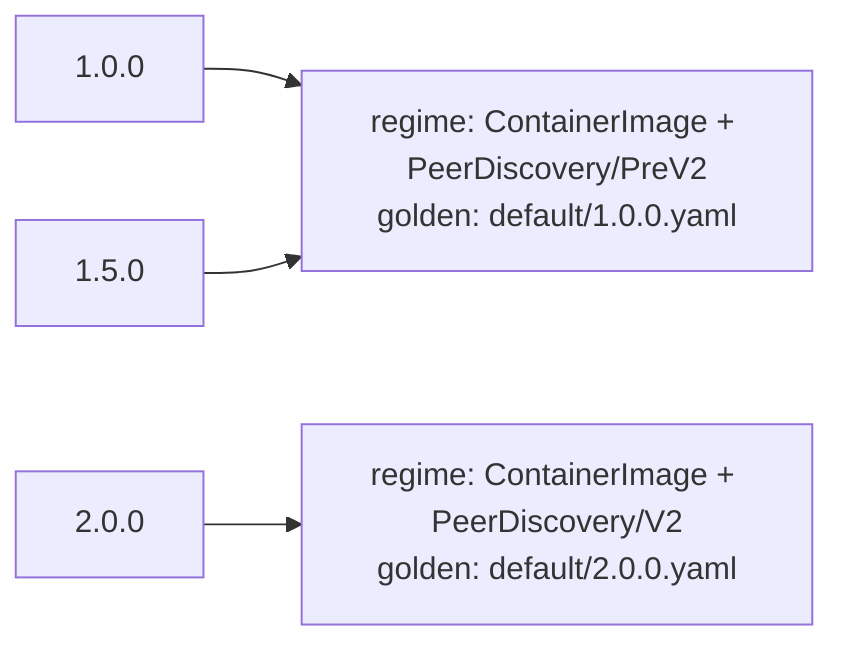

# Testing

The framework ships two test-only packages: `pkg/testing/golden` for single-build snapshot tests and
`pkg/testing/goldengen` for declarative coverage across versions and specs. Both are opt-in and import nothing into the
reconcile path, so a consumer that does not test against them pays nothing. This page organizes them around three
testing layers.

## The three layers

Test a component from the inside out. Each layer asserts something the layer below cannot:

| Layer         | What you assert                                                        | Tool                                                               |
| ------------- | ---------------------------------------------------------------------- | ------------------------------------------------------------------ |
| **Mutation**  | one mutation makes the field changes you intend, on a baseline         | testify, against `Preview()`                                       |
| **Resource**  | the right mutations fire for a spec, and the rendered output is pinned | `concepts.MutationInspector` and `golden`, or `goldengen.Resource` |
| **Component** | the whole component renders the resources you expect, applied together | `golden.AssertComponentYAML`, or `goldengen.Component`             |

The
[`mutations-and-gating` example](https://github.com/sourcehawk/operator-component-framework/tree/main/examples/mutations-and-gating)
demonstrates all three, and the
[`version-matrix` example](https://github.com/sourcehawk/operator-component-framework/tree/main/examples/version-matrix)
is a focused walkthrough of `goldengen`.

## Mutation tests

Unit-test a mutation in isolation: build a minimal baseline primitive with only that mutation, preview it, and assert
the fields it changed. There is no golden file at this layer; the assertion states intent directly.

```go
func TestDebugLoggingMutation(t *testing.T) {
    res, err := deployment.NewBuilder(baseDeployment()).
        WithMutation(features.DebugLoggingMutation(true)).
        Build()
    require.NoError(t, err)

    dep, err := res.Preview()
    require.NoError(t, err)

    container := dep.(*appsv1.Deployment).Spec.Template.Spec.Containers[0]
    assert.Contains(t, container.Env, corev1.EnvVar{Name: "LOG_LEVEL", Value: "debug"})
}
```

Share the minimal `baseDeployment()` / `baseConfigMap()` baselines across a package's mutation tests in a
`helpers_test.go` so each test declares only what it exercises.

## Golden snapshots

`golden` renders a built primitive or component to canonical YAML and compares it against a checked-in file. The
serialization resolves `TypeMeta` (from the object or a supplied scheme) and strips zero-value noise fields, so the
golden reflects only the meaningful desired state.

### golden.WithScheme is effectively mandatory

Typed Kubernetes objects (all built-in primitives and standard `k8s.io/api` types) do not populate `TypeMeta` by
default. Attempting to serialize such an object without a scheme produces an error:

```
object *v1.Deployment has incomplete TypeMeta (kind="", apiVersion="") and no scheme was provided
```

Pass `golden.WithScheme(scheme)` to every `AssertYAML` and `AssertComponentYAML` call. The scheme only needs to register
the types you are serializing; the same scheme you use in your controller's manager is normally sufficient.

```go
var scheme = runtime.NewScheme()

func init() {
    _ = appsv1.AddToScheme(scheme)
    _ = corev1.AddToScheme(scheme)
}
```

### The Previewer and ComponentPreviewer contracts

`AssertYAML` accepts a `golden.Previewer`:

```go
type Previewer interface {
    Preview() (client.Object, error)
}
```

`AssertComponentYAML` accepts a `golden.ComponentPreviewer`:

```go
type ComponentPreviewer interface {
    Preview() ([]client.Object, error)
}
```

All built-in primitives satisfy `Previewer` through `generic.BaseResource`. A built `*component.Component` satisfies
`ComponentPreviewer` through its `Preview` method. If you are implementing a custom resource wrapper, your built
resource must also satisfy `Previewer` for golden tests to work. See [Custom Resources](custom-resource.md) for how to
implement `Preview` on a custom resource.

### Assert a single resource

`AssertYAML` previews a built primitive, serializes it, and fails the test on any difference from the golden file.

```go
var update = flag.Bool("update", false, "update golden files")

func TestDeploymentGolden(t *testing.T) {
    res, err := deployment.NewBuilder(baseDeployment()).
        WithMutation(features.DebugLoggingMutation(true)).
        Build()
    require.NoError(t, err)

    golden.AssertYAML(t, "testdata/deployment.yaml", res,
        golden.WithScheme(scheme), golden.Update(*update))
}
```

`golden.Update(*update)` overwrites the golden file (creating intermediate directories) instead of comparing. Generate
the golden once, inspect it, then commit it:

```bash
go test ./path/to/pkg -run TestDeploymentGolden -update
go test ./path/to/pkg -run TestDeploymentGolden
```

!!! note The `-update` flag goes **after** the package path, not before it. `go test -update ./...` passes `-update` to
`go test` itself, which rejects it. The correct form is `go test ./path/to/pkg -update`.

Golden files live in a `testdata/` directory next to the test file. Go excludes `testdata/` from the build by
convention, so the files are invisible to the compiler.

### Assert a component

`AssertComponentYAML` previews every resource a component would apply and serializes them into one multi-document YAML
stream (`---` separated, in apply order).

```go
func TestComponentGolden(t *testing.T) {
    c, err := buildComponent(owner)
    require.NoError(t, err)

    golden.AssertComponentYAML(t, "testdata/component.yaml", c,
        golden.WithScheme(scheme), golden.Update(*update))
}
```

Generate and verify with the same `-update` pattern:

```bash
go test ./path/to/pkg -run TestComponentGolden -update
go test ./path/to/pkg -run TestComponentGolden
```

### Non-testing variants and out-of-band serialization

Both helpers have non-`testing.T` variants that return a `*MismatchError` (carrying a unified diff) instead of failing a
test, for use outside a test body:

- `CompareYAML(path string, p Previewer, opts ...Option) error`
- `CompareComponentYAML(path string, c ComponentPreviewer, opts ...Option) error`

When you need the canonical YAML bytes directly (to feed a custom comparison or generate goldens from a tool), call the
serializers directly:

```go
data, err := golden.Serialize(obj, scheme)             // one object
stream, err := golden.SerializeComponent(objs, scheme) // multi-document stream
```

`goldengen` is built on exactly these two functions.

## Asserting which mutations fire

A golden pins what a resource renders, but not which mutations produced it. To assert that the gates you expect actually
fired for a given spec, use the introspection a built primitive exposes through `concepts.MutationInspector`. Build the
resource through the same factory the reconciler uses, then inspect it:

```go
import "github.com/sourcehawk/operator-component-framework/pkg/component/concepts"

res, err := resources.NewDeploymentResource(owner) // the real factory
require.NoError(t, err)

inspector := res.(concepts.MutationInspector)
firing, err := inspector.FiringSet()
require.NoError(t, err)
assert.ElementsMatch(t, []string{"DebugLogging"}, firing)
```

`RegisteredMutations()` returns the name of every mutation registered on the resource; `FiringSet()` returns the subset
whose gate is enabled for the version and flags the resource was built at. A built `*component.Component` implements the
same interface, deduplicated across its resources, which is how the component layer asserts firing across a whole
component.

Asserting the firing set by hand is enough for a single build. To prove that _every_ registered mutation is tested,
across versions and specs, use `goldengen` below: it is built on exactly this introspection and adds a completeness
check.

## Coverage with goldengen

`goldengen` is the declarative way to do the resource and component layers when you want coverage rather than a single
snapshot. It sweeps a set of versions and specs, asserts which mutations fire at each (so you do not call `FiringSet` by
hand), writes one golden per distinct firing group, and proves through `AssertComplete` that no registered mutation went
untested.

It works at either granularity through one `Unit` abstraction: wrap a built resource with
`goldengen.Resource(res, scheme)` for resource-level coverage, or a built component with
`goldengen.Component(comp, scheme)` for component-level coverage. Everything below (fixtures, gating assertions, the
manifest, completeness) applies the same to both.

A resource with version-gated mutations behaves differently across versions, but not at every version: behavior changes
only where a gate flips. Asserting one golden per version is wasteful and obscures where behavior actually changes.
`goldengen` groups the swept versions by which mutations fire and writes one golden per distinct group.

The worked example lives at
[`examples/version-matrix`](https://github.com/sourcehawk/operator-component-framework/tree/main/examples/version-matrix)
(a single resource); the
[`mutations-and-gating` example](https://github.com/sourcehawk/operator-component-framework/tree/main/examples/mutations-and-gating)
applies the same harness at both the resource and component layers. The walkthrough below follows the version-matrix
example.

### Declare the matrix

A `Config[T]` declares the whole matrix. `T` is your fixture spec type (a custom resource, or any value your build
function accepts).

```go
var gen = goldengen.New(goldengen.Config[*app.ExampleApp]{
    Dir:      "testdata/version_matrix",
    Versions: []string{"1.0.0", "1.5.0", "2.0.0"},
    Fixtures: []goldengen.Fixture[*app.ExampleApp]{{
        Name: "default",
        Spec: defaultCluster(),
        Requires: []goldengen.Expect{
            {Name: "ContainerImage"},
            {Name: "PeerDiscovery/PreV2", For: "1.5.0"},
            {Name: "PeerDiscovery/V2", For: "2.0.0"},
        },
        Forbids: []goldengen.Expect{
            {Name: "PeerDiscovery/V2", For: "1.5.0"},
            {Name: "PeerDiscovery/PreV2", For: "2.0.0"},
        },
    }},
    Build: func(version string, spec *app.ExampleApp) (goldengen.Unit, error) {
        c := spec.DeepCopyObject().(*app.ExampleApp)
        c.Spec.Version = version
        res, err := resources.NewStatefulSetResource(c)
        if err != nil {
            return nil, err
        }
        return goldengen.Resource(res, scheme), nil
    },
})
```

The fields:

- **`Dir`** roots the generated goldens and the manifest.
- **`Versions`** is the version universe to sweep, in the order you supply (see [version ordering](#version-ordering)).
- **`Fixtures`** are the specs to build and assert. Each names its own golden subdirectory.
- **`Exclude`** (omitted above) lists registered mutation names you deliberately leave unasserted, so they do not fail
  the [completeness check](#completeness-accounting). It does not affect gating or golden generation.
- **`Build`** materializes a `Unit` from a fixture spec at a version. It must apply the version to the spec so the gates
  evaluate against it. Copy the spec before mutating it, since `Build` is called once per version for the same fixture.

`Build` returns a `Unit`, the introspectable-and-renderable handle the generator works with. Adapt a built primitive
with `goldengen.Resource(res, scheme)` or a built component with `goldengen.Component(comp, scheme)`. Both delegate
rendering to `golden.Serialize` / `golden.SerializeComponent`.

`goldengen.Resource` requires that the primitive satisfies both `concepts.MutationInspector` (for `RegisteredMutations`
and `FiringSet`) and `concepts.Previewable` (for `Preview`). All built-in primitives satisfy both through
`generic.BaseResource`. For custom resources, see [Custom Resources](custom-resource.md) for how to implement
`MutationInspector`.

### Run the sweep

Wire a `-update` flag through `WithUpdate` and call `Run` from a normal test:

```go
var update = flag.Bool("update", false, "update golden files")

func TestVersionMatrix(t *testing.T) {
    gen.WithUpdate(*update)
    gen.Run(t)
}
```

`Run` validates the config, builds every fixture at every version, asserts the gating, then writes (under `-update`) or
compares one golden per regime plus the manifest. Generate the goldens once, inspect them, then commit:

```bash
go test ./examples/version-matrix/ -run TestVersionMatrix -update
go test ./examples/version-matrix/
```

### Firing-set classification

The firing set at a version is the set of registered mutations whose gate is enabled there (a mutation with no gate
fires unconditionally). A **regime** is a maximal group of swept versions sharing an identical firing set. `goldengen`
writes one golden per regime, named after the regime's representative, instead of one golden per version.

In the example, the universe `1.0.0`, `1.5.0`, `2.0.0` collapses to two regimes:



`1.0.0` and `1.5.0` fire the same set, so they share one golden; `2.0.0` crosses the `PeerDiscovery` boundary into its
own regime. Two goldens cover three versions, and adding more versions inside an existing regime adds no goldens.

### Version ordering

The representative of a regime is the first version in supplied order that belongs to it. Listing `Versions` ascending
therefore puts each representative on the **lower inclusive boundary** of its gating range, so the golden's filename
marks exactly where the regime begins. In the example, `default/2.0.0.yaml` is named for the first version at which the
newer peer-discovery regime takes effect. List versions ascending unless you have a specific reason not to.

### The four assertions

Per fixture you assert gating with `Requires` and `Forbids`, each a list of `Expect{Name, For}`. `For` is optional; when
set it must be a version drawn from `Versions`.

| Assertion             | `For` set | Meaning                                        |
| --------------------- | --------- | ---------------------------------------------- |
| `Requires{Name}`      | no        | the mutation fires at **some** swept version   |
| `Requires{Name, For}` | yes       | the mutation fires **at that version**         |
| `Forbids{Name}`       | no        | the mutation fires at **no** swept version     |
| `Forbids{Name, For}`  | yes       | the mutation **does not** fire at that version |

Pin both sides of a boundary to assert it precisely: in the example `PeerDiscovery/V2` is required at `2.0.0` and
forbidden at `1.5.0`, which locks the gate to exactly the `2.0.0` boundary rather than merely "fires somewhere".

### Completeness accounting

`AssertComplete` proves no registered mutation slips through unasserted. Call it from `TestMain`, passing the result of
`m.Run()`:

```go
func TestMain(m *testing.M) {
    os.Exit(gen.AssertComplete(m.Run()))
}
```

Accounting holds when the universe of registered mutation names across all fixtures equals
`union(Requires names) ∪ Exclude`. `AssertComplete` returns the incoming code unchanged when the tests already failed (a
nonzero code) or when accounting holds; otherwise it prints the violations to stderr and returns a nonzero code. The
violations are:

- a registered mutation that is neither required by a fixture nor listed in `Exclude` (an unasserted mutation),
- a name in `Requires` or `Exclude` that no fixture actually registers (a stale assertion), and
- a registered mutation with an empty name.

The effect: registering a new version-gated mutation fails the suite until you either assert it with a `Requires` or
deliberately set it aside with `Exclude`.

### The manifest

Alongside the goldens, `Run` writes `<Dir>/manifest.yaml`, a reviewable coverage map: per fixture, each regime with its
representative version, the versions it covers, and the shared firing set.

```yaml
fixtures:
  - name: default
    regimes:
      - representative: 1.0.0
        versions:
          - 1.0.0
          - 1.5.0
        firing:
          - ContainerImage
          - PeerDiscovery/PreV2
      - representative: 2.0.0
        versions:
          - 2.0.0
        firing:
          - ContainerImage
          - PeerDiscovery/V2
```

Reviewing the manifest diff in a pull request shows at a glance how the gating coverage changed: a new regime, a moved
boundary, or a mutation that started or stopped firing.

## YAML matrix loader

The matrix can be declared in YAML instead of Go, keeping the version universe and fixtures as data while the build
function stays in code. `LoadMatrix` reads the file and returns a ready-to-run `Config[T]`:

```go
func LoadMatrix[T any](
    path string,
    newSpec func() T,
    build func(version string, spec T) (Unit, error),
) (Config[T], error)
```

`newSpec` returns a fresh, empty spec to unmarshal each fixture into; `build` is the same callback you would set on a Go
`Config`, and it supplies the scheme by passing it to `goldengen.Resource` or `goldengen.Component`. The returned config
is validated before it is returned.

A matrix file mirrors `Config` minus the Go-only `build`. Each fixture supplies its spec either inline under `spec:` or
from an external file under `specFile:` (resolved relative to the matrix file), exactly one of the two:

```yaml
dir: testdata/version_matrix
versions:
  - "1.0.0"
  - "1.5.0"
  - "2.0.0"
exclude: []
fixtures:
  - name: default
    spec: # inline custom resource
      apiVersion: apps.example.io/v1
      kind: ExampleApp
      metadata:
        name: demo
        namespace: default
      spec:
        version: 1.0.0
    requires:
      - { name: ContainerImage }
      - { name: PeerDiscovery/PreV2, for: "1.5.0" }
      - { name: PeerDiscovery/V2, for: "2.0.0" }
    forbids:
      - { name: PeerDiscovery/V2, for: "1.5.0" }
  - name: tls
    specFile: fixtures/tls.yaml # external custom resource
    requires:
      - { name: ContainerImage }
```

```go
cfg, err := goldengen.LoadMatrix("testdata/matrix.yaml",
    func() *app.ExampleApp { return &app.ExampleApp{} },
    buildUnit)
require.NoError(t, err)

gen := goldengen.New(cfg).WithUpdate(*update)
gen.Run(t)
```

`LoadMatrix` errors if a fixture sets both `spec` and `specFile` or neither, if a `for` value is not in `versions`, or
if any spec fails to unmarshal into `T`.
