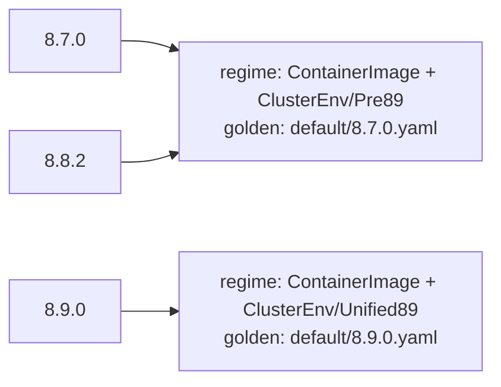

# Testing

The framework ships two test-only packages for asserting the desired state your resources and components produce:

- `pkg/testing/golden` snapshots a single build to a YAML golden file and compares against it on every run.
- `pkg/testing/goldengen` sweeps a version universe over one or more fixtures, classifies the swept versions into gating
  regimes, generates the minimal set of goldens covering them, asserts which mutations fire at which version, and proves
  every registered mutation is accounted for.

Reach for `golden` when you want to pin the output of one build. Reach for `goldengen` when a resource carries
version-gated mutations and you want one golden per behavior rather than one per version, with the gating asserted
explicitly.

Both packages are opt-in and import nothing into the reconcile path. A consumer that does not import them pays nothing.

## Golden snapshots

`golden` renders a built primitive or component to canonical YAML and compares it against a checked-in file. The
serialization resolves `TypeMeta` (from the object or a supplied scheme) and strips zero-value noise fields, so the
golden reflects only the meaningful desired state.

### Assert a single resource

`AssertYAML` previews a built primitive, serializes it, and fails the test on any difference from the golden file. Wire
a `-update` flag to regenerate the golden when the desired state legitimately changes.

```go
var update = flag.Bool("update", false, "update golden files")

func TestDeploymentGolden(t *testing.T) {
	res, err := deployment.NewBuilder(baseDeployment()).
		WithMutation(features.DebugLoggingMutation(true)).
		Build()
	require.NoError(t, err)

	golden.AssertYAML(t, "testdata/deployment.yaml", res,
		golden.WithScheme(scheme), golden.Update(*update))
}
```

`golden.WithScheme(scheme)` resolves `apiVersion` and `kind` for objects that do not populate `TypeMeta`. Without it,
serialization of such an object fails. `golden.Update(*update)` overwrites the golden file (creating intermediate
directories) instead of comparing, so `go test ./... -update` refreshes every golden in one pass.

### Assert a component

`AssertComponentYAML` previews every resource a component would apply and serializes them into one multi-document YAML
stream (`---` separated, in apply order).

```go
func TestComponentGolden(t *testing.T) {
	c, err := buildComponent(owner)
	require.NoError(t, err)

	golden.AssertComponentYAML(t, "testdata/component.yaml", c,
		golden.WithScheme(scheme), golden.Update(*update))
}
```

Both helpers have non-`testing.T` variants, `CompareYAML` and `CompareComponentYAML`, that return a `*MismatchError`
(carrying a unified diff) instead of failing a test, for use outside a test body.

### Serialize out of band

When you need the canonical YAML bytes directly, for example to feed a custom comparison or to generate goldens from a
tool, call the serializers the assertions use:

```go
data, err := golden.Serialize(obj, scheme)                 // one object
stream, err := golden.SerializeComponent(objs, scheme)     // multi-document stream
```

`goldengen` is built on exactly these two functions.

## Version matrix generation

A resource with version-gated mutations behaves differently across versions, but not at every version: it changes only
where a gate flips. Asserting one golden per version is wasteful and obscures where behavior actually changes.
`goldengen` sweeps the versions you supply, groups them by which mutations fire, and writes one golden per distinct
group.

The worked example lives at
[`examples/version-matrix`](https://github.com/sourcehawk/operator-component-framework/tree/main/examples/version-matrix).
The walkthrough below follows it.

### Declare the matrix

A `Config[T]` declares the whole matrix. `T` is your fixture spec type (a custom resource, or any value your build
function accepts).

```go
var gen = goldengen.New(goldengen.Config[*app.ExampleApp]{
	Dir:      "testdata/version_matrix",
	Versions: []string{"8.7.0", "8.8.2", "8.9.0"},
	Fixtures: []goldengen.Fixture[*app.ExampleApp]{{
		Name: "default",
		Spec: defaultCluster(),
		Requires: []goldengen.Expect{
			{Name: "ContainerImage"},
			{Name: "ClusterEnv/Pre89", For: "8.8.2"},
			{Name: "ClusterEnv/Unified89", For: "8.9.0"},
		},
		Forbids: []goldengen.Expect{
			{Name: "ClusterEnv/Unified89", For: "8.8.2"},
			{Name: "ClusterEnv/Pre89", For: "8.9.0"},
		},
	}},
	Build: func(version string, spec *app.ExampleApp) (goldengen.Unit, error) {
		c := spec.DeepCopyObject().(*app.ExampleApp)
		c.Spec.Version = version
		res, err := resources.NewStatefulSetResource(c)
		if err != nil {
			return nil, err
		}
		return goldengen.Resource(res, scheme), nil
	},
})
```

The fields:

- **`Dir`** roots the generated goldens and the manifest.
- **`Versions`** is the version universe to sweep, in the order you supply (see [version ordering](#version-ordering)).
- **`Fixtures`** are the specs to build and assert. Each names its own golden subdirectory.
- **`Exclude`** (omitted above) lists registered mutation names you deliberately leave unasserted, so they do not fail
  the [completeness check](#completeness-accounting). It does not affect gating or golden generation.
- **`Build`** materializes a `Unit` from a fixture spec at a version. It must apply the version to the spec so the gates
  evaluate against it. Copy the spec before mutating it, since `Build` is called once per version for the same fixture.

`Build` returns a `Unit`, the introspectable-and-renderable handle the generator works with. Adapt a built primitive
with `goldengen.Resource(res, scheme)` or a built component with `goldengen.Component(comp, scheme)`. Both delegate
rendering to `golden.Serialize` / `golden.SerializeComponent`.

### Run the sweep

Wire a `-update` flag through `WithUpdate` and call `Run` from a normal test:

```go
var update = flag.Bool("update", false, "update golden files")

func TestVersionMatrix(t *testing.T) {
	gen.WithUpdate(*update)
	gen.Run(t)
}
```

`Run` validates the config, builds every fixture at every version, asserts the gating, then writes (under `-update`) or
compares one golden per regime plus the manifest. Generate the goldens once, inspect them, then commit:

```bash
go test ./examples/version-matrix/ -run TestVersionMatrix -update   # generate
go test ./examples/version-matrix/                                  # verify
```

### Firing-set classification

The firing set at a version is the set of registered mutations whose gate is enabled there (a mutation with no gate
fires unconditionally). A **regime** is a maximal group of swept versions sharing an identical firing set. `goldengen`
writes one golden per regime, named after the regime's representative, instead of one golden per version.

In the example, the universe `8.7.0`, `8.8.2`, `8.9.0` collapses to two regimes:



`8.7.0` and `8.8.2` fire the same set, so they share one golden; `8.9.0` crosses the `ClusterEnv` boundary into its own
regime. Two goldens cover three versions, and adding more versions inside an existing regime adds no goldens.

### Version ordering

The representative of a regime is the first version in supplied order that belongs to it. Listing `Versions` ascending
therefore puts each representative on the **lower inclusive boundary** of its gating range, so the golden's filename
marks exactly where the regime begins. In the example, `default/8.9.0.yaml` is named for the first version at which the
unified-discovery regime takes effect. List versions ascending unless you have a specific reason not to.

### The four assertions

Per fixture you assert gating with `Requires` and `Forbids`, each a list of `Expect{Name, For}`. `For` is optional; when
set it must be a version drawn from `Versions`.

| Assertion             | `For` set | Meaning                                        |
| --------------------- | --------- | ---------------------------------------------- |
| `Requires{Name}`      | no        | the mutation fires at **some** swept version   |
| `Requires{Name, For}` | yes       | the mutation fires **at that version**         |
| `Forbids{Name}`       | no        | the mutation fires at **no** swept version     |
| `Forbids{Name, For}`  | yes       | the mutation **does not** fire at that version |

Pin both sides of a boundary to assert it precisely: in the example `ClusterEnv/Unified89` is required at `8.9.0` and
forbidden at `8.8.2`, which locks the gate to exactly the `8.9.0` boundary rather than merely "fires somewhere".

### Completeness accounting

`AssertComplete` proves no registered mutation slips through unasserted. Call it from `TestMain`, passing the result of
`m.Run()`:

```go
func TestMain(m *testing.M) {
	os.Exit(gen.AssertComplete(m.Run()))
}
```

Accounting holds when the universe of registered mutation names across all fixtures equals
`union(Requires names) ∪ Exclude`. `AssertComplete` returns the incoming code unchanged when the tests already failed (a
nonzero code) or when accounting holds; otherwise it prints the violations to stderr and returns a nonzero code. The
violations are:

- a registered mutation that is neither required by a fixture nor listed in `Exclude` (an unasserted mutation),
- a name in `Requires` or `Exclude` that no fixture actually registers (a stale assertion), and
- a registered mutation with an empty name.

The effect: registering a new version-gated mutation fails the suite until you either assert it with a `Requires` or
deliberately set it aside with `Exclude`.

### The manifest

Alongside the goldens, `Run` writes `<Dir>/manifest.yaml`, a reviewable coverage map: per fixture, each regime with its
representative version, the versions it covers, and the shared firing set.

```yaml
fixtures:
  - name: default
    regimes:
      - representative: 8.7.0
        versions:
          - 8.7.0
          - 8.8.2
        firing:
          - ClusterEnv/Pre89
          - ContainerImage
      - representative: 8.9.0
        versions:
          - 8.9.0
        firing:
          - ClusterEnv/Unified89
          - ContainerImage
```

Reviewing the manifest diff in a pull request shows at a glance how the gating coverage changed: a new regime, a moved
boundary, or a mutation that started or stopped firing.

## YAML matrix loader

The matrix can be declared in YAML instead of Go, keeping the version universe and fixtures as data while the build
function stays in code. `LoadMatrix` reads the file and returns a ready-to-run `Config[T]`:

```go
func LoadMatrix[T any](
	path string,
	newSpec func() T,
	build func(version string, spec T) (Unit, error),
) (Config[T], error)
```

`newSpec` returns a fresh, empty spec to unmarshal each fixture into; `build` is the same callback you would set on a Go
`Config`, and it supplies the scheme by passing it to `goldengen.Resource` or `goldengen.Component`. The returned config
is validated before it is returned.

A matrix file mirrors `Config` minus the Go-only `build`. Each fixture supplies its spec either inline under `spec:` or
from an external file under `specFile:` (resolved relative to the matrix file), exactly one of the two:

```yaml
dir: testdata/version_matrix
versions:
  - "8.7.0"
  - "8.8.2"
  - "8.9.0"
exclude: []
fixtures:
  - name: default
    spec: # inline custom resource
      apiVersion: apps.example.io/v1
      kind: ExampleApp
      metadata:
        name: demo
        namespace: default
      spec:
        version: 8.7.0
    requires:
      - { name: ContainerImage }
      - { name: ClusterEnv/Pre89, for: "8.8.2" }
      - { name: ClusterEnv/Unified89, for: "8.9.0" }
    forbids:
      - { name: ClusterEnv/Unified89, for: "8.8.2" }
  - name: tls
    specFile: fixtures/tls.yaml # external custom resource
    requires:
      - { name: ContainerImage }
```

```go
cfg, err := goldengen.LoadMatrix("testdata/matrix.yaml",
	func() *app.ExampleApp { return &app.ExampleApp{} },
	buildUnit)
require.NoError(t, err)

gen := goldengen.New(cfg).WithUpdate(*update)
gen.Run(t)
```

`LoadMatrix` errors if a fixture sets both `spec` and `specFile` or neither, if a `for` value is not in `versions`, or
if any spec fails to unmarshal into `T`.
